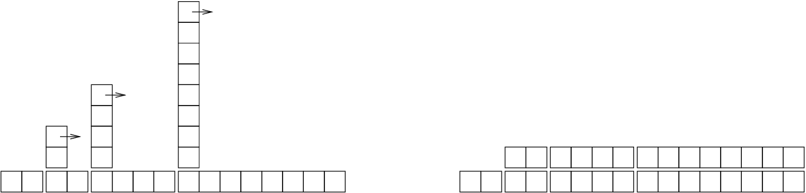

# Analysis of Algorithms

> This appendix is an edited excerpt from *Think
> Complexity*, by Allen B. Downey, also published by O’Reilly
> Media (2012). When you are done with this book, you might want to move
> on to that one.

**Analysis of algorithms** is a branch of computer science
that studies the performance of algorithms, especially their run time
and space requirements. See
https://en.wikipedia.org/wiki/Analysis_of_algorithms.

The practical goal of algorithm analysis is to predict the performance
of different algorithms in order to guide design decisions.

During the 2008 United States Presidential Campaign, candidate Barack
Obama was asked to perform an impromptu analysis when he visited Google.
Chief executive Eric Schmidt jokingly asked him for “the most efficient
way to sort a million 32-bit integers.” Obama had apparently been tipped
off, because he quickly replied, “I think the bubble sort would be the
wrong way to go.” See https://www.youtube.com/watch?v=k4RRi_ntQc8.

This is true: bubble sort is conceptually simple but slow for large
datasets. The answer Schmidt was probably looking for is “radix sort”
(https://en.wikipedia.org/wiki/Radix_sort).

But if you get a question like this in an interview, I think a
better answer is, “The fastest way to sort a million integers is to
use whatever sort function is provided by the language I’m using.
Its performance is good enough for the vast majority of
applications, but if it turned out that my application was too slow,
I would use a profiler to see where the time was being spent. If it
looked like a faster sort algorithm would have a significant effect
on performance, then I would look around for a good implementation
of radix sort.”

The goal of algorithm analysis is to make meaningful comparisons between
algorithms, but there are some problems:

  - The relative performance of the algorithms might depend on
    characteristics of the hardware, so one algorithm might be faster on
    Machine A, another on Machine B. The general solution to this
    problem is to specify a **machine model** and analyze
    the number of steps, or operations, an algorithm requires under a
    given model.

  - Relative performance might depend on the details of the dataset. For
    example, some sorting algorithms run faster if the data are already
    partially sorted; other algorithms run slower in this case. A common
    way to avoid this problem is to analyze the **worst
    case** scenario. It is sometimes useful to analyze average
    case performance, but that’s usually harder, and it might not be
    obvious what set of cases to average over.

  - Relative performance also depends on the size of the problem. A
    sorting algorithm that is fast for small lists might be slow for
    long lists. The usual solution to this problem is to express run
    time (or number of operations) as a function of problem size, and
    group functions into categories depending on how quickly they grow
    as problem size increases.

The good thing about this kind of comparison is that it lends itself to
simple classification of algorithms. For example, if I know that the run
time of Algorithm A tends to be proportional to the size of the input,
`n`, and Algorithm B tends to be proportional to `n^2`, then I
expect A to be faster than B, at least for large values of `n`.

This kind of analysis comes with some caveats, but we’ll get to that
later.

## Order of growth

Suppose you have analyzed two algorithms and expressed their run times
in terms of the size of the input: Algorithm A takes `100n+1` steps to
solve a problem with size `n`; Algorithm B takes `n^2 + n + 1` steps.

The following table shows the run time of these algorithms for different
problem sizes:

| Input size | Run time of Algorithm A | Run time of Algorithm B |
| ------ | ----------- | ------------- |
|     10 |       1 001 |           111 |
|    100 |      10 001 |        10 101 |
|  1 000 |     100 001 |     1 001 001 |
| 10 000 |   1 000 001 |   100 010 001 |

At `n=10`, Algorithm A looks pretty bad; it takes almost 10 times
longer than Algorithm B. But for `n=100` they are about the same, and
for larger values A is much better.

The fundamental reason is that for large values of `n`, any function
that contains an `n^2` term will grow faster than a function whose
leading term is `n`. The **leading term** is the term
with the highest exponent.

For Algorithm A, the leading term has a large coefficient, 100, which is
why B does better than A for small `n`. But regardless of the
coefficients, there will always be some value of `n` where
`a n^2 > b n`, for any values of `a` and `b`.

The same argument applies to the non-leading terms. Even if the run time
of Algorithm A were `n+1000000`, it would still be better than
Algorithm B for sufficiently large `n`.

In general, we expect an algorithm with a smaller leading term to be a
better algorithm for large problems, but for smaller problems, there may
be a **crossover point** where another algorithm is better.
The location of the crossover point depends on the details of the
algorithms, the inputs, and the hardware, so it is usually ignored for
purposes of algorithmic analysis. But that doesn’t mean you can forget
about it.

If two algorithms have the same leading order term, it is hard to say
which is better; again, the answer depends on the details. So for
algorithmic analysis, functions with the same leading term are
considered equivalent, even if they have different coefficients.

An **order of growth** is a set of functions whose growth
behavior is considered equivalent. For example, `2n`, `100n` and
`n+1` belong to the same order of growth, which is written `O(n)` in
**Big-Oh notation** and often called
**linear** because every function in the set grows linearly
with `n`.

All functions with the leading term `n^2` belong to `O(n^2)`; they
are called **quadratic**.

The following table shows some of the orders of growth that appear most
commonly in algorithmic analysis, in increasing order of badness.

| Order of growth | Name                        |
| --------------- | --------------------------- |
|          `O(1)` |                    constant |
|   `O(\log_b n)` | logarithmic (for any `b`)   |
|          `O(n)` |                      linear |
| `O(n \log_b n)` |                linearithmic |
|        `O(n^2)` |                   quadratic |
|        `O(n^3)` |                       cubic |
|        `O(c^n)` | exponential (for any `c`)   |

For the logarithmic terms, the base of the logarithm doesn’t matter;
changing bases is the equivalent of multiplying by a constant, which
doesn’t change the order of growth. Similarly, all exponential functions
belong to the same order of growth regardless of the base of the
exponent. Exponential functions grow very quickly, so exponential
algorithms are only useful for small problems.

Read the Wikipedia page on Big-Oh notation at
https://en.wikipedia.org/wiki/Big_O_notation and answer the following
questions:

1.  What is the order of growth of `n^3 + n^2`? What about
    `1000000 n^3 + n^2`? What about `n^3 + 1000000 n^2`?

2.  What is the order of growth of `(n^2 + n) \cdot (n + 1)`? Before
    you start multiplying, remember that you only need the leading term.

3.  If `f` is in `O(g)`, for some unspecified function `g`, what
    can we say about `af+b`?

4.  If `f_1` and `f_2` are in `O(g)`, what can we say about
    `f_1 + f_2`?

5.  If `f_1` is in `O(g)` and `f_2` is in `O(h)`, what can we
    say about `f_1 + f_2`?

6.  If `f_1` is in `O(g)` and `f_2` is `O(h)`, what can we say
    about `f_1 \cdot f_2`?

Programmers who care about performance often find this kind of analysis
hard to swallow. They have a point: sometimes the coefficients and the
non-leading terms make a real difference. Sometimes the details of the
hardware, the programming language, and the characteristics of the input
make a big difference. And for small problems asymptotic behavior is
irrelevant.

But if you keep those caveats in mind, algorithmic analysis is a useful
tool. At least for large problems, the “better” algorithm is usually
better, and sometimes it is *much* better. The difference
between two algorithms with the same order of growth is usually a
constant factor, but the difference between a good algorithm and a bad
algorithm is unbounded!

## Analysis of basic Python operations

In Python, most arithmetic operations are constant time; multiplication
usually takes longer than addition and subtraction, and division takes
even longer, but these run times don’t depend on the magnitude of the
operands. Very large integers are an exception; in that case the run
time increases with the number of digits.

Indexing operations—reading or writing elements in a sequence or
dictionary—are also constant time, regardless of the size of the data
structure.

A `for` loop that traverses a sequence or dictionary is
usually linear, as long as all of the operations in the body of the loop
are constant time. For example, adding up the elements of a list is
linear:

```ruby
total = 0
for x in t:
    total += x
```

The built-in function `sum` is also linear because it does
the same thing, but it tends to be faster because it is a more efficient
implementation; in the language of algorithmic analysis, it has a
smaller leading coefficient.

As a rule of thumb, if the body of a loop is in `O(n^a)` then the
whole loop is in `O(n^{a+1})`. The exception is if you can show that
the loop exits after a constant number of iterations. If a loop runs
`k` times regardless of `n`, then the loop is in `O(n^a)`, even
for large `k`.

Multiplying by `k` doesn’t change the order of growth, but neither
does dividing. So if the body of a loop is in `O(n^a)` and it runs
`n/k` times, the loop is in `O(n^{a+1})`, even for large `k`.

Most string and tuple operations are linear, except indexing and `
len`, which are constant time. The built-in functions
`min` and `max` are linear. The run-time of a
slice operation is proportional to the length of the output, but
independent of the size of the input.

String concatenation is linear; the run time depends on the sum of the
lengths of the operands.

All string methods are linear, but if the lengths of the strings are
bounded by a constant—for example, operations on single characters—they
are considered constant time. The string method `join` is
linear; the run time depends on the total length of the strings.

Most list methods are linear, but there are some exceptions:

  - Adding an element to the end of a list is constant time on average;
    when it runs out of room it occasionally gets copied to a bigger
    location, but the total time for `n` operations is `O(n)`, so
    the average time for each operation is `O(1)`.

  - Removing an element from the end of a list is constant time.

  - Sorting is `O(n \log n)`.

Most dictionary operations and methods are constant time, but there are
some exceptions:

  - The run time of `update` is proportional to the size of
    the dictionary passed as a parameter, not the dictionary being
    updated.

  - `keys`, `values` and `items` are
    constant time because they return iterators. But if you loop through
    the iterators, the loop will be linear.

The performance of dictionaries is one of the minor miracles of computer
science. We will see how they work in Section [Hashtables](#hashtables).

Read the Wikipedia page on sorting algorithms at
https://en.wikipedia.org/wiki/Sorting_algorithm and answer the
following questions:

1.  What is a “comparison sort?” What is the best worst-case order of
    growth for a comparison sort? What is the best worst-case order of
    growth for any sort algorithm?

2.  What is the order of growth of bubble sort, and why does Barack
    Obama think it is “the wrong way to go?”

3.  What is the order of growth of radix sort? What preconditions do we
    need to use it?

4.  What is a stable sort and why might it matter in practice?

5.  What is the worst sorting algorithm (that has a name)?

6.  What sort algorithm does the C library use? What sort algorithm does
    Python use? Are these algorithms stable? You might have to Google
    around to find these answers.

7.  Many of the non-comparison sorts are linear, so why does does Python
    use an `O(n \log n)` comparison sort?

## Analysis of search algorithms

A **search** is an algorithm that takes a collection and a
target item and determines whether the target is in the collection,
often returning the index of the target.

The simplest search algorithm is a “linear search”, which traverses the
items of the collection in order, stopping if it finds the target. In
the worst case it has to traverse the entire collection, so the run time
is linear.

The `in` operator for sequences uses a linear search; so do
string methods like `find` and `count`.

If the elements of the sequence are in order, you can use a
**bisection search**, which is `O(\log n)`. Bisection search is
similar to the algorithm you might use to look a word up in a dictionary
(a paper dictionary, not the data structure). Instead of starting at the
beginning and checking each item in order, you start with the item in
the middle and check whether the word you are looking for comes before
or after. If it comes before, then you search the first half of the
sequence. Otherwise you search the second half. Either way, you cut the
number of remaining items in half.

If the sequence has 1,000,000 items, it will take about 20 steps to find
the word or conclude that it’s not there. So that’s about 50,000 times
faster than a linear search.

Bisection search can be much faster than linear search, but it requires
the sequence to be in order, which might require extra work.

There is another data structure, called a **hashtable**
that is even faster—it can do a search in constant time—and it doesn’t
require the items to be sorted. Python dictionaries are implemented
using hashtables, which is why most dictionary operations, including the
`in` operator, are constant time.

## Hashtables

To explain how hashtables work and why their performance is so good, I
start with a simple implementation of a map and gradually improve it
until it’s a hashtable.

I use Python to demonstrate these implementations, but in real life you
wouldn’t write code like this in Python; you would just use a
dictionary! So for the rest of this chapter, you have to imagine that
dictionaries don’t exist and you want to implement a data structure that
maps from keys to values. The operations you have to implement are:

  - **add(k, v)**:  
    Add a new item that maps from key `k` to value
    `v`. With a Python dictionary, `d`, this
    operation is written `d[k] = v`.

  - **get(k)**:  
    Look up and return the value that corresponds to key `k`.
    With a Python dictionary, `d`, this operation is written
    `d[k]` or `d.get(k)`.

For now, I assume that each key only appears once. The simplest
implementation of this interface uses a list of tuples, where each tuple
is a key-value pair.

```ruby
class LinearMap:

    def __init__(self):
        self.items = []

    def add(self, k, v):
        self.items.append((k, v))

    def get(self, k):
        for key, val in self.items:
            if key == k:
                return val
        raise KeyError
```

`add` appends a key-value tuple to the list of items, which
takes constant time.

`get` uses a `for` loop to search the list: if it
finds the target key it returns the corresponding value; otherwise it
raises a `KeyError`. So `get` is linear.

An alternative is to keep the list sorted by key. Then `get`
could use a bisection search, which is `O(\log n)`. But inserting a
new item in the middle of a list is linear, so this might not be the
best option. There are other data structures that can implement `
add` and `get` in log time, but that’s still not as
good as constant time, so let’s move on.

One way to improve `LinearMap` is to break the list of
key-value pairs into smaller lists. Here’s an implementation called
`BetterMap`, which is a list of 100 LinearMaps. As we’ll see
in a second, the order of growth for `get` is still linear,
but `BetterMap` is a step on the path toward hashtables:

```ruby
class BetterMap:

    def __init__(self, n=100):
        self.maps = []
        for i in range(n):
            self.maps.append(LinearMap())

    def find_map(self, k):
        index = hash(k) % len(self.maps)
        return self.maps[index]

    def add(self, k, v):
        m = self.find_map(k)
        m.add(k, v)

    def get(self, k):
        m = self.find_map(k)
        return m.get(k)
```

`__init__` makes a list of `n` `LinearMap`s.

`find_map` is used by `add` and `get` to figure
out which map to put the new item in, or which map to search.

`find_map` uses the built-in function `hash`, which takes
almost any Python object and returns an integer. A limitation of this
implementation is that it only works with hashable keys. Mutable types
like lists and dictionaries are unhashable.

Hashable objects that are considered equivalent return the same hash
value, but the converse is not necessarily true: two objects with
different values can return the same hash value.

`find_map` uses the modulus operator to wrap the hash values into the
range from 0 to `len(self.maps)`, so the result is a legal
index into the list. Of course, this means that many different hash
values will wrap onto the same index. But if the hash function spreads
things out pretty evenly (which is what hash functions are designed to
do), then we expect `n/100` items per LinearMap.

Since the run time of `LinearMap.get` is proportional to the
number of items, we expect BetterMap to be about 100 times faster than
LinearMap. The order of growth is still linear, but the leading
coefficient is smaller. That’s nice, but still not as good as a
hashtable.

Here (finally) is the crucial idea that makes hashtables fast: if you
can keep the maximum length of the LinearMaps bounded,
`LinearMap.get` is constant time. All you have to do is keep track
of the number of items and when the number of items per LinearMap
exceeds a threshold, resize the hashtable by adding more LinearMaps.

Here is an implementation of a hashtable:

```ruby
class HashMap:

    def __init__(self):
        self.maps = BetterMap(2)
        self.num = 0

    def get(self, k):
        return self.maps.get(k)

    def add(self, k, v):
        if self.num == len(self.maps.maps):
            self.resize()

        self.maps.add(k, v)
        self.num += 1

    def resize(self):
        new_maps = BetterMap(self.num * 2)

        for m in self.maps.maps:
            for k, v in m.items:
                new_maps.add(k, v)

        self.maps = new_maps
```

Each `HashMap` contains a `BetterMap`; `__init__`
starts with just 2 LinearMaps and initializes `num`, which
keeps track of the number of items.

`get` just dispatches to `BetterMap`. The real
work happens in `add`, which checks the number of items and
the size of the `BetterMap`: if they are equal, the average
number of items per LinearMap is 1, so it calls `resize`.

`resize` make a new `BetterMap`, twice as big as
the previous one, and then “rehashes” the items from the old map to the
new.

Rehashing is necessary because changing the number of LinearMaps changes
the denominator of the modulus operator in `find_map`. That means that
some objects that used to hash into the same LinearMap will get split up
(which is what we wanted, right?).

Rehashing is linear, so `resize` is linear, which might seem
bad, since I promised that `add` would be constant time. But
remember that we don’t have to resize every time, so `add` is
usually constant time and only occasionally linear. The total amount of
work to run `add` `n` times is proportional to `n`, so
the average time of each `add` is constant time!

To see how this works, think about starting with an empty HashTable and
adding a sequence of items. We start with 2 LinearMaps, so the first 2
adds are fast (no resizing required). Let’s say that they take one unit
of work each. The next add requires a resize, so we have to rehash the
first two items (let’s call that 2 more units of work) and then add the
third item (one more unit). Adding the next item costs 1 unit, so the
total so far is 6 units of work for 4 items.

The next `add` costs 5 units, but the next three are only one
unit each, so the total is 14 units for the first 8 adds.

The next `add` costs 9 units, but then we can add 7 more
before the next resize, so the total is 30 units for the first 16 adds.

After 32 adds, the total cost is 62 units, and I hope you are starting
to see a pattern. After `n` adds, where `n` is a power of two, the
total cost is `2n-2` units, so the average work per add is a little
less than 2 units. When `n` is a power of two, that’s the best case;
for other values of `n` the average work is a little higher, but
that’s not important. The important thing is that it is `O(1)`.

Figure below shows how this works graphically. Each
block represents a unit of work. The columns show the total work for
each add in order from left to right: the first two `adds`
cost 1 units, the third costs 3 units, etc.

  
*Figure B.1: The cost of a hashtable add*

The extra work of rehashing appears as a sequence of increasingly tall
towers with increasing space between them. Now if you knock over the
towers, spreading the cost of resizing over all adds, you can see
graphically that the total cost after `n` adds is `2n - 2`.

An important feature of this algorithm is that when we resize the
HashTable it grows geometrically; that is, we multiply the size by a
constant. If you increase the size arithmetically—adding a fixed number
each time—the average time per `add` is linear.

You can download my implementation of HashMap from
http://thinkpython2.com/code/Map.py, but remember that there is no
reason to use it; if you want a map, just use a Python dictionary.

## Glossary

  - **analysis of algorithms**:  
    A way to compare algorithms in terms of their run time and/or space
    requirements.

  - **machine model**:  
    A simplified representation of a computer used to describe
    algorithms.

  - **worst case**:  
    The input that makes a given algorithm run slowest (or require the
    most space.

  - **leading term**:  
    In a polynomial, the term with the highest exponent.

  - **crossover point**:  
    The problem size where two algorithms require the same run time or
    space.

  - **order of growth**:  
    A set of functions that all grow in a way considered equivalent for
    purposes of analysis of algorithms. For example, all functions that
    grow linearly belong to the same order of growth.

  - **Big-Oh notation**:  
    Notation for representing an order of growth; for example, `O(n)`
    represents the set of functions that grow linearly.

  - **linear**:  
    An algorithm whose run time is proportional to problem size, at
    least for large problem sizes.

  - **quadratic**:  
    An algorithm whose run time is proportional to `n^2`, where `n`
    is a measure of problem size.

  - **search**:  
    The problem of locating an element of a collection (like a list or
    dictionary) or determining that it is not present.

  - **hashtable**:  
    A data structure that represents a collection of key-value pairs and
    performs search in constant time.

