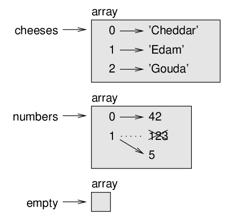
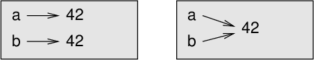
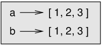
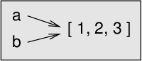
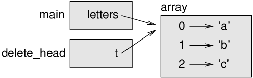

# Arrays

This chapter presents one of Ruby’s most useful built-in types, arrays.
You will also learn more about objects and what can happen when you have
more than one name for the same object.

## An array is a sequence

Like a string, an **array** is a sequence of values. In a
string, the values are characters; in an array, they can be any type.
The values in an array are called **elements** or sometimes
**items**.

There are several ways to create a new array; the simplest is to enclose
the elements in square brackets (`[` and `]`):

```ruby
[10, 20, 30, 40]
['crunchy frog', 'ram bladder', 'lark vomit']
```

The first example is an array of four integers. The second is an array
of three strings. The elements of an array don’t have to be the same
type. The following array contains a string, a float, an integer, and
(lo!) another array:

```ruby
['spam', 2.0, 5, [10, 20]]
```

An array within another array is **nested**.

An array that contains no elements is called an empty array; you can
create one with empty brackets, `[]`.

As you might expect, you can assign array values to variables:

```ruby
>> cheeses = ['Cheddar', 'Edam', 'Gouda']
=> ["Cheddar", "Edam", "Gouda"]
>> numbers = [42, 123]
=> [42, 123]
>> empty = []
=> []

>> puts "#{cheeses}, #{numbers}, #{empty}"
["Cheddar", "Edam", "Gouda"], [42, 123], []
=> nil
```

## Arrays are mutable

The syntax for accessing the elements of an array is the same as for
accessing the characters of a string—the bracket operator. The
expression inside the brackets specifies the index. Remember that the
indices start at 0:

```ruby
>> cheeses[0]
=> "Cheddar"
```

Like strings, arrays are mutable. When the bracket operator appears on
the left side of an assignment, it identifies the element of the array
that will be assigned.

```ruby
>> numbers = [42, 123]
=> [42, 123]
>> numbers[1] = 5
=> 5
>> numbers
=> [42, 5]
```

The one-eth element of `numbers`, which used to be 123, is
now 5.

Figure below shows the state diagram for
`cheeses`, `numbers` and `empty`:

  
*Figure 10.1: State diagram*

Arrays are represented by boxes with the word “array” outside and the
elements of the array inside. `cheeses` refers to an array
with three elements indexed 0, 1 and 2. `numbers` contains
two elements; the diagram shows that the value of the second element has
been reassigned from 123 to 5. `empty` refers to an array
with no elements.

Array indices work similar to string indices:

  - Any integer expression can be used as an index.

  - A floating expression used as an index gets rounded down to an
    integer.

  - If you try to read an element that does not exist, you get back
    `nil` value.

  - If you try to write to an element that does not exist, it gets added
    to the array, with `nil` values as filler if needed.

  - If an index has a negative value, it counts backward from the end of
    the array.

The `include?` method also works on arrays.

```ruby
>> cheeses = ['Cheddar', 'Edam', 'Gouda']
=> ["Cheddar", "Edam", "Gouda"]
>> cheeses.include?('Edam')
=> true
>> cheeses.include?('Brie')
=> false
```

## Traversing an array

To traverse the elements of an array, a `for` loop can be used:

```ruby
for cheese in cheeses
  puts cheese
end
```

More commonly, a `block` of statements is passed to one of
various array built-in methods, `each` for example:

```ruby
# preferred way for multiple statements
cheeses.each do |cheese|
  all_caps = cheese.upcase
  puts all_caps
end

# preferred way for single statement
cheeses.each { |cheese| puts cheese }
```

A significant difference between `for` loop and `block` form is variable
scope. Similar to what we saw for user defined methods in
[Methods chapter](./methods.md#variables-and-parameters-are-local),
variables defined inside the `block` are local. In above
example, `cheese` and `all_caps` are local and will raise exception if
called outside the `block`.

`for` loop and `each` method works well if you only need
to read the elements of the array. But if you want to write or update
the elements, you need the indices.

```ruby
# using for loop
for i in 0...numbers.length
  numbers[i] = numbers[i] * 2
end

# using each_index method
numbers.each_index { |i| numbers[i] = numbers[i] * 2 }
```

These traverse the array and update each element. Each time
through the loop `i` gets the index of the next element. The
assignment statement in the body uses `i` to read the old
value of the element and to assign the new value.

Looping over an empty array never runs the body:

```ruby
for x in []
  puts 'This never happens.'
end

[].each { puts 'This never happens.' }
```

Although an array can contain another array, the nested array still
counts as a single element. The length of this array is four:

```ruby
['spam', 1, ['Brie', 'Roquefort', 'Pol le Veq'], [1, 2, 3]]
```

## Array operations

The `+` operator concatenates arrays:

```ruby
>> a = [1, 2, 3]
=> [1, 2, 3]
>> b = [4, 5, 6]
=> [4, 5, 6]
>> c = a + b
=> [1, 2, 3, 4, 5, 6]
```

The `*` operator repeats an array a given number of times:

```ruby
>> [0] * 4
=> [0, 0, 0, 0]
>> [1, 2, 3] * 3
=> [1, 2, 3, 1, 2, 3, 1, 2, 3]
```

The first example repeats four times. The second example repeats the
array three times.

The `-` operator performs array difference:

```ruby
>> a = [2, 6, 12, 4, 5, 12]
=> [2, 6, 12, 4, 5, 12]
>> b = [12, 1, 5, 2]
=> [12, 1, 5, 2]
>> c = a - b
=> [6, 4]
```

## array slices

Slicing also works on arrays:

```ruby
>> t = ['a', 'b', 'c', 'd', 'e', 'f']
=> ["a", "b", "c", "d", "e", "f"]
>> t[1..2]
=> ["b", "c"]
>> t[0..3]
=> ["a", "b", "c", "d"]
>> t[4..-1]
=> ["e", "f"]
```

If you use `0` as first index, the slice starts at the
beginning. If you use `-1` as the second, the slice goes to
the end. So if you use both, the slice is a copy of the whole array.
Which is same as using the `clone` method.

```ruby
>> t[0..-1]
=> ["a", "b", "c", "d", "e", "f"]

>> t.clone
=> ["a", "b", "c", "d", "e", "f"]
```

Since arrays are mutable, it is often useful to make a copy before
performing operations that modify arrays.

Slicing used on the left side of an assignment can update multiple
elements:

```ruby
>> t = ['a', 'b', 'c', 'd', 'e', 'f']
=> ["a", "b", "c", "d", "e", "f"]
>> t[1..2] = ['x', 'y']
=> ["x", "y"]
>> t
=> ["a", "x", "y", "d", "e", "f"]
```

## Array methods

Ruby provides methods that operate on array. For example,
`append` adds new element(s) to the end of an array:

```ruby
>> t = ['a', 'b', 'c']
=> ["a", "b", "c"]
>> t.append('d')
=> ["a", "b", "c", "d"]
>> t.append('e', 'f', 'g')
=> ["a", "b", "c", "d", "e", "f", "g"]
```

As can be observed from this example, the `append` method modifies
the input array in-place.

To append all of the elements from another array, use **splat** operator,
which turns array into an argument list:

```ruby
>> t1 = ['a', 'b', 'c']
=> ["a", "b", "c"]
>> t2 = ['d', 'e']
=> ["d", "e"]
>> t1.append(*t2)
=> ["a", "b", "c", "d", "e"]
```

This example leaves `t2` unmodified.

`sort` arranges the elements of the array from low to high:

```ruby
>> t = ['d', 'c', 'e', 'b', 'a']
=> ["d", "c", "e", "b", "a"]
>> t.sort
=> ["a", "b", "c", "d", "e"]
>> t
=> ["d", "c", "e", "b", "a"]
```

Some array methods not ending with `!` in their name return an array
without modifying the original array. Similar to `?` special character we
saw in Section [Boolean methods](./fruitful_methods.md#boolean-methods),
`!` at end of method name is used to indicate that the
method modifies the object it was invoked upon.

So, use `sort!` to modify the array in-place:

```ruby
>> t = ['d', 'c', 'e', 'b', 'a']
=> ["d", "c", "e", "b", "a"]
>> t.sort!
=> ["a", "b", "c", "d", "e"]
>> t
=> ["a", "b", "c", "d", "e"]
```

## Map, filter and reduce

To add up all the numbers in an array, you can use a loop like this:

```ruby
def add_all(t)
  total = 0
  t.each { |x| total += x }
  return total
end
```

`total` is initialized to 0. Each time through the loop,
`x` gets one element from the array. The `+=`
operator provides a short way to update a variable. This
**augmented assignment statement**,

```ruby
total += x
```

is equivalent to

```ruby
total = total + x
```

As the loop runs, `total` accumulates the sum of the
elements; a variable used this way is sometimes called an
**accumulator**.

Note that since `total` was defined in same scope before
passing the block to `each` method, a local version of the
variable is not created inside the block.

Adding up the elements of an array is such a common operation that Ruby
provides it as a built-in method, `sum`:

```ruby
>> t = [1, 2, 3]
=> [1, 2, 3]
>> t.sum
=> 6
```

An operation like this that combines a sequence of elements into a
single value is sometimes called **reduce**.

Sometimes you want to traverse one array while building another. For
example, the following method takes an array of strings and returns a
new array that contains capitalized strings:

```ruby
def capitalize_all(t)
  res = []
  t.each { |s| res.append(s.capitalize) }
  return res
end
```

`res` is initialized with an empty array; each time through
the loop, we append the next element. So `res` is another
kind of accumulator.

An operation like `capitalize_all` is sometimes called a **map**
because it “maps” a method (in this case the method
`capitalize`) onto each of the elements in a sequence.

Another common operation is to select some of the elements from an array
and return a subarray. For example, the following method takes an array
of words and returns an array that contains words only made up of
uppercase letters:

```ruby
def only_upper(t)
  res = []
  t.each { |s| res.append(s) if !s.match?(/[^A-Z]/) }
  return res
end
```

An operation like `only_upper` is called a **filter**
because it selects some of the elements and filters out the others.

Most common array operations can be expressed as a combination of map,
filter and reduce.

## Deleting elements

There are several ways to delete elements from an array. If you know the
index of the element you want, you can use `slice!`:

```ruby
>> t = ['a', 'b', 'c']
=> ["a", "b", "c"]
>> x = t.slice!(1)
=> "b"
>> t
=> ["a", "c"]
>> x
=> "b"
```

`slice!` modifies the array and returns the element that was removed.

To remove more than one element, you can use slicing notation:

```ruby
>> t = ['a', 'b', 'c', 'd', 'e', 'f']
=> ["a", "b", "c", "d", "e", "f"]
>> t.slice!(1..4)
=> ["b", "c", "d", "e"]
>> t
=> ["a", "f"]
```

If you know the element you want to remove (but not the index), you can
use `delete`:

```ruby
>> t = ['a', 'b', 'c', 'b']
=> ["a", "b", "c", "b"]
>> t.delete('b')
=> "b"
>> t
=> ["a", "c"]
```

Observe that all elements matching the given argument is deleted. To
remove multiple elements, use the `-` operator as discussed
in Section [Array operations](#array-operations).

## Arrays and strings

A string is a sequence of characters and an array is a sequence of
values, but an array of characters is not the same as a string. To
convert from a string to an array of characters, you can use
`chars` method:

```ruby
>> s = 'spam'
=> "spam"
>> t = s.chars
=> ["s", "p", "a", "m"]
```

The `chars` method breaks a string into individual letters.
If you want to break a string into words, you can use the
`split` method:

```ruby
>> s = 'pining for the fjords'
=> "pining for the fjords"
>> t = s.split
=> ["pining", "for", "the", "fjords"]
```

An optional argument called a **delimiter** specifies which
characters to use as word boundaries. The following example uses a
hyphen as a delimiter:

```ruby
>> s = 'spam-spam-spam'
=> "spam-spam-spam"
>> delimiter = '-'
=> "-"
>> t = s.split(delimiter)
=> ["spam", "spam", "spam"]
```

`join` is the inverse of `split`. It concatenates the elements of an array.

```ruby
>> t = ['pining', 'for', 'the', 'fjords']
=> ["pining", "for", "the", "fjords"]
>> delimiter = ' '
=> " "
>> s = t.join(delimiter)
=> "pining for the fjords"

>> [1, 2, [3, 4]].join
=> "1234"
```

In this case the delimiter is a space character, so `join`
puts a space between elements. If you don’t pass an argument, the
default delimiter is empty string.

## Objects and values

If we run these assignment statements:

```ruby
a = 42
b = 42
```

We know that `a` and `b` both refer to an integer,
but we don’t know whether they refer to the *same* integer.
There are two possible states, as shown below.

  
*Figure 10.2: State diagram*

In one case, `a` and `b` refer to two different objects that have the
same value. In the second case, they refer to the same object.

To check whether two variables refer to the same object, you can use the
`equal?` method.

```ruby
>> a = 42
=> 42
>> b = 42
=> 42
>> a.equal?(b)
=> true
```

In this example, Ruby only created one integer object, and both
`a` and `b` refer to it. But when you create two arrays,
you get two objects:

```ruby
>> a = [1, 2, 3]
=> [1, 2, 3]
>> b = [1, 2, 3]
=> [1, 2, 3]
>> a.equal?(b)
=> false
```

So the state diagram looks like:

  
*Figure 10.3: State diagram*

In this case we would say that the two arrays are
**equivalent**, because they have the same elements, but
not **identical**, because they are not the same object. If
two objects are identical, they are also equivalent, but if they are
equivalent, they are not necessarily identical.

Until now, we have been using “object” and “value” interchangeably, but
it is more precise to say that an object has a value. If you evaluate
`[1, 2, 3]`, you get an array object whose value is a sequence of integers.
If another array has the same elements, we say it has the same value, but
it is not the same object.

## Aliasing

If `a` refers to an object and you assign `b = a`,
then both variables refer to the same object:

```ruby
>> a = [1, 2, 3]
=> [1, 2, 3]
>> b = a
=> [1, 2, 3]
>> b.equal?(a)
=> true
```

The state diagram now looks like:

  
*Figure 10.4: State diagram*

The association of a variable with an object is called a **reference**.
In this example, there are two references to the same object.

An object with more than one reference has more than one name, so we say
that the object is **aliased**.

If the aliased object is mutable, changes made with one alias affect the
other:

```ruby
>> b[0] = 42
=> 42
>> a
=> [42, 2, 3]
```

Although this behavior can be useful, it is error-prone. In general, it
is safer to avoid aliasing when you are working with mutable objects.

For immutable objects like integers, aliasing is not as much of a
problem. In this example:

```ruby
a = 42
b = 42
```

It almost never makes a difference whether `a` and
`b` refer to the same integer or not.

## Array arguments

When you pass an array to a method, the method gets a reference to the
array. If the method modifies the array, the caller sees the change. For
example, `delete_head` removes the first element from an array:

```ruby
def delete_head(t)
  t.slice!(0)
end
```

Here’s how it is used:

```ruby
>> letters = ['a', 'b', 'c']
=> ["a", "b", "c"]
>> delete_head(letters)
=> "a"
>> letters
=> ["b", "c"]
```

The parameter `t` and the variable `letters` are
aliases for the same object. The stack diagram looks like:

  
*Figure 10.5: Stack diagram*

Since the array is shared by two frames, I drew it between them.

It is important to distinguish between operations that modify arrays and
operations that create new arrays. For example, the `append`
method modifies an array, but the `+` operator creates a new
array.

Here’s an example using `append`:

```ruby
>> t1 = [1, 2]
=> [1, 2]
>> t2 = t1.append(3)
=> [1, 2, 3]
>> t1
=> [1, 2, 3]
>> t2
=> [1, 2, 3]
```

Here’s an example using the `+` operator:

```ruby
>> t3 = t1 + [4]
=> [1, 2, 3, 4]
>> t1
=> [1, 2, 3]
>> t3
=> [1, 2, 3, 4]
```

The result of the operator is a new array, and the original array is
unchanged.

This difference is important when you write methods that are supposed to
modify arrays. For example, this method *does not* delete
the head of an array:

```ruby
def bad_delete_head(t)
  t = t[1..-1]              # WRONG!
end
```

The slicing creates a new array and the assignment makes `t`
refer to it, but that doesn’t affect the caller.

```ruby
>> t4 = [1, 2, 3]
=> [1, 2, 3]
>> bad_delete_head(t4)
=> [2, 3]
>> t4
=> [1, 2, 3]
```

At the beginning of `bad_delete_head`, `t` and
`t4` refer to the same array. At the end, `t`
refers to a new array, but `t4` still refers to the original,
unmodified array.

An alternative is to write a method that creates and returns a new
array. For example, `tail` returns all but the first element
of an array:

```ruby
def tail(t)
  return t[1..-1]
end
```

This method leaves the original array unmodified. Here’s how it is used:

```ruby
>> letters = ['a', 'b', 'c']
=> ["a", "b", "c"]
>> rest = tail(letters)
=> ["b", "c"]
>> rest
=> ["b", "c"]
```

## Debugging

Careless use of arrays (and other mutable objects) can lead to long
hours of debugging. Here are some common pitfalls and ways to avoid
them:

1.  Array methods like `sort` and `slice` have two
    versions, one that returns the result and the other having
    `!` in their name to indicate argument is modified
    in-place. Methods like `append` and `delete`
    have only one version that always modify the argument.
    
    If you are used to writing array code like this:
    
    ```ruby
    numbers.append(4)
    ```
    
    It is tempting to write array code for in-place sorting like this:
    
    ```ruby
    numbers.sort           # WRONG!
    ```
    
    Because `sort` doesn’t modify array in-place, the next
    operation you perform with `numbers` is likely to fail.
    
    Before using array methods and operators, you should read the
    documentation carefully and then test them in interactive mode.

2.  Pick an idiom and stick with it.
    
    Part of the problem with arrays is that there are too many ways to
    do things. For example, to remove an element from an array, you can
    use `pop`, `delete`, `slice!`, or `-` operator.
    
    To add an element, you can use the `append` method or the
    `+` operator. Assuming that `t` is an array
    and `x` is an array element, these are correct:
    
    ```ruby
    t.append(x)
    t = t + [x]
    t += [x]
    ```
    
    And these are wrong:
    
    ```ruby
    t.append([x])          # WRONG!
    t + [x]                # WRONG!
    t = t + x              # WRONG!
    ```
    
    Try out each of these examples in interactive mode to make sure you
    understand what they do. Notice that only the last one causes a
    runtime error; the other two are legal, but they do the wrong thing.

3.  Make copies to avoid aliasing.
    
    If you want to use a method like `delete` that modifies
    the argument, but you need to keep the original array as well, you
    can make a copy.
    
    ```ruby
    >> t = [3, 1, 2]
    => [3, 1, 2]
    >> t2 = t.clone
    => [3, 1, 2]
    >> t2.delete(1)
    => 1
    >> t
    => [3, 1, 2]
    >> t2
    => [3, 2]
    ```

## Glossary

  - **array**:  
    A sequence of values.

  - **element**:  
    One of the values in an array (or other sequence), also called
    items.

  - **nested array**:  
    An array that is an element of another array.

  - **accumulator**:  
    A variable used in a loop to add up or accumulate a result.

  - **augmented assignment**:  
    A statement that updates the value of a variable using an operator
    like `+=`.

  - **reduce**:  
    A processing pattern that traverses a sequence and accumulates the
    elements into a single result.

  - **map**:  
    A processing pattern that traverses a sequence and performs an
    operation on each element.

  - **filter**:  
    A processing pattern that traverses an array and selects the
    elements that satisfy some criterion.

  - **object**:  
    Something a variable can refer to. An object has a type and a value.

  - **equivalent**:  
    Having the same value.

  - **identical**:  
    Being the same object (which implies equivalence).

  - **reference**:  
    The association between a variable and its value.

  - **aliasing**:  
    A circumstance where two or more variables refer to the same object.

  - **delimiter**:  
    A character or string used to indicate where a string should be
    split.

## Exercises

**Exercise 1**  
Write a method called `nested_sum` that takes an array of arrays of
integers and adds up the elements from all of the nested arrays. For
example:

```ruby
>> t = [[1, 2], [3], [4, 5, 6]]
=> [[1, 2], [3], [4, 5, 6]]
>> nested_sum(t)
=> 21
```

**Exercise 2**  
Write a method called `cumsum` that takes an array of numbers
and returns the cumulative sum; that is, a new array where the `i`th
element is the sum of the first `i+1` elements from the original
array. For example:

```ruby
>> t = [1, 2, 3]
=> [1, 2, 3]
>> cumsum(t)
[1, 3, 6]
```

**Exercise 3**  
Write a method called `middle` that takes an array and returns a new
array that contains all but the first and last elements. For example:

```ruby
>> t = [1, 2, 3, 4]
=> [1, 2, 3, 4]
>> middle(t)
[2, 3]
```

**Exercise 4**  
Write a method called `chop!` that takes an array, modifies it by
removing the first and last elements, and returns `nil`. For
example:

```ruby
>> t = [1, 2, 3, 4]
=> [1, 2, 3, 4]
>> chop!(t)
=> nil
>> t
=> [2, 3]
```

**Exercise 5**  
Write a method called `sorted?` that takes an array as a parameter and
returns `true` if the array is sorted in ascending order and
`false` otherwise. For example:

```ruby
>> sorted?([1, 2, 2])
=> true
>> sorted?(['b', 'a'])
=> false
```

**Exercise 6**  
Two words are anagrams if you can rearrange the letters from one to
spell the other. Write a method called `anagram?` that takes two strings
and returns `true` if they are anagrams.

**Exercise 7**  
Write a method called `has_duplicates?` that takes an array and returns
`true` if there is any element that appears more than once.
It should not modify the original array.

**Exercise 8**  
This exercise pertains to the so-called Birthday Paradox, which you can
read about at https://en.wikipedia.org/wiki/Birthday_paradox.

If there are 23 students in your class, what are the chances that two of
you have the same birthday? You can estimate this probability by
generating random samples of 23 birthdays and checking for matches.
Hint: you can generate random birthdays with the `rand`
method.

**Exercise 9**  
Write a method that reads the file `words.txt` and builds an
array with one element per word. Write two versions of this method, one
using the `append` method and the other using the idiom
`t = t + [x]`. Which one takes longer to run? Why?

**Exercise 10**  
To check whether a word is in the word array, you could use the
`include?` method, but it would be slow because it searches
through the words in order.

Because the words are in alphabetical order, we can speed things up with
a bisection search (also known as binary search), which is similar to
what you do when you look a word up in the dictionary. You start in the
middle and check to see whether the word you are looking for comes
before the word in the middle of the array. If so, you search the first
half of the array the same way. Otherwise you search the second half.

Either way, you cut the remaining search space in half. If the word
array has 113,809 words, it will take about 17 steps to find the word or
conclude that it’s not there.

Write a method called `in_bisect?` that takes a sorted array and a
target value and returns `true` if the word is in the array
and `false` if it’s not.

Or you could read the documentation of the `bsearch` method
and use that!

**Exercise 11**  
Two words are a “reverse pair” if each is the reverse of the other.
Write a program that finds all the reverse pairs in the word array.

**Exercise 12**  
Two words “interlock” if taking alternating letters from each forms a
new word. For example, “shoe” and “cold” interlock to form “schooled”.
Credit: This exercise is inspired by an example at
http://puzzlers.org.

1.  Write a program that finds all pairs of words that interlock. Hint:
    don’t enumerate all pairs!

2.  Can you find any words that are three-way interlocked; that is,
    every third letter forms a word, starting from the first, second or
    third?

