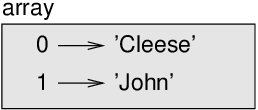
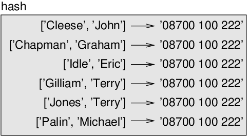

# Arrays and Hashes

This chapter presents some more array operations, and then shows how
arrays and hashes work together. I also present a useful feature for
variable-length argument lists, the gather and scatter operators.

## Array comparison

For arrays, the **spaceship** operator `<=>`
starts by comparing the first element from each array. If they are
equal, it goes on to the next elements, and so on, until it finds
elements that differ. Subsequent elements are not considered (even if
they are really big).

```ruby
>> [0, 1, 2] <=> [0, 1, 2]
=> 0

>> [0, 1, 2] <=> [0, 3, 4]
=> -1
>> [0, 1, 2000000] <=> [0, 3, 4]
=> -1

>> [0, 1, 2000000] <=> [0, 1, 4]
=> 1
>> [0, 2] <=> [0, 1, 2]
=> 1
```

The output is `0` if the arrays are identical. `-1` to indicate that the
first array is *less than* the second one. And `1` otherwise. The spaceship
operator, or an equivalent logic, is useful to customize `sort` method.

## Array freezing

To render an array partially immutable, use `freeze` method.
If you try to assign a new value to one of the elements of frozen array,
you get an error:

```ruby
>> t = ['a', 'b', 'c', 'd', 'e'].freeze
=> ["a", "b", "c", "d", "e"]
>> t[0] = 'A'
FrozenError (can't modify frozen Array)
```

But the individual elements of the array themselves are not frozen,
mutable elements can still be modified:

```ruby
>> t[0].upcase!
=> "A"
>> t
=> ["A", "b", "c", "d", "e"]
```

## Array assignment

It is often useful to swap the values of two variables. With
conventional assignments, you have to use a temporary variable. For
example, to swap `a` and `b`:

```ruby
temp = a
a = b
b = temp
```

This solution is cumbersome; **array assignment** is more elegant:

```ruby
a, b = b, a
```

The left side is an array of variables; the right side is an array of
expressions. Each value is assigned to its respective variable. All the
expressions on the right side are evaluated before any of the
assignments. Enclosing the right side expressions within square brackets
is optional.

The number of variables on the left and the number of values on the
right need not be the same. Extra values are ignored and extra variables
are assigned `nil`:

```ruby
>> a, b, c = 1, 2
=> [1, 2]

>> [a, b, c]
=> [1, 2, nil]
```

Another example - to split an email address into a user name and a
domain, you could write:

```ruby
>> addr = 'gem@ruby.org'
=> "gem@ruby.org"
>> uname, domain = addr.split('@')
=> ["gem", "ruby.org"]
```

The return value from `split` is an array with two elements;
the first element is assigned to `uname`, the second to `domain`.

```ruby
>> uname
=> "gem"
>> domain
=> "ruby.org"
```

## Multiple return values

Strictly speaking, a method can only return one value, but if the value
is an array, the effect is the same as returning multiple values. For
example, if you want to divide two integers and compute the quotient and
remainder, it is inefficient to compute `x/y` and then
`x%y`. It is better to compute them both at the same time.

The built-in numeric method `divmod` returns an array of two values, the
quotient and remainder. You can store the result as an array:

```ruby
>> t = 7.divmod(3)
=> [2, 1]
```

Or use array assignment to store the elements separately:

```ruby
>> quot, rem = 7.divmod(3)
=> [2, 1]
>> quot
=> 2
>> rem
=> 1
```

Here is an example of a method that returns an array:

```ruby
def min_max(t)
  return t.min, t.max
end
```

`max` and `min` are array methods that find the
largest and smallest elements of an array. `min_max` computes both and
returns an array of two values.

## Variable-length argument array

Methods can take a variable number of arguments. A parameter name that
begins with `*` **gathers** arguments into an array. For example,
`printall` takes any number of arguments and prints them:

```ruby
def printall(*args)
  puts args.inspect
end
```

The gather parameter can have any name you like, but `args`
is conventional. `inspect` method is used here to get string
representation of array, otherwise `puts` would recursively
print each element of array on separate line. Here’s how the
method works:

```ruby
>> printall(1, 2.0, '3')
[1, 2.0, "3"]

>> puts [1, 2.0, "3"]
1
2.0
3

>> puts [1, 2.0, "3"].inspect
[1, 2.0, "3"]
```

The complement of gather is **scatter**. If you have a
sequence of values and you want to pass it to a method as multiple
arguments, you can use the **splat** operator. For example,
`values_at` method doesn’t work with an array:

```ruby
>> primes = [2, 3, 5, 7, 11, 13]
=> [2, 3, 5, 7, 11, 13]
>> idx = [3, 0, -1]
=> [3, 0, -1]
>> primes.values_at(idx)
TypeError (no implicit conversion of Array into Integer)
```

But if you scatter the array, it works:

```ruby
>> primes.values_at(*idx)
=> [7, 2, 13]
```

As an exercise, write a method called `sumall` that takes any
number of arguments and returns their sum.

## Zipping

The `zip` array method takes one or more arguments and
returns an array of arrays where each array element contains one element
from each of the input arguments. The name of the method refers to a
zipper, which joins and interleaves two rows of teeth.

This example zips a string and an array:

```ruby
>> s = 'abc'
=> "abc"
>> t = [0, 1, 2]
=> [0, 1, 2]

>> s.chars
=> ["a", "b", "c"]
>> s.chars.zip(t)
=> [["a", 0], ["b", 1], ["c", 2]]
```

The most common use of `zip` is in a loop:

```ruby
>> for pair in s.chars.zip(t)
>>   puts pair.inspect
>> end
["a", 0]
["b", 1]
["c", 2]

>> s.chars.zip(t) { |pair| puts pair.inspect }
["a", 0]
["b", 1]
["c", 2]
```

If the arguments are not the same length, the result has the length of
the array on which `zip` is invoked. `nil` value
is used as filler if required.

```ruby
>> 'Hi'.chars.zip('Hello'.chars)
=> [["H", "H"], ["i", "e"]]

>> 'Anne'.chars.zip('Elk'.chars)
=> [["A", "E"], ["n", "l"], ["n", "k"], ["e", nil]]
```

You can use array assignment in a loop to traverse an array of arrays:

```ruby
t = [['a', 0], ['b', 1], ['c', 2]]
for letter, number in t
  puts "#{number} #{letter}"
end

t.each { |letter, number| puts "#{number} #{letter}" }
```

Each time through the loop, we get an array as value. Array assignment
then assigns the elements to `letter` and
`number`. The output of either looping technique is:

```
0 a
1 b
2 c
```

If you combine `zip`, loop and array assignment, you get a
useful idiom for traversing two (or more) arrays at the same time. For
example, `has_match?` takes two arrays, `t1` and
`t2`, and returns `true` if there is an index
`i` such that `t1[i] == t2[i]`:

```ruby
def has_match?(t1, t2)
  for x, y in t1.zip(t2)
    return true if x == y
  end
  return false
end
```

If you need to traverse the elements of an array and their indices, you
can use the method `each_with_index`:

```ruby
'abc'.chars.each_with_index do |index, element|
  puts "#{index} #{element}"
end
```

The result from `each_with_index` is an
`Enumerator` object, which iterates a sequence of pairs; each
pair contains an index (starting from 0) and an element from the given
sequence. In this example, the output is

```
0 a
1 b
2 c
```

Again.

## to_a and to_h

Hashes have a method called `to_a` that returns an array of
arrays, where each element is a key-value pair.

```ruby
>> h = { 'a' => 0, 'b' => 1, 'c' => 2 }
=> {"a"=>0, "b"=>1, "c"=>2}
>> t = h.to_a
=> [["a", 0], ["b", 1], ["c", 2]]
```

Going in the other direction, you can use an array of arrays to
initialize a new hash:

```ruby
>> t = [['a', 0], ['b', 1], ['c', 2]]
=> [["a", 0], ["b", 1], ["c", 2]]
>> h = t.to_h
=> {"a"=>0, "b"=>1, "c"=>2}
```

## Array as a hash key

Arrays as keys in hashes can be useful. For example, a telephone
directory might map from last-name, first-name pairs to telephone
numbers. Assuming that we have defined `last`,
`first` and `number`, we could write:

```ruby
directory[[last, first]] = number
```

The expression in brackets is an array used as a key. To partially make
it immutable, use `[last, first].freeze`. We could use array assignment
to traverse this hash.

```ruby
for key, value in directory
  puts "#{key[1]} #{key[0]} #{value}"
end
```

This loop traverses the key-value pairs in `directory`. It
assigns the elements of each pair to `key` and
`value`, then prints first-name, last-name and corresponding
telephone number.

There are two ways to represent arrays in a state diagram. The more
detailed version shows the indices and elements. For example, the array
`['Cleese', 'John']` would appear as shown below:

  
*Figure 12.1: State diagram*

But in a larger diagram you might want to leave out the details. For
example, a diagram of the telephone directory might appear as
shown below:

  
*Figure 12.2: State diagram*

Here the arrays are shown using Ruby syntax as a graphical shorthand.
The telephone number in the diagram is the complaints line for the BBC,
so please don’t call it.

## Debugging

Arrays and hashes are examples of **data structures**; in
this chapter we are starting to see compound data structures, like array
of arrays, or hashes that contain arrays as keys and arrays as values.
Compound data structures are useful, but they are prone to what I call
**shape errors**; that is, errors caused when a data
structure has the wrong type, size, or structure. For example, if you
are expecting an array with one integer and I give you a plain old
integer (not in an array), it won’t work.

To help debug these kinds of errors, I have written a script called
`structshape` that provides a method, also called `structshape`, that
takes Array/Set/Hash data structure as an argument and returns a string
that summarizes its shape. You can view it from
https://github.com/learnbyexample/ThinkRubyBuild/blob/master/code/structshape.rb

After creating a local copy of this program, you can use it as a
stand-alone or load it inside another program using **require statement**.

Here’s the result for a simple array:

```ruby
>> require './structshape'
=> true

>> t = [1, 2, 3]
=> [1, 2, 3]
>> structshape(t)
=> "Array of 3 Integer"
```

A fancier program might write “Array of 3 Integer*s*”, but
it was easier not to deal with plurals. Here’s an array of arrays:

```ruby
>> t2 = [[1,2], [3,4], [5,6]]
=> [[1, 2], [3, 4], [5, 6]]
>> structshape(t2)
=> "Array of 3 Array of 2 Integer"
```

If the elements of the array are not the same type,
`structshape` groups them, in order, by type:

```ruby
>> t3 = [1, 2, 3, 4.0, '5', '6', [7], [8], 9]
=> [1, 2, 3, 4.0, "5", "6", [7], [8], 9]
>> structshape(t3)
=> "Array of (3 Integer, Float, 2 String, 2 Array of Integer, Integer)"
```

Here’s an array of arrays with different types:

```ruby
>> s = 'abc'.chars
=> ["a", "b", "c"]
>> a2 = t.zip(s)
=> [[1, "a"], [2, "b"], [3, "c"]]
>> structshape(a2)
=> "Array of 3 Array of (Integer, String)"
```

And here’s a hash with 3 items that map integers to strings.

```ruby
>> h = a2.to_h
=> {1=>"a", 2=>"b", 3=>"c"}
>> structshape(h)
=> "Hash of 3 Integer->String"
```

If you are having trouble keeping track of your data structures,
`structshape` can help.

## Glossary

  - **array assignment**:  
    An assignment with a sequence on the right side and an array of
    variables on the left. The right side is evaluated and then its
    elements are assigned to the variables on the left.

  - **gather**:  
    The operation of assembling a variable-length argument array.

  - **scatter**:  
    The operation of treating a sequence as an array of arguments.

  - **data structure**:  
    A collection of related values, often organized in arrays, hashes,
    sets, etc.

  - **shape error**:  
    An error caused because a value has the wrong shape; that is, the
    wrong type or size.

## Exercises

**Exercise 1**  
Write a method called `most_frequent` that takes a string and prints the
letters in decreasing order of frequency. Find text samples from several
different languages and see how letter frequency varies between
languages. Compare your results with the tables at
https://en.wikipedia.org/wiki/Letter_frequencies.

**Exercise 2**  
More anagrams!

1.  Write a program that reads a word list from a file (see Section
    [Reading word lists](./case_study_word_play.md#Reading-word-lists))
    and prints all the sets of words that are anagrams.
    
    Here is an example of what the output might look like:
    
    ```ruby
    ['deltas', 'desalt', 'lasted', 'salted', 'slated', 'staled']
    ['retainers', 'ternaries']
    ['generating', 'greatening']
    ['resmelts', 'smelters', 'termless']
    ```
    
    Hint: you might want to build a hash that maps from a collection of
    letters to a list of words that can be spelled with those letters.
    The question is, how can you represent the collection of letters in
    a way that can be used as a key?

2.  Modify the previous program so that it prints the longest list of
    anagrams first, followed by the second longest, and so on.

3.  In Scrabble a “bingo” is when you play all seven tiles in your rack,
    along with a letter on the board, to form an eight-letter word. What
    collection of 8 letters forms the most possible bingos? Hint: there
    are seven.

**Exercise 3**  
Two words form a “metathesis pair” if you can transform one into the
other by swapping two letters; for example, “converse” and “conserve”.
Write a program that finds all of the metathesis pairs in the
dictionary. Hint: don’t test all pairs of words, and don’t test all
possible swaps. Credit: This exercise is inspired by an example at
http://puzzlers.org.

**Exercise 4**  
Here’s another Car Talk Puzzler
(https://www.cartalk.com/puzzler/browse):

> What is the longest English word, that remains a valid English word,
> as you remove its letters one at a time?
> 
> Now, letters can be removed from either end, or the middle, but you
> can’t rearrange any of the letters. Every time you drop a letter, you
> wind up with another English word. If you do that, you’re eventually
> going to wind up with one letter and that too is going to be an
> English word—one that’s found in the dictionary. I want to know what’s
> the longest word and how many letters does it have?
> 
> I’m going to give you a little modest example: Sprite. Ok? You start
> off with sprite, you take a letter off, one from the interior of the
> word, take the r away, and we’re left with the word spite, then we
> take the e off the end, we’re left with spit, we take the s off, we’re
> left with pit, it, and I.

Write a program to find all words that can be reduced in this way, and
then find the longest one.

This exercise is a little more challenging than most, so here are some
suggestions:

1.  You might want to write a method that takes a word and computes an
    array of all the words that can be formed by removing one letter.
    These are the “children” of the word.

2.  Recursively, a word is reducible if any of its children are
    reducible. As a base case, you can consider the empty string
    reducible.

3.  The wordlist I provided, `words.txt`, doesn’t contain
    single letter words. So you might want to add “I”, “a”, and the
    empty string.

4.  To improve the performance of your program, you might want to
    memoize the words that are known to be reducible.

