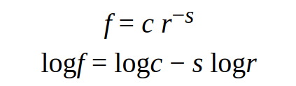

# Case study: data structure selection

At this point you have learned about Ruby’s core data structures, and
you have seen some of the algorithms that use them. If you would like to
know more about algorithms, this might be a good time to read
Chapter [Analysis of Algorithms](./analysis_of_algorithms.md).
But you don’t have to read it before you go on; you can read it
whenever you are interested.

This chapter presents a case study with exercises that let you think
about choosing data structures and practice using them.

## Word frequency analysis

As usual, you should at least attempt the exercises before you read my
solutions.

**Exercise 1**  
Write a program that reads a file, breaks each line into words, strips
punctuation from the words, and converts them to lowercase.

Hint: read the documentation for string methods `split`,
`sub`, `gsub` and the various methods for changing case.

Identifying and removing all punctuation characters from start and end
of string would be cumbersome to do in a loop. For such cases
**regular expressions** come in handy as shown in the example below:

```ruby
>> s = '$%&hello>?@['
=> "$%&hello>?@["

# remove all punctuation characters from start of string
>> s.sub(/\A[[:punct:]]+/, '')
=> "hello>?@["
# remove all punctuation characters from end of string as well
>> s.sub(/\A[[:punct:]]+/, '').sub(/[[:punct:]]+\z/, '')
=> "hello"

# can be accomplished in one-shot using gsub instead of sub
>> s.gsub(/\A[[:punct:]]+|[[:punct:]]+\z/, '')
=> "hello"
```

If you are curious to learn more about regular expressions, see
https://github.com/learnbyexample/Ruby_Scripting/blob/master/chapters/Regular_expressions.md

**Exercise 2**  
Go to Project Gutenberg (https://www.gutenberg.org/ebooks/) and
download your favorite out-of-copyright book in plain text format.

Modify your program from the previous exercise to read the book you
downloaded, skip over the header information at the beginning of the
file, and process the rest of the words as before.

Then modify the program to count the total number of words in the book,
and the number of times each word is used.

Print the number of different words used in the book. Compare different
books by different authors, written in different eras. Which author uses
the most extensive vocabulary?

**Exercise 3**  
Modify the program from the previous exercise to print the 20 most
frequently used words in the book.

**Exercise 4**  
Modify the previous program to read a word list (see Section
[Reading word lists](./case_study_word_play.md#Reading-word-lists))
and then print all the words in the book that are not in the word list.
How many of them are typos? How many of them are common words that
*should* be in the word list, and how many of them are really obscure?

## Random numbers

Given the same inputs, most computer programs generate the same outputs
every time, so they are said to be **deterministic**.
Determinism is usually a good thing, since we expect the same
calculation to yield the same result. For some applications, though, we
want the computer to be unpredictable. Games are an obvious example, but
there are more.

Making a program truly nondeterministic turns out to be difficult, but
there are ways to make it at least seem nondeterministic. One of them is
to use algorithms that generate **pseudorandom** numbers.
Pseudorandom (which I will simply call “random” from here on) numbers
are not truly random because they are generated by a deterministic
computation, but just by looking at the numbers it is all but impossible
to distinguish them from random.

The method `rand` (provided by Kernel module) returns a
random float between 0.0 and 1.0 (including 0.0 but not 1.0). Each time
you call `rand`, you get the next number in a long series. To
see a sample, run this loop:

```ruby
>> 7.times { puts rand }
0.40798564208349464
0.7270919970198657
0.622358165946798
0.8834127252800146
0.4859189422217032
0.6379159020838661
0.4033801832939934
```

The `rand` method also accepts a number or range object:

```ruby
# integer number between 0 and 2
>> rand(3)
=> 2

# integer number between 5 and 10
>> rand(5..10)
=> 9

# floating-point number between 1.3 and 1.5
>> rand(1.3..1.5)
=> 1.3902344746797168

# integer number between 42 and 100, excluding 100
>> rand(42...100)
=> 61
```

To choose element(s) from an array at random, you can use `sample`:

```ruby
>> t = [1, 2, 3, 4, 5]
=> [1, 2, 3, 4, 5]
>> t.sample
=> 2
>> t.sample(3)
=> [3, 4, 2]
```

**Exercise 5**  
Write a method named `sample_from_hist` that takes a histogram as defined
in Section 
[Hash as a collection of counters](./hashes.md#hash-as-a-collection-of-counters)
and returns a random value from the histogram, chosen with probability in
proportion to frequency. For example, for this histogram:

```ruby
>> t = ['a', 'a', 'b']
=> ["a", "a", "b"]
>> hist = histogram(t)
=> {"a"=>2, "b"=>1}
```

your method should return `'a'` with probability `2/3` and `'b'` with
probability `1/3`.

## Word histogram

You should attempt the previous exercises before you go on. You will
also need to download https://www.gutenberg.org/files/158/158.txt and
save it as `emma.txt`.

Here is a program that reads a file and builds a histogram of the words
in the file:

```ruby
def process_file(filename)
  hist = Hash.new(0)
  fp = File.open(filename)
  for line in fp
    process_line(line, hist)
  end
  return hist
end

def process_line(line, hist)
  line.gsub!('-', ' ')

  for word in line.split
    word.gsub!(/\A[[:punct:]]+|[[:punct:]]+\z/, '')
    word.downcase!
    hist[word] += 1
  end
end

hist = process_file('emma.txt')
```

This program reads `emma.txt`, which contains the text of
*Emma* by Jane Austen.

`process_file` loops through the lines of the file, passing them one at
a time to `process_line`. The histogram `hist` is being used
as an accumulator.

`process_line` uses the string method `gsub!` to replace all
occurrences of hyphens with spaces. Recall that methods with
`!` suffix indicates that the method modifies the argument
in-place. The modified line is then broken based on whitespace into
array of strings using `split` method. It traverses the array
of words and uses **regular expression** and
`downcase!` to remove punctuation and convert to lower case.
(It is a shorthand to say that strings are “converted”)

Finally, `process_line` updates the histogram by creating a new item or
incrementing an existing one.

To count the total number of words in the file, we can add up the
frequencies in the histogram:

```ruby
def total_words(hist)
  return hist.values.sum
end
```

The number of different words is just the number of items in the
dictionary:

```ruby
def different_words(hist)
  return hist.size
end
```

Here is some code to print the results:

```ruby
puts "Total number of words: #{total_words(hist)}"
puts "Number of different words: #{different_words(hist)}"
```

And the results:

```
Total number of words: 164112
Number of different words: 7526
```

The numbers shown above may be different for you if the source file gets
updated.

## Most common words

To find the most common words, we can make an array of arrays, where
each element contains a word and its frequency, and sort it.

The following method takes a histogram and returns an array of
frequency-word pairs:

```ruby
def most_common(hist)
  t = []
  hist.each { |key, value| t.append([value, key]) }

  t.sort!
  return t.reverse
end
```

In each element, the frequency appears first, so the resulting array is
sorted by frequency. Here is a loop that prints the ten most common
words:

```ruby
t = most_common(hist)
puts 'The most common words are:'
t[0..9].each { |freq, word| puts "#{word}\t#{freq}" }
```

I use a tab character as a “separator”, rather than a space, so the
second column is lined up. Here are the results from *Emma*:

```
The most common words are:
the     5380
to      5322
and     4965
of      4412
i       3191
a       3187
it      2544
her     2483
was     2401
she     2364
```

This code can be simplified by passing a block to `sort` or
`sort_by` methods directly on hash object. The result would
be an array of arrays with each element as word-frequency pair.

```ruby
hist.sort { |a, b| b[1] <=> a[1] }
hist.sort_by { |k, v| -v }
```

If you are curious, you can read about these methods at
https://github.com/learnbyexample/Ruby_Scripting/blob/master/chapters/Arrays.md#sorting-and-company.

## Optional parameters

We have seen built-in methods that take optional arguments. It is
possible to write programmer-defined methods with optional arguments,
too. For example, here is a method that prints the most common words in
a histogram

```ruby
def print_most_common(hist, num=10)
  t = most_common(hist)
  puts 'The most common words are:'
  t[0...num].each { |freq, word| puts "#{word}\t#{freq}" }
end
```

The first parameter is required; the second is optional. The
**default value** of `num` is 10.

If you only provide one argument:

```ruby
print_most_common(hist)
```

`num` gets the default value. If you provide two arguments:

```ruby
print_most_common(hist, 20)
```

`num` gets the value of the argument instead. In other words,
the optional argument **overrides** the default value.

If a method has both required and optional parameters, all the optional
parameters have to be grouped together, and are usually placed after the
required ones.

## Hash subtraction

Finding the words from the book that are not in the word list from
`words.txt` is a problem you might recognize as set
subtraction; that is, we want to find all the words from one set (the
words in the book) that are not in the other (the words in the list).

`subtract` takes hashes `h1` and `h2`
and returns a new hash that contains all the keys from `h1`
that are not in `h2`. Since we don’t really care about the
values, we set them all to `nil`.

```ruby
def subtract(h1, h2)
  res = Hash.new
  h1.keys.each do |key|
    res[key] = nil if !h2.include?(key)
  end
  return res
end
```

To find the words in the book that are not in `words.txt`, we
can use `process_file` to build a histogram for `words.txt`,
and then subtract:

```ruby
words = process_file('words.txt')
diff = subtract(hist, words)

puts "Words in the book that aren't in the word list:"
diff.each { |word, value| print "#{word} " }
```

Here are some of the results from *Emma*:

```
rencontre jane's blanche woodhouses disingenuousness 
friend's venice apartment ...
```

Some of these words are names and possessives. Others, like “rencontre”,
are no longer in common use. But a few are common words that should
really be in the list!

**Exercise 6**  
Ruby provides a data structure called `Set` that provides
many common set operations. You can read about them in
Section [Sets](./the_goodies.md#sets), or read the documentation at
https://ruby-doc.org/stdlib-2.5.0/libdoc/set/rdoc/Set.html.

Write a program that uses set subtraction to find words in the book that
are not in the word list.

## Random words

To choose a random word from the histogram, the simplest algorithm is to
build an array with multiple copies of each word, according to the
observed frequency, and then choose from the array:

```ruby
def random_word(h)
  t = []
  h.each { |word, freq| t.concat([word] * freq) }

  return t.sample
end
```

The expression `* freq` creates an array with `freq` copies of the string
`word`. The `concat` method is similar to `append` except that the
argument is an array.

This algorithm works, but it is not very efficient; each time you choose
a random word, it rebuilds the array, which is as big as the original
book. An obvious improvement is to build the array once and then make
multiple selections, but the array is still big.

An alternative is:

1.  Use `keys` to get an array of the words in the book.

2.  Build an array that contains the cumulative sum of the word
    frequencies (see Exercise [cumulative](./arrays.md#exercises)). The last
    item in this array is the total number of words in the book, `n`.

3.  Choose a random number from 1 to `n`. Use a bisection search (See
    Exercise [bisection](./arrays.md#exercises)) to find the index where the
    random number would be inserted in the cumulative sum.

4.  Use the index to find the corresponding word in the word list.

**Exercise 7**  
Write a program that uses this algorithm to choose a random word from
the book.

## Markov analysis

If you choose words from the book at random, you can get a sense of the
vocabulary, but you probably won’t get a sentence:

```
this the small regard harriet which knightley's it most things
```

A series of random words seldom makes sense because there is no
relationship between successive words. For example, in a real sentence
you would expect an article like “the” to be followed by an adjective or
a noun, and probably not a verb or adverb.

One way to measure these kinds of relationships is Markov analysis,
which characterizes, for a given sequence of words, the probability of
the words that might come next. For example, the song *Eric, the
Half a Bee* begins:

> Half a bee, philosophically,  
> Must, ipso facto, half not be.  
> But half the bee has got to be  
> Vis a vis, its entity. D’you see?  
>   
> But can a bee be said to be  
> Or not to be an entire bee  
> When half the bee is not a bee  
> Due to some ancient injury?  

In this text, the phrase “half the” is always followed by the word
“bee”, but the phrase “the bee” might be followed by either “has” or
“is”.

The result of Markov analysis is a mapping from each prefix (like “half
the” and “the bee”) to all possible suffixes (like “has” and “is”).

Given this mapping, you can generate a random text by starting with any
prefix and choosing at random from the possible suffixes. Next, you can
combine the end of the prefix and the new suffix to form the next
prefix, and repeat.

For example, if you start with the prefix “Half a”, then the next word
has to be “bee”, because the prefix only appears once in the text. The
next prefix is “a bee”, so the next suffix might be “philosophically”,
“be” or “due”.

In this example the length of the prefix is always two, but you can do
Markov analysis with any prefix length.

**Exercise 8**  
Markov analysis:

1.  Write a program to read a text from a file and perform Markov
    analysis. The result should be a hash that maps from prefixes to a
    collection of possible suffixes. The collection might be an array,
    or hash; it is up to you to make an appropriate choice. You can test
    your program with prefix length two, but you should write the
    program in a way that makes it easy to try other lengths.

2.  Add a method to the previous program to generate random text based
    on the Markov analysis. Here is an example from *Emma*
    with prefix length 2:
    
    > He was very clever, be it sweetness or be angry, ashamed or only
    > amused, at such a stroke. She had never thought of Hannah till you
    > were never meant for me?" "I cannot make speeches, Emma:" he soon
    > cut it all himself.
    
    For this example, I left the punctuation attached to the words. The
    result is almost syntactically correct, but not quite. Semantically,
    it almost makes sense, but not quite.
    
    What happens if you increase the prefix length? Does the random text
    make more sense?

3.  Once your program is working, you might want to try a mash-up: if
    you combine text from two or more books, the random text you
    generate will blend the vocabulary and phrases from the sources in
    interesting ways.

Credit: This case study is based on an example from Kernighan and Pike,
*The Practice of Programming*, Addison-Wesley, 1999.

You should attempt this exercise before you go on. You will also need
https://www.gutenberg.org/files/158/158.txt that was downloaded and
saved before as `emma.txt`.

## Data structures

Using Markov analysis to generate random text is fun, but there is also
a point to this exercise: data structure selection. In your solution to
the previous exercises, you had to choose:

  - How to represent the prefixes.

  - How to represent the collection of possible suffixes.

  - How to represent the mapping from each prefix to the collection of
    possible suffixes.

The last one is easy: a hash is the obvious choice for a mapping from
keys to corresponding values.

For the prefixes, the most obvious options are string, or array of
strings.

For the suffixes, one option is an array; another is a histogram (hash).

How should you choose? The first step is to think about the operations
you will need to implement for each data structure. For the prefixes, we
need to be able to remove words from the beginning and add to the end.
For example, if the current prefix is “Half a”, and the next word is
“bee”, you need to be able to form the next prefix, “a bee”.

The simplest choice be an array, since it is easy to add and remove
elements, and can be used as keys in a hash.

```ruby
def shift(prefix, word)
  return prefix[1..-1] + [word]
end
```

`shift` takes an array of words, `prefix`, and a
string, `word`, and forms a new array that has all the words
in `prefix` except the first, and `word` added to the end.

For the collection of suffixes, the operations we need to perform
include adding a new suffix (or increasing the frequency of an existing
one), and choosing a random suffix.

Adding a new suffix is equally easy for the array implementation or the
histogram. Choosing a random element from an array is easy; choosing
from a histogram is harder to do efficiently (see
exercise in [Random words](#random-words) section).

So far we have been talking mostly about ease of implementation, but
there are other factors to consider in choosing data structures. One is
run time. Sometimes there is a theoretical reason to expect one data
structure to be faster than other; for example, I mentioned that the
`include?` method is faster for hashes than for arrays, at
least when the number of elements is large.

But often you don’t know ahead of time which implementation will be
faster. One option is to implement both of them and see which is better.
This approach is called **benchmarking**. A practical
alternative is to choose the data structure that is easiest to
implement, and then see if it is fast enough for the intended
application. If so, there is no need to go on. If not, there are tools,
like the `profile` module
(https://ruby-doc.org/stdlib-2.5.0/libdoc/profiler/rdoc/Profiler__.html),
that can identify the places in a program that take the most time.

The other factor to consider is storage space. For example, using a
histogram for the collection of suffixes might take less space because
you only have to store each word once, no matter how many times it
appears in the text. In some cases, saving space can also make your
program run faster, and in the extreme, your program might not run at
all if you run out of memory. But for many applications, space is a
secondary consideration after run time.

One final thought: in this discussion, I have implied that we should use
one data structure for both analysis and generation. But since these are
separate phases, it would also be possible to use one structure for
analysis and then convert to another structure for generation. This
would be a net win if the time saved during generation exceeded the time
spent in conversion.

## Debugging

When you are debugging a program, and especially if you are working on a
hard bug, there are five things to try:

  - **Reading**:  
    Examine your code, read it back to yourself, and check that it says
    what you meant to say.

  - **Running**:  
    Experiment by making changes and running different versions. Often
    if you display the right thing at the right place in the program,
    the problem becomes obvious, but sometimes you have to build
    scaffolding.

  - **Ruminating**:  
    Take some time to think! What kind of error is it: syntax, runtime,
    or semantic? What information can you get from the error messages,
    or from the output of the program? What kind of error could cause
    the problem you’re seeing? What did you change last, before the
    problem appeared?

  - **Rubberducking**:  
    If you explain the problem to someone else, you sometimes find the
    answer before you finish asking the question. Often you don’t need
    the other person; you could just talk to a rubber duck. And that’s
    the origin of the well-known strategy called `**rubber duck
    debugging**`. I am not making this up; see
    https://en.wikipedia.org/wiki/Rubber_duck_debugging.

  - **Retreating**:  
    At some point, the best thing to do is back off, undoing recent
    changes, until you get back to a program that works and that you
    understand. Then you can start rebuilding.

Beginning programmers sometimes get stuck on one of these activities and
forget the others. Each activity comes with its own failure mode.

For example, reading your code might help if the problem is a
typographical error, but not if the problem is a conceptual
misunderstanding. If you don’t understand what your program does, you
can read it 100 times and never see the error, because the error is in
your head.

Running experiments can help, especially if you run small, simple tests.
But if you run experiments without thinking or reading your code, you
might fall into a pattern I call “random walk programming”, which is the
process of making random changes until the program does the right thing.
Needless to say, random walk programming can take a long time.

You have to take time to think. Debugging is like an experimental
science. You should have at least one hypothesis about what the problem
is. If there are two or more possibilities, try to think of a test that
would eliminate one of them.

But even the best debugging techniques will fail if there are too many
errors, or if the code you are trying to fix is too big and complicated.
Sometimes the best option is to retreat, simplifying the program until
you get to something that works and that you understand.

Beginning programmers are often reluctant to retreat because they can’t
stand to delete a line of code (even if it’s wrong). If it makes you
feel better, copy your program into another file before you start
stripping it down. Then you can copy the pieces back one at a time.

Finding a hard bug requires reading, running, ruminating, and sometimes
retreating. If you get stuck on one of these activities, try the others.

## Glossary

  - **deterministic**:  
    Pertaining to a program that does the same thing each time it runs,
    given the same inputs.

  - **pseudorandom**:  
    Pertaining to a sequence of numbers that appears to be random, but
    is generated by a deterministic program.

  - **default value**:  
    The value given to an optional parameter if no argument is provided.

  - **override**:  
    To replace a default value with an argument.

  - **benchmarking**:  
    The process of choosing between data structures by implementing
    alternatives and testing them on a sample of the possible inputs.

  - **rubber duck debugging**:  
    Debugging by explaining your problem to an inanimate object such as
    a rubber duck. Articulating the problem can help you solve it, even
    if the rubber duck doesn’t know Ruby.

## Exercises

**Exercise 9**  
The “rank” of a word is its position in a list of words sorted by
frequency: the most common word has rank 1, the second most common has
rank 2, etc.

Zipf’s law describes a relationship between the ranks and frequencies of
words in natural languages (https://en.wikipedia.org/wiki/Zipf's_law).
Specifically, it predicts that the frequency, `f`, of the word with
rank `r` is:

  
*Figure 13.1: Zipf’s law*

where `s` and `c` are parameters that depend on the language and the text.
You get the second equation by taking logarithm of both sides of the
first equation.

So if you plot log `f` versus log `r`, you should get a straight line
with slope `-s` and intercept log `c`.

Write a program that reads a text from a file, counts word frequencies,
and prints one line for each word, in descending order of frequency,
with log `f` and log `r`. Use the graphing program of your choice to
plot the results and check whether they form a straight line. Can you
estimate the value of `s`?

