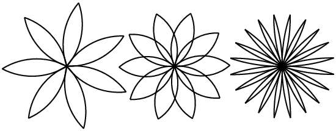
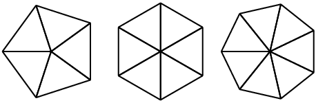

# Case study: interface design

This chapter presents a case study that demonstrates a process for
designing methods that work together.

It introduces the `turtle` module, which allows you to create
images using turtle graphics. The `turtle` module is included
in most Ruby installations, but if you are running Ruby using
PythonAnywhere, you won’t be able to run the turtle examples (at least
you couldn’t when I wrote this).

If you have already installed Ruby on your computer, you should be able
to run the examples. Otherwise, now is a good time to install. I have
posted instructions at http://tinyurl.com/thinkpython2e.

Code examples from this chapter are available from
http://thinkpython2.com/code/polygon.py.

## The turtle module

To check whether you have the `turtle` module, open the Ruby
interpreter and type

```ruby
>>> import turtle
>>> bob = turtle.Turtle()
```

When you run this code, it should create a new window with small arrow
that represents the turtle. Close the window.

Create a file named `mypolygon.py` and type in the following
code:

```ruby
import turtle
bob = turtle.Turtle()
print(bob)
turtle.mainloop()
```

The `turtle` module (with a lowercase ’t’) provides a method
called `Turtle` (with an uppercase ’T’) that creates a Turtle
object, which we assign to a variable named `bob`. Printing
`bob` displays something like:

```ruby
<turtle.Turtle object at 0xb7bfbf4c>
```

This means that `bob` refers to an object with type
`Turtle` as defined in module `turtle`.

`mainloop` tells the window to wait for the user to do something,
although in this case there’s not much for the user to do except close
the window.

Once you create a Turtle, you can call a **method** to move
it around the window. A method is similar to a method, but it uses
slightly different syntax. For example, to move the turtle forward:

```ruby
bob.fd(100)
```

The method, `fd`, is associated with the turtle object we’re
calling `bob`. Calling a method is like making a request: you
are asking `bob` to move forward.

The argument of `fd` is a distance in pixels, so the actual
size depends on your display.

Other methods you can call on a Turtle are `bk` to move
backward, `lt` for left turn, and `rt` right turn.
The argument for `lt` and `rt` is an angle in
degrees.

Also, each Turtle is holding a pen, which is either down or up; if the
pen is down, the Turtle leaves a trail when it moves. The methods
`pu` and `pd` stand for “pen up” and “pen down”.

To draw a right angle, add these lines to the program (after creating
`bob` and before calling `mainloop`):

```ruby
bob.fd(100)
bob.lt(90)
bob.fd(100)
```

When you run this program, you should see `bob` move east and
then north, leaving two line segments behind.

Now modify the program to draw a square. Don’t go on until you’ve got it
working!

## Simple repetition

Chances are you wrote something like this:

```ruby
bob.fd(100)
bob.lt(90)

bob.fd(100)
bob.lt(90)

bob.fd(100)
bob.lt(90)

bob.fd(100)
```

We can do the same thing more concisely with a `for`
statement. Add this example to `mypolygon.py` and run it
again:

```ruby
for i in range(4):
    print('Hello!')
```

You should see something like this:

```ruby
Hello!
Hello!
Hello!
Hello!
```

This is the simplest use of the `for` statement; we will see
more later. But that should be enough to let you rewrite your
square-drawing program. Don’t go on until you do.

Here is a `for` statement that draws a square:

```ruby
for i in range(4):
    bob.fd(100)
    bob.lt(90)
```

The syntax of a `for` statement is similar to a method
definition. It has a header that ends with a colon and an indented body.
The body can contain any number of statements.

A `for` statement is also called a **loop**
because the flow of execution runs through the body and then loops back
to the top. In this case, it runs the body four times.

This version is actually a little different from the previous
square-drawing code because it makes another turn after drawing the last
side of the square. The extra turn takes more time, but it simplifies
the code if we do the same thing every time through the loop. This
version also has the effect of leaving the turtle back in the starting
position, facing in the starting direction.

## Exercises

The following is a series of exercises using TurtleWorld. They are meant
to be fun, but they have a point, too. While you are working on them,
think about what the point is.

The following sections have solutions to the exercises, so don’t look
until you have finished (or at least tried).

1.  Write a method called `square` that takes a parameter
    named `t`, which is a turtle. It should use the turtle to
    draw a square.
    
    Write a method call that passes `bob` as an argument to
    `square`, and then run the program again.

2.  Add another parameter, named `length`, to
    `square`. Modify the body so length of the sides is
    `length`, and then modify the method call to provide a
    second argument. Run the program again. Test your program with a
    range of values for ` length`.

3.  Make a copy of `square` and change the name to `
    polygon`. Add another parameter named `n` and
    modify the body so it draws an n-sided regular polygon. Hint: The
    exterior angles of an n-sided regular polygon are `360/n` degrees.

4.  Write a method called `circle` that takes a turtle,
    `t`, and radius, `r`, as parameters and that
    draws an approximate circle by calling `polygon` with an
    appropriate length and number of sides. Test your method with a
    range of values of `r`.
    
    Hint: figure out the circumference of the circle and make sure that
    `length * n = circumference`.

5.  Make a more general version of `circle` called
    `arc` that takes an additional parameter
    `angle`, which determines what fraction of a circle to
    draw. `angle` is in units of degrees, so when
    `angle=360`, `arc` should draw a complete
    circle.

## Encapsulation

The first exercise asks you to put your square-drawing code into a
method definition and then call the method, passing the turtle as a
parameter. Here is a solution:

```ruby
def square(t):
    for i in range(4):
        t.fd(100)
        t.lt(90)

square(bob)
```

The innermost statements, `fd` and `lt` are
indented twice to show that they are inside the `for` loop,
which is inside the function definition. The next line,
`square(bob)`, is flush with the left margin, which indicates
the end of both the `for` loop and the function definition.

Inside the function, `t` refers to the same turtle
`bob`, so `t.lt(90)` has the same effect as
`bob.lt(90)`. In that case, why not call the parameter
`bob`? The idea is that `t` can be any turtle, not
just `bob`, so you could create a second turtle and pass it
as an argument to `square`:

```ruby
alice = turtle.Turtle()
square(alice)
```

Wrapping a piece of code up in a function is called **encapsulation**. One of the benefits of encapsulation is that
it attaches a name to the code, which serves as a kind of documentation.
Another advantage is that if you re-use the code, it is more concise to
call a function twice than to copy and paste the body!

## Generalization

The next step is to add a `length` parameter to
`square`. Here is a solution:

```ruby
def square(t, length):
    for i in range(4):
        t.fd(length)
        t.lt(90)

square(bob, 100)
```

Adding a parameter to a function is called
**generalization** because it makes the function more
general: in the previous version, the square is always the same size; in
this version it can be any size.

The next step is also a generalization. Instead of drawing squares,
`polygon` draws regular polygons with any number of sides.
Here is a solution:

```ruby
def polygon(t, n, length):
    angle = 360 / n
    for i in range(n):
        t.fd(length)
        t.lt(angle)

polygon(bob, 7, 70)
```

This example draws a 7-sided polygon with side length 70.

If you are using Python 2, the value of `angle` might be off
because of integer division. A simple solution is to compute `angle
= 360.0 / n`. Because the numerator is a floating-point number,
the result is floating point.

When a function has more than a few numeric arguments, it is easy to
forget what they are, or what order they should be in. In that case it
is often a good idea to include the names of the parameters in the
argument list:

```ruby
polygon(bob, n=7, length=70)
```

These are called **keyword arguments** because they include
the parameter names as “keywords” (not to be confused with Python
keywords like `while` and `def`).

This syntax makes the program more readable. It is also a reminder about
how arguments and parameters work: when you call a function, the
arguments are assigned to the parameters.

## Interface design

The next step is to write `circle`, which takes a radius,
`r`, as a parameter. Here is a simple solution that uses
`polygon` to draw a 50-sided polygon:

```ruby
import math

def circle(t, r):
    circumference = 2 * math.pi * r
    n = 50
    length = circumference / n
    polygon(t, n, length)
```

The first line computes the circumference of a circle with radius
`r` using the formula `2 π r`. Since we use
`math.pi`, we have to import `math`. By
convention, `import` statements are usually at the beginning
of the script.

`n` is the number of line segments in our approximation of a
circle, so `length` is the length of each segment. Thus,
`polygon` draws a 50-sided polygon that approximates a circle
with radius `r`.

One limitation of this solution is that `n` is a constant,
which means that for very big circles, the line segments are too long,
and for small circles, we waste time drawing very small segments. One
solution would be to generalize the function by taking `n` as
a parameter. This would give the user (whoever calls
`circle`) more control, but the interface would be less
clean.

The **interface** of a function is a summary of how it is
used: what are the parameters? What does the function do? And what is
the return value? An interface is “clean” if it allows the caller to do
what they want without dealing with unnecessary details.

In this example, `r` belongs in the interface because it
specifies the circle to be drawn. `n` is less appropriate
because it pertains to the details of *how* the circle
should be rendered.

Rather than clutter up the interface, it is better to choose an
appropriate value of `n` depending on
`circumference`:

```ruby
def circle(t, r):
    circumference = 2 * math.pi * r
    n = int(circumference / 3) + 3
    length = circumference / n
    polygon(t, n, length)
```

Now the number of segments is an integer near
`circumference/3`, so the length of each segment is
approximately 3, which is small enough that the circles look good, but
big enough to be efficient, and acceptable for any size circle.

Adding 3 to `n` guarantees that the polygon has at least 3
sides.

## Refactoring

When I wrote `circle`, I was able to re-use
`polygon` because a many-sided polygon is a good
approximation of a circle. But `arc` is not as cooperative;
we can’t use `polygon` or `circle` to draw an arc.

One alternative is to start with a copy of `polygon` and
transform it into `arc`. The result might look like this:

```ruby
def arc(t, r, angle):
    arc_length = 2 * math.pi * r * angle / 360
    n = int(arc_length / 3) + 1
    step_length = arc_length / n
    step_angle = angle / n
    
    for i in range(n):
        t.fd(step_length)
        t.lt(step_angle)
```

The second half of this function looks like `polygon`, but we
can’t re-use `polygon` without changing the interface. We
could generalize `polygon` to take an angle as a third
argument, but then `polygon` would no longer be an
appropriate name! Instead, let’s call the more general function
`polyline`:

```ruby
def polyline(t, n, length, angle):
    for i in range(n):
        t.fd(length)
        t.lt(angle)
```

Now we can rewrite `polygon` and `arc` to use
`polyline`:

```ruby
def polygon(t, n, length):
    angle = 360.0 / n
    polyline(t, n, length, angle)

def arc(t, r, angle):
    arc_length = 2 * math.pi * r * angle / 360
    n = int(arc_length / 3) + 1
    step_length = arc_length / n
    step_angle = float(angle) / n
    polyline(t, n, step_length, step_angle)
```

Finally, we can rewrite `circle` to use `arc`:

```ruby
def circle(t, r):
    arc(t, r, 360)
```

This process—rearranging a program to improve interfaces and facilitate
code re-use—is called **refactoring**. In this case, we
noticed that there was similar code in `arc` and
`polygon`, so we “factored it out” into
`polyline`.

If we had planned ahead, we might have written `polyline`
first and avoided refactoring, but often you don’t know enough at the
beginning of a project to design all the interfaces. Once you start
coding, you understand the problem better. Sometimes refactoring is a
sign that you have learned something.

## A development plan

A **development plan** is a process for writing programs.
The process we used in this case study is “encapsulation and
generalization”. The steps of this process are:

1.  Start by writing a small program with no function definitions.

2.  Once you get the program working, identify a coherent piece of it,
    encapsulate the piece in a function and give it a name.

3.  Generalize the function by adding appropriate parameters.

4.  Repeat steps 1-3 until you have a set of working functions. Copy and
    paste working code to avoid retyping (and re-debugging).

5.  Look for opportunities to improve the program by refactoring. For
    example, if you have similar code in several places, consider
    factoring it into an appropriately general function.

This process has some drawbacks—we will see alternatives later—but it
can be useful if you don’t know ahead of time how to divide the program
into functions. This approach lets you design as you go along.

## docstring

A **docstring** is a string at the beginning of a function
that explains the interface (“doc” is short for “documentation”). Here
is an example:

```ruby
def polyline(t, n, length, angle):
    """Draws n line segments with the given length and
    angle (in degrees) between them.  t is a turtle.
    """    
    for i in range(n):
        t.fd(length)
        t.lt(angle)
```

By convention, all docstrings are triple-quoted strings, also known as
multiline strings because the triple quotes allow the string to span
more than one line.

It is terse, but it contains the essential information someone would
need to use this function. It explains concisely what the function does
(without getting into the details of how it does it). It explains what
effect each parameter has on the behavior of the function and what type
each parameter should be (if it is not obvious).

Writing this kind of documentation is an important part of interface
design. A well-designed interface should be simple to explain; if you
have a hard time explaining one of your functions, maybe the interface
could be improved.

## Debugging

An interface is like a contract between a function and a caller. The
caller agrees to provide certain parameters and the function agrees to
do certain work.

For example, `polyline` requires four arguments:
`t` has to be a Turtle; `n` has to be an integer;
`length` should be a positive number; and ` angle`
has to be a number, which is understood to be in degrees.

These requirements are called **preconditions** because
they are supposed to be true before the function starts executing.
Conversely, conditions at the end of the function are
**postconditions**. Postconditions include the intended
effect of the function (like drawing line segments) and any side effects
(like moving the Turtle or making other changes).

Preconditions are the responsibility of the caller. If the caller
violates a (properly documented!) precondition and the function doesn’t
work correctly, the bug is in the caller, not the function.

If the preconditions are satisfied and the postconditions are not, the
bug is in the function. If your pre- and postconditions are clear, they
can help with debugging.

## Glossary

  - **method**:  
    A function that is associated with an object and called using dot
    notation.

  - **loop**:  
    A part of a program that can run repeatedly.

  - **encapsulation**:  
    The process of transforming a sequence of statements into a function
    definition.

  - **generalization**:  
    The process of replacing something unnecessarily specific (like a
    number) with something appropriately general (like a variable or
    parameter).

  - **keyword argument**:  
    An argument that includes the name of the parameter as a “keyword”.

  - **interface**:  
    A description of how to use a function, including the name and
    descriptions of the arguments and return value.

  - **refactoring**:  
    The process of modifying a working program to improve function
    interfaces and other qualities of the code.

  - **development plan**:  
    A process for writing programs.

  - **docstring**:  
    A string that appears at the top of a function definition to
    document the function’s interface.

  - **precondition**:  
    A requirement that should be satisfied by the caller before a
    function starts.

  - **postcondition**:  
    A requirement that should be satisfied by the function before it
    ends.

## Exercises

**Exercise 1**  
Download the code in this chapter from
http://thinkpython2.com/code/polygon.py.

1.  Draw a stack diagram that shows the state of the program while
    executing `circle(bob, radius)`. You can do the
    arithmetic by hand or add `print` statements to the code.

2.  The version of `arc` in
    Section [\[refactoring\]](#refactoring) is not very accurate
    because the linear approximation of the circle is always outside the
    true circle. As a result, the Turtle ends up a few pixels away from
    the correct destination. My solution shows a way to reduce the
    effect of this error. Read the code and see if it makes sense to
    you. If you draw a diagram, you might see how it works.

**Exercise 2**  
Write an appropriately general set of functions that can draw flowers as
shown below.

  
*Figure 4.1: Turtle flowers*

Solution: http://thinkpython2.com/code/flower.py, also requires
http://thinkpython2.com/code/polygon.py.

**Exercise 3**  
Write an appropriately general set of functions that can draw shapes as
shown below.

  
*Figure 4.2: Turtle pies*

Solution: http://thinkpython2.com/code/pie.py.

**Exercise 4**  
The letters of the alphabet can be constructed from a moderate number of
basic elements, like vertical and horizontal lines and a few curves.
Design an alphabet that can be drawn with a minimal number of basic
elements and then write functions that draw the letters.

You should write one function for each letter, with names `draw_a`,
`draw_b`, etc., and put your functions in a file named
`letters.py`. You can download a “turtle typewriter” from
http://thinkpython2.com/code/typewriter.py to help you test your code.

You can get a solution from http://thinkpython2.com/code/letters.py;
it also requires http://thinkpython2.com/code/polygon.py.

**Exercise 5**  
Read about spirals at http://en.wikipedia.org/wiki/Spiral; then write
a program that draws an Archimedian spiral (or one of the other kinds).
Solution: http://thinkpython2.com/code/spiral.py.

