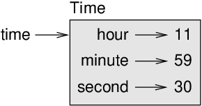

# Classes and functions

Now that we know how to create new types, the next step is to write
functions that take programmer-defined objects as parameters and return
them as results. In this chapter I also present “functional programming
style” and two new program development plans.

Code examples from this chapter are available from
http://thinkpython2.com/code/Time1.py. Solutions to the exercises are
at http://thinkpython2.com/code/Time1_soln.py.

## Time

As another example of a programmer-defined type, we’ll define a class
called `Time` that records the time of day. The class
definition looks like this:

```ruby
class Time:
    """Represents the time of day.
       
    attributes: hour, minute, second
    """
```

We can create a new `Time` object and assign attributes for
hours, minutes, and seconds:

```ruby
time = Time()
time.hour = 11
time.minute = 59
time.second = 30
```

The state diagram for the `Time` object looks as shown below:

  
*Figure 16.1: Object diagram*

As an exercise, write a function called `print_time` that takes a Time
object and prints it in the form `hour:minute:second`. Hint:
the format sequence `'%.2d'` prints an integer using at least two
digits, including a leading zero if necessary.

Write a boolean function called `is_after` that takes two Time objects,
`t1` and `t2`, and returns `True` if
`t1` follows `t2` chronologically and
`False` otherwise. Challenge: don’t use an `if`
statement.

## Pure functions

In the next few sections, we’ll write two functions that add time
values. They demonstrate two kinds of functions: pure functions and
modifiers. They also demonstrate a development plan I’ll call
**prototype and patch**, which is a way of tackling a complex
problem by starting with a simple prototype and incrementally dealing
with the complications.

Here is a simple prototype of `add_time`:

```ruby
def add_time(t1, t2):
    sum = Time()
    sum.hour = t1.hour + t2.hour
    sum.minute = t1.minute + t2.minute
    sum.second = t1.second + t2.second
    return sum
```

The function creates a new `Time` object, initializes its
attributes, and returns a reference to the new object. This is called a
**pure function** because it does not modify any of the
objects passed to it as arguments and it has no effect, like displaying
a value or getting user input, other than returning a value.

To test this function, I’ll create two Time objects: `start`
contains the start time of a movie, like *Monty Python and the
Holy Grail*, and `duration` contains the run time of
the movie, which is one hour 35 minutes.

`add_time` figures out when the movie will be done.

```ruby
>>> start = Time()
>>> start.hour = 9
>>> start.minute = 45
>>> start.second =  0

>>> duration = Time()
>>> duration.hour = 1
>>> duration.minute = 35
>>> duration.second = 0

>>> done = add_time(start, duration)
>>> print_time(done)
10:80:00
```

The result, `10:80:00` might not be what you were hoping for.
The problem is that this function does not deal with cases where the
number of seconds or minutes adds up to more than sixty. When that
happens, we have to “carry” the extra seconds into the minute column or
the extra minutes into the hour column.

Here’s an improved version:

```ruby
def add_time(t1, t2):
    sum = Time()
    sum.hour = t1.hour + t2.hour
    sum.minute = t1.minute + t2.minute
    sum.second = t1.second + t2.second

    if sum.second >= 60:
        sum.second -= 60
        sum.minute += 1

    if sum.minute >= 60:
        sum.minute -= 60
        sum.hour += 1

    return sum
```

Although this function is correct, it is starting to get big. We will
see a shorter alternative later.

## Modifiers

Sometimes it is useful for a function to modify the objects it gets as
parameters. In that case, the changes are visible to the caller.
Functions that work this way are called **modifiers**.

`increment`, which adds a given number of seconds to a
`Time` object, can be written naturally as a modifier. Here
is a rough draft:

```ruby
def increment(time, seconds):
    time.second += seconds

    if time.second >= 60:
        time.second -= 60
        time.minute += 1

    if time.minute >= 60:
        time.minute -= 60
        time.hour += 1
```

The first line performs the basic operation; the remainder deals with
the special cases we saw before.

Is this function correct? What happens if `seconds` is much
greater than sixty?

In that case, it is not enough to carry once; we have to keep doing it
until `time.second` is less than sixty. One solution is to
replace the `if` statements with `while`
statements. That would make the function correct, but not very
efficient. As an exercise, write a correct version of
`increment` that doesn’t contain any loops.

Anything that can be done with modifiers can also be done with pure
functions. In fact, some programming languages only allow pure
functions. There is some evidence that programs that use pure functions
are faster to develop and less error-prone than programs that use
modifiers. But modifiers are convenient at times, and functional
programs tend to be less efficient.

In general, I recommend that you write pure functions whenever it is
reasonable and resort to modifiers only if there is a compelling
advantage. This approach might be called a **functional
programming style**.

As an exercise, write a “pure” version of `increment` that
creates and returns a new Time object rather than modifying the
parameter.

## Prototyping versus planning

The development plan I am demonstrating is called “prototype and patch”.
For each function, I wrote a prototype that performed the basic
calculation and then tested it, patching errors along the way.

This approach can be effective, especially if you don’t yet have a deep
understanding of the problem. But incremental corrections can generate
code that is unnecessarily complicated—since it deals with many special
cases—and unreliable—since it is hard to know if you have found all the
errors.

An alternative is **designed development**, in which
high-level insight into the problem can make the programming much
easier. In this case, the insight is that a Time object is really a
three-digit number in base 60 (see
https://en.wikipedia.org/wiki/Sexagesimal.)! The `second`
attribute is the “ones column”, the `minute` attribute is the
“sixties column”, and the `hour` attribute is the “thirty-six
hundreds column”.

When we wrote `add_time` and `increment`, we were effectively
doing addition in base 60, which is why we had to carry from one column
to the next.

This observation suggests another approach to the whole problem—we can
convert Time objects to integers and take advantage of the fact that the
computer knows how to do integer arithmetic.

Here is a function that converts Times to integers:

```ruby
def time_to_int(time):
    minutes = time.hour * 60 + time.minute
    seconds = minutes * 60 + time.second
    return seconds
```

And here is a function that converts an integer to a Time (recall that
`divmod` divides the first argument by the second and returns
the quotient and remainder as a tuple).

```ruby
def int_to_time(seconds):
    time = Time()
    minutes, time.second = divmod(seconds, 60)
    time.hour, time.minute = divmod(minutes, 60)
    return time
```

You might have to think a bit, and run some tests, to convince yourself
that these functions are correct. One way to test them is to check that
`time_to_int(int_to_time(x)) == x` for many values of `x`.
This is an example of a consistency check.

Once you are convinced they are correct, you can use them to rewrite
`add_time`:

```ruby
def add_time(t1, t2):
    seconds = time_to_int(t1) + time_to_int(t2)
    return int_to_time(seconds)
```

This version is shorter than the original, and easier to verify. As an
exercise, rewrite `increment` using `time_to_int` and
`int_to_time`.

In some ways, converting from base 60 to base 10 and back is harder than
just dealing with times. Base conversion is more abstract; our intuition
for dealing with time values is better.

But if we have the insight to treat times as base 60 numbers and make
the investment of writing the conversion functions (`time_to_int` and
`int_to_time`), we get a program that is shorter, easier to read and
debug, and more reliable.

It is also easier to add features later. For example, imagine
subtracting two Times to find the duration between them. The naive
approach would be to implement subtraction with borrowing. Using the
conversion functions would be easier and more likely to be correct.

Ironically, sometimes making a problem harder (or more general) makes it
easier (because there are fewer special cases and fewer opportunities
for error).

## Debugging

A Time object is well-formed if the values of `minute` and
` second` are between 0 and 60 (including 0 but not 60) and
if `hour` is positive. `hour` and
`minute` should be integral values, but we might allow
`second` to have a fraction part.

Requirements like these are called **invariants** because
they should always be true. To put it a different way, if they are not
true, something has gone wrong.

Writing code to check invariants can help detect errors and find their
causes. For example, you might have a function like `valid_time` that
takes a Time object and returns `False` if it violates an
invariant:

```ruby
def valid_time(time):
    if time.hour < 0 or time.minute < 0 or time.second < 0:
        return False
    if time.minute >= 60 or time.second >= 60:
        return False
    return True
```

At the beginning of each function you could check the arguments to make
sure they are valid:

```ruby
def add_time(t1, t2):
    if not valid_time(t1) or not valid_time(t2):
        raise ValueError('invalid Time object in add_time')
    seconds = time_to_int(t1) + time_to_int(t2)
    return int_to_time(seconds)
```

Or you could use an **assert statement**, which checks a
given invariant and raises an exception if it fails:

```ruby
def add_time(t1, t2):
    assert valid_time(t1) and valid_time(t2)
    seconds = time_to_int(t1) + time_to_int(t2)
    return int_to_time(seconds)
```

`assert` statements are useful because they distinguish code
that deals with normal conditions from code that checks for errors.

## Glossary

  - **prototype and patch**:  
    A development plan that involves writing a rough draft of a program,
    testing, and correcting errors as they are found.

  - **designed development**:  
    A development plan that involves high-level insight into the problem
    and more planning than incremental development or prototype
    development.

  - **pure function**:  
    A function that does not modify any of the objects it receives as
    arguments. Most pure functions are fruitful.

  - **modifier**:  
    A function that changes one or more of the objects it receives as
    arguments. Most modifiers are void; that is, they return
    `None`.

  - **functional programming style**:  
    A style of program design in which the majority of functions are
    pure.

  - **invariant**:  
    A condition that should always be true during the execution of a
    program.

  - **assert statement**:  
    A statement that check a condition and raises an exception if it
    fails.

## Exercises

**Exercise 1**  
Code examples from this chapter are available from
http://thinkpython2.com/code/Time1.py; solutions to the exercises are
available from http://thinkpython2.com/code/Time1_soln.py.

Write a function called `mul_time` that takes a Time object and a number
and returns a new Time object that contains the product of the original
Time and the number.

Then use `mul_time` to write a function that takes a Time object that
represents the finishing time in a race, and a number that represents
the distance, and returns a Time object that represents the average pace
(time per mile).

**Exercise 2**  
The `datetime` module provides `time` objects that
are similar to the Time objects in this chapter, but they provide a rich
set of methods and operators. Read the documentation at
http://docs.python.org/3/library/datetime.html.

1.  Use the `datetime` module to write a program that gets
    the current date and prints the day of the week.

2.  Write a program that takes a birthday as input and prints the user’s
    age and the number of days, hours, minutes and seconds until their
    next birthday.

3.  For two people born on different days, there is a day when one is
    twice as old as the other. That’s their Double Day. Write a program
    that takes two birthdays and computes their Double Day.

4.  For a little more challenge, write the more general version that
    computes the day when one person is `n` times older than the
    other.

Solution: http://thinkpython2.com/code/double.py

