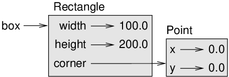

# Classes and objects

At this point you know how to use functions to organize code and
built-in types to organize data. The next step is to learn
“object-oriented programming”, which uses programmer-defined types to
organize both code and data. Object-oriented programming is a big topic;
it will take a few chapters to get there.

Code examples from this chapter are available from
http://thinkpython2.com/code/Point1.py; solutions to the exercises are
available from http://thinkpython2.com/code/Point1_soln.py.

## Programmer-defined types

We have used many of Python’s built-in types; now we are going to define
a new type. As an example, we will create a type called
`Point` that represents a point in two-dimensional space.

In mathematical notation, points are often written in parentheses with a
comma separating the coordinates. For example, `(0,0)` represents the
origin, and `(x,y)` represents the point `x` units to the right and
`y` units up from the origin.

There are several ways we might represent points in Python:

  - We could store the coordinates separately in two variables,
    `x` and `y`.

  - We could store the coordinates as elements in a list or tuple.

  - We could create a new type to represent points as objects.

Creating a new type is more complicated than the other options, but it
has advantages that will be apparent soon.

A programmer-defined type is also called a **class**. A
class definition looks like this:

```ruby
class Point:
    """Represents a point in 2-D space."""
```

The header indicates that the new class is called `Point`.
The body is a docstring that explains what the class is for. You can
define variables and methods inside a class definition, but we will get
back to that later.

Defining a class named `Point` creates a **class object**.

```ruby
>>> Point
<class '__main__.Point'>
```

Because `Point` is defined at the top level, its “full name”
is `__main__.Point`.

The class object is like a factory for creating objects. To create a
Point, you call `Point` as if it were a function.

```ruby
>>> blank = Point()
>>> blank
<__main__.Point object at 0xb7e9d3ac>
```

The return value is a reference to a Point object, which we assign to
`blank`.

Creating a new object is called **instantiation**, and the
object is an **instance** of the class.

When you print an instance, Python tells you what class it belongs to
and where it is stored in memory (the prefix `0x` means that
the following number is in hexadecimal).

Every object is an instance of some class, so “object” and “instance”
are interchangeable. But in this chapter I use “instance” to indicate
that I am talking about a programmer-defined type.

## Attributes

You can assign values to an instance using dot notation:

```ruby
>>> blank.x = 3.0
>>> blank.y = 4.0
```

This syntax is similar to the syntax for selecting a variable from a
module, such as `math.pi` or `string.whitespace`.
In this case, though, we are assigning values to named elements of an
object. These elements are called **attributes**.

As a noun, “AT-trib-ute” is pronounced with emphasis on the first
syllable, as opposed to “a-TRIB-ute”, which is a verb.

The following diagram shows the result of these assignments. A state
diagram that shows an object and its attributes is called an
**object diagram**; see figure below.

  
*Figure 15.1: Object diagram*

The variable `blank` refers to a Point object, which contains
two attributes. Each attribute refers to a floating-point number.

You can read the value of an attribute using the same syntax:

```ruby
>>> blank.y
4.0
>>> x = blank.x
>>> x
3.0
```

The expression `blank.x` means, “Go to the object
`blank` refers to and get the value of `x`.” In
the example, we assign that value to a variable named `x`.
There is no conflict between the variable `x` and the
attribute `x`.

You can use dot notation as part of any expression. For example:

```ruby
>>> '(%g, %g)' % (blank.x, blank.y)
'(3.0, 4.0)'
>>> distance = math.sqrt(blank.x**2 + blank.y**2)
>>> distance
5.0
```

You can pass an instance as an argument in the usual way. For example:

```ruby
def print_point(p):
    print('(%g, %g)' % (p.x, p.y))
```

`print_point` takes a point as an argument and displays it in
mathematical notation. To invoke it, you can pass `blank` as
an argument:

```ruby
>>> print_point(blank)
(3.0, 4.0)
```

Inside the function, `p` is an alias for `blank`,
so if the function modifies `p`, `blank` changes.

As an exercise, write a function called `distance_between_points` that
takes two Points as arguments and returns the distance between them.

## Rectangles

Sometimes it is obvious what the attributes of an object should be, but
other times you have to make decisions. For example, imagine you are
designing a class to represent rectangles. What attributes would you use
to specify the location and size of a rectangle? You can ignore angle;
to keep things simple, assume that the rectangle is either vertical or
horizontal.

There are at least two possibilities:

  - You could specify one corner of the rectangle (or the center), the
    width, and the height.

  - You could specify two opposing corners.

At this point it is hard to say whether either is better than the other,
so we’ll implement the first one, just as an example.

Here is the class definition:

```ruby
class Rectangle:
    """Represents a rectangle. 

    attributes: width, height, corner.
    """
```

The docstring lists the attributes: `width` and
`height` are numbers; `corner` is a Point object
that specifies the lower-left corner.

To represent a rectangle, you have to instantiate a Rectangle object and
assign values to the attributes:

```ruby
box = Rectangle()
box.width = 100.0
box.height = 200.0
box.corner = Point()
box.corner.x = 0.0
box.corner.y = 0.0
```

The expression `box.corner.x` means, “Go to the object
`box` refers to and select the attribute named
`corner`; then go to that object and select the attribute
named `x`.”

  
*Figure 15.2: Object diagram*

Figure above shows the state of this object. An object
that is an attribute of another object is **embedded**.

## Instances as return values

Functions can return instances. For example, `find_center` takes a
`Rectangle` as an argument and returns a `Point`
that contains the coordinates of the center of the
`Rectangle`:

```ruby
def find_center(rect):
    p = Point()
    p.x = rect.corner.x + rect.width/2
    p.y = rect.corner.y + rect.height/2
    return p
```

Here is an example that passes `box` as an argument and
assigns the resulting Point to `center`:

```ruby
>>> center = find_center(box)
>>> print_point(center)
(50, 100)
```

## Objects are mutable

You can change the state of an object by making an assignment to one of
its attributes. For example, to change the size of a rectangle without
changing its position, you can modify the values of ` width`
and `height`:

```ruby
box.width = box.width + 50
box.height = box.height + 100
```

You can also write functions that modify objects. For example,
`grow_rectangle` takes a Rectangle object and two numbers,
`dwidth` and `dheight`, and adds the numbers to
the width and height of the rectangle:

```ruby
def grow_rectangle(rect, dwidth, dheight):
    rect.width += dwidth
    rect.height += dheight
```

Here is an example that demonstrates the effect:

```ruby
>>> box.width, box.height
(150.0, 300.0)
>>> grow_rectangle(box, 50, 100)
>>> box.width, box.height
(200.0, 400.0)
```

Inside the function, `rect` is an alias for `box`,
so when the function modifies `rect`, `box`
changes.

As an exercise, write a function named `move_rectangle` that takes a
Rectangle and two numbers named `dx` and `dy`. It
should change the location of the rectangle by adding `dx` to
the `x` coordinate of `corner` and adding
`dy` to the `y` coordinate of `corner`.

## Copying

Aliasing can make a program difficult to read because changes in one
place might have unexpected effects in another place. It is hard to keep
track of all the variables that might refer to a given object.

Copying an object is often an alternative to aliasing. The
`copy` module contains a function called `copy`
that can duplicate any object:

```ruby
>>> p1 = Point()
>>> p1.x = 3.0
>>> p1.y = 4.0

>>> import copy
>>> p2 = copy.copy(p1)
```

`p1` and `p2` contain the same data, but they are
not the same Point.

```ruby
>>> print_point(p1)
(3, 4)
>>> print_point(p2)
(3, 4)
>>> p1 is p2
False
>>> p1 == p2
False
```

The `is` operator indicates that `p1` and
`p2` are not the same object, which is what we expected. But
you might have expected `==` to yield `True`
because these points contain the same data. In that case, you will be
disappointed to learn that for instances, the default behavior of the
`==` operator is the same as the `is` operator; it
checks object identity, not object equivalence. That’s because for
programmer-defined types, Python doesn’t know what should be considered
equivalent. At least, not yet.

If you use `copy.copy` to duplicate a Rectangle, you will
find that it copies the Rectangle object but not the embedded Point.

```ruby
>>> box2 = copy.copy(box)
>>> box2 is box
False
>>> box2.corner is box.corner
True
```

  
*Figure 15.3: Object diagram*

Figure above shows what the object diagram looks like.
This operation is called a **shallow copy** because it
copies the object and any references it contains, but not the embedded
objects.

For most applications, this is not what you want. In this example,
invoking `grow_rectangle` on one of the Rectangles would not affect the
other, but invoking `move_rectangle` on either would affect both! This
behavior is confusing and error-prone.

Fortunately, the `copy` module provides a method named
`deepcopy` that copies not only the object but also the objects it
refers to, and the objects *they* refer to, and so on. You
will not be surprised to learn that this operation is called a
**deep copy**.

```ruby
>>> box3 = copy.deepcopy(box)
>>> box3 is box
False
>>> box3.corner is box.corner
False
```

`box3` and `box` are completely separate objects.

As an exercise, write a version of `move_rectangle` that creates and
returns a new Rectangle instead of modifying the old one.

## Debugging

When you start working with objects, you are likely to encounter some
new exceptions. If you try to access an attribute that doesn’t exist,
you get an `AttributeError`:

```ruby
>>> p = Point()
>>> p.x = 3
>>> p.y = 4
>>> p.z
AttributeError: Point instance has no attribute 'z'
```

If you are not sure what type an object is, you can ask:

```ruby
>>> type(p)
<class '__main__.Point'>
```

You can also use `isinstance` to check whether an object is
an instance of a class:

```ruby
>>> isinstance(p, Point)
True
```

If you are not sure whether an object has a particular attribute, you
can use the built-in function `hasattr`:

```ruby
>>> hasattr(p, 'x')
True
>>> hasattr(p, 'z')
False
```

The first argument can be any object; the second argument is a
*string* that contains the name of the attribute.

You can also use a `try` statement to see if the object has
the attributes you need:

```ruby
try:
    x = p.x
except AttributeError:
    x = 0
```

This approach can make it easier to write functions that work with
different types; more on that topic is coming up in
Section [Polymorphism](./classes_and_methods.md#polymorphism).

## Glossary

  - **class**:  
    A programmer-defined type. A class definition creates a new class
    object.

  - **class object**:  
    An object that contains information about a programmer-defined type.
    The class object can be used to create instances of the type.

  - **instance**:  
    An object that belongs to a class.

  - **instantiate**:  
    To create a new object.

  - **attribute**:  
    One of the named values associated with an object.

  - **embedded object**:  
    An object that is stored as an attribute of another object.

  - **shallow copy**:  
    To copy the contents of an object, including any references to
    embedded objects; implemented by the `copy` function in
    the `copy` module.

  - **deep copy**:  
    To copy the contents of an object as well as any embedded objects,
    and any objects embedded in them, and so on; implemented by the
    `deepcopy` function in the `copy` module.

  - **object diagram**:  
    A diagram that shows objects, their attributes, and the values of
    the attributes.

## Exercises

**Exercise 1**  
Write a definition for a class named `Circle` with attributes
`center` and `radius`, where `center`
is a Point object and radius is a number.

Instantiate a Circle object that represents a circle with its center at
`(150, 100)` and radius 75.

Write a function named `point_in_circle` that takes a Circle and a Point
and returns True if the Point lies in or on the boundary of the circle.

Write a function named `rect_in_circle` that takes a Circle and a
Rectangle and returns True if the Rectangle lies entirely in or on the
boundary of the circle.

Write a function named `rect_circle_overlap` that takes a Circle and a
Rectangle and returns True if any of the corners of the Rectangle fall
inside the circle. Or as a more challenging version, return True if any
part of the Rectangle falls inside the circle.

Solution: http://thinkpython2.com/code/Circle.py.

**Exercise 2**  
Write a function called `draw_rect` that takes a Turtle object and a
Rectangle and uses the Turtle to draw the Rectangle. See
Chapter [Case study: interface design](./case_study_interface_design.md)
for examples using Turtle objects.

Write a function called `draw_circle` that takes a Turtle and a Circle
and draws the Circle.

Solution: http://thinkpython2.com/code/draw.py.

