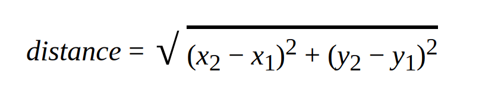
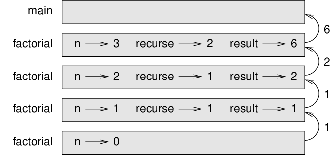

# Fruitful methods

Many of the Ruby methods we have used, such as the Math methods, produce
return values. But the methods we’ve written are all void: they have an
effect, like printing a value, but they don’t have an explicit and
meaningful return value. In this chapter you will learn to write
fruitful methods.

## Return values

Calling the method generates a return value, which we usually assign to
a variable or use as part of an expression.

```ruby
e = Math.exp(1.0)
height = radius * Math.sin(radians)
```

The methods we have written so far are void. Speaking casually, they
have no return value; more precisely, their return value is result of
last expression evaluated. For example, it is `nil` for `puts` statement.

In this chapter, we are (finally) going to write fruitful methods. The
first example is `area`, which returns the area of a circle
with the given radius:

```ruby
def area(radius)
  a = Math::PI * radius**2
  return a
end
```

We have seen the `return` statement before, but in a fruitful
method the `return` statement includes an expression. This
statement means: “Return immediately from this method and use the
following expression as a return value.” The expression can be
arbitrarily complicated, so we could have written this method more
concisely:

```ruby
def area(radius)
  return Math::PI * radius**2
end
```

On the other hand, **temporary variables** like
`a` can make debugging easier.

Sometimes it is useful to have multiple return statements, one in each
branch of a conditional:

```ruby
def absolute_value(x)
  if x < 0
    return -x
  else
    return x
  end
end
```

Since these `return` statements are in an alternative
conditional, only one runs.

As soon as a return statement runs, the method terminates without
executing any subsequent statements. Code that appears after a
`return` statement, or any other place the flow of execution
can never reach, is called **dead code**.

In a fruitful method, it is a good idea to ensure that every possible
path through the program hits a `return` statement. For
example:

```ruby
def absolute_value(x)
  return -x if x < 0
  return x if x > 0
end
```

This method is incorrect because if `x` happens to be 0,
neither condition is true, and the method ends without hitting a
`return` statement. If the flow of execution gets to the end
of a method without executing any code, the default return value is
`nil`, which is *not* the absolute value of 0.

```ruby
>> absolute_value(0)
=> nil
```

By the way, both Integer and Float class provide a method called
`abs` that computes absolute values.

```ruby
>> -15.abs
=> 15
>> 3.abs
=> 3
>> -1.52.abs
=> 1.52
```

As an exercise, write a `compare` method takes two values,
`x` and `y`, and returns `1` if `x > y`,
`0` if `x == y`, and `-1` if `x < y`.

## Incremental development

As you write larger methods, you might find yourself spending more time
debugging.

To deal with increasingly complex programs, you might want to try a
process called **incremental development**. The goal of
incremental development is to avoid long debugging sessions by adding
and testing only a small amount of code at a time.

As an example, suppose you want to find the distance between two points,
given by the coordinates `(x1, y1)` and `(x2, y2)`. By the
Pythagorean theorem, the distance is:

  
*Figure 6.1: Pythagorean theorem*

The first step is to consider what a `distance` method should look like
in Ruby. In other words, what are the inputs (parameters) and what is
the output (return value)?

In this case, the inputs are two points, which you can represent using
four numbers. The return value is the distance represented by a
floating-point value.

Immediately you can write an outline of the method:

```ruby
def distance(x1, y1, x2, y2)
  return 0.0
end
```

Obviously, this version doesn’t compute distances; it always returns
zero. But it is syntactically correct, and it runs, which means that you
can test it before you make it more complicated.

To test the new method, call it with sample arguments:

```ruby
>> distance(1, 2, 4, 6)
=> 0.0
```

I chose these values so that the horizontal distance is 3 and the
vertical distance is 4; that way, the result is 5, the hypotenuse of a
3-4-5 triangle. When testing a method, it is useful to know the right
answer.

At this point we have confirmed that the method is syntactically
correct, and we can start adding code to the body. A reasonable next
step is to find the differences `x2 - x1` and `y2 - y1`. The
next version stores those values in temporary variables and prints them.

```ruby
def distance(x1, y1, x2, y2)
  dx = x2 - x1
  dy = y2 - y1
  puts "dx is #{dx}"
  puts "dy is #{dy}"
  return 0.0
end
```

When using double quotes, an expression can be embedded by enclosing it
within `#{}`. This is referred to as **string interpolation**.

If the method is working, it should display `dx is 3` and `dy is 4`. If
so, we know that the method is getting the right arguments and
performing the first computation correctly. If not, there are only a few
lines to check.

Next we compute the sum of squares of `dx` and `dy`:

```ruby
def distance(x1, y1, x2, y2)
  dx = x2 - x1
  dy = y2 - y1
  dsquared = dx**2 + dy**2
  puts "dsquared is: #{dsquared}"
  return 0.0
end
```

Again, you would run the program at this stage and check the output
(which should be 25). Finally, you can use `Math.sqrt` to
compute and return the result:

```ruby
def distance(x1, y1, x2, y2)
  dx = x2 - x1
  dy = y2 - y1
  dsquared = dx**2 + dy**2
  result = Math.sqrt(dsquared)
  return result
end
```

If that works correctly, you are done. Otherwise, you might want to
print the value of `result` before the return statement.

The final version of the method doesn’t display anything when it runs;
it only returns a value. The `puts` statements we wrote are
useful for debugging, but once you get the method working, you should
remove them. Code like that is called **scaffolding**
because it is helpful for building the program but is not part of the
final product.

When you start out, you should add only a line or two of code at a time.
As you gain more experience, you might find yourself writing and
debugging bigger chunks. Either way, incremental development can save
you a lot of debugging time.

The key aspects of the process are:

1.  Start with a working program and make small incremental changes. At
    any point, if there is an error, you should have a good idea where
    it is.

2.  Use variables to hold intermediate values so you can display and
    check them.

3.  Once the program is working, you might want to remove some of the
    scaffolding or consolidate multiple statements into compound
    expressions, but only if it does not make the program difficult to
    read.

As an exercise, use incremental development to write a method called
`hypotenuse` that returns the length of the hypotenuse of a
right triangle given the lengths of the other two legs as arguments.
Record each stage of the development process as you go.

## Composition

As you should expect by now, you can call one method from within
another. As an example, we’ll write a method that takes two points, the
center of the circle and a point on the perimeter, and computes the area
of the circle.

Assume that the center point is stored in the variables `xc`
and `yc`, and the perimeter point is in `xp` and
`yp`. The first step is to find the radius of the circle,
which is the distance between the two points. We just wrote a method,
` distance`, that does that:

```ruby
radius = distance(xc, yc, xp, yp)
```

The next step is to find the area of a circle with that radius; we just
wrote that, too:

```ruby
result = area(radius)
```

Encapsulating these steps in a method, we get:

```ruby
def circle_area(xc, yc, xp, yp)
  radius = distance(xc, yc, xp, yp)
  result = area(radius)
  return result
end
```

The temporary variables `radius` and `result` are
useful for development and debugging, but once the program is working,
we can make it more concise by composing the method calls:

```ruby
def circle_area(xc, yc, xp, yp)
  return area(distance(xc, yc, xp, yp))
end
```

## Boolean methods

Methods can return booleans, which is often convenient for hiding
complicated tests inside methods. For example:

```ruby
def divisible?(x, y)
  if x % y == 0
    return true
  else
    return false
  end
end
```

It is common to add a `?` character to method names to make
it sound like yes/no questions; `divisible?` returns either
`true` or `false` to indicate whether
`x` is divisible by `y`.

Here is an example usage for method we just wrote and a built-in
String method:

```ruby
>> divisible?(6, 4)
=> false
>> divisible?(6, 3)
=> true

>> 'good' == 'Good'
=> false
# compare strings irrespective of case
>> 'good'.casecmp?('Good')
=> true
```

We’ll see other such special characters that can be added to method
names later.

The result of the `==` operator is a boolean, so we can write
the method more concisely by returning it directly:

```ruby
def divisible?(x, y)
  return x % y == 0
end
```

Boolean methods are often used in conditional statements:

```ruby
if divisible?(x, y)
  puts 'x is divisible by y'
end
```

It might be tempting to write something like:

```ruby
if divisible?(x, y) == true
  puts 'x is divisible by y'
end
```

But the extra comparison is unnecessary.

As an exercise, write a method `between?(x, y, z)` that returns
`true` if `x` is less than or equal to `y` and `y` is less than or
equal to `z`. `false` otherwise.

## More recursion

We have only covered a small subset of Ruby, but you might be interested
to know that this subset is a *complete* programming
language, which means that anything that can be computed can be
expressed in this language. Any program ever written could be rewritten
using only the language features you have learned so far (actually, you
would need a few commands to control devices like the mouse, disks,
etc., but that’s all).

Proving that claim is a nontrivial exercise first accomplished by Alan
Turing, one of the first computer scientists (some would argue that he
was a mathematician, but a lot of early computer scientists started as
mathematicians). Accordingly, it is known as the Turing Thesis. For a
more complete (and accurate) discussion of the Turing Thesis, I
recommend Michael Sipser’s book *Introduction to the Theory of
Computation*.

To give you an idea of what you can do with the tools you have learned
so far, we’ll evaluate a few recursively defined mathematical methods. A
recursive definition is similar to a circular definition, in the sense
that the definition contains a reference to the thing being defined. A
truly circular definition is not very useful:

  - **vorpal**:  
    An adjective used to describe something that is vorpal.

If you saw that definition in the dictionary, you might be annoyed. On
the other hand, if you looked up the definition of the factorial method,
denoted with the symbol `!`, you might get something like this:

```
     0! = 1
     n! = n (n-1)!
```

This definition says that the factorial
of 0 is 1, and the factorial of any other value, `n`, is `n`
multiplied by the factorial of `n-1`.

So `3!` is 3 times `2!`, which is 2 times `1!`, which is 1 times
`0!`. Putting it all together, `3!` equals 3 times 2 times 1 times
1, which is 6.

If you can write a recursive definition of something, you can write a
Ruby program to evaluate it. The first step is to decide what the
parameters should be. In this case it should be clear that
`factorial` takes an integer:

```ruby
def factorial(n)
end
```

If the argument happens to be 0, all we have to do is return 1:

```ruby
def factorial(n)
  if n == 0
    return 1
  end
end
```

Otherwise, and this is the interesting part, we have to make a recursive
call to find the factorial of `n-1` and then multiply it by `n`:

```ruby
def factorial(n)
  if n == 0
    return 1
  else
    recurse = factorial(n-1)
    result = n * recurse
    return result
  end
end
```

The flow of execution for this program is similar to the flow of `countdown`
in Section [recursion](./conditionals_and_recursion.md#recursion). If we call
`factorial` with the value 3:

Since 3 is not 0, we take the second branch and calculate the factorial
of `n-1`...

> Since 2 is not 0, we take the second branch and calculate the
> factorial of `n-1`...
> 
> > Since 1 is not 0, we take the second branch and calculate the
> > factorial of `n-1`...
> > 
> > > Since 0 equals 0, we take the first branch and return 1 without
> > > making any more recursive calls.
> > 
> > The return value, 1, is multiplied by `n`, which is 1, and the
> > result is returned.
> 
> The return value, 1, is multiplied by `n`, which is 2, and the
> result is returned.

The return value (2) is multiplied by `n`, which is 3, and the result,
6, becomes the return value of the method call that started the whole
process.

Figure below shows what the stack diagram looks like for
this sequence of method calls.

  
*Figure 6.2: Stack diagram*

The return values are shown being passed back up the stack. In each
frame, the return value is the value of `result`, which is
the product of `n` and `recurse`.

In the last frame, the local variables `recurse` and
`result` do not exist, because the branch that creates them
does not run.

## Leap of faith

Following the flow of execution is one way to read programs, but it can
quickly become overwhelming. An alternative is what I call the “leap of
faith”. When you come to a method call, instead of following the flow of
execution, you *assume* that the method works correctly
and returns the right result.

In fact, you are already practicing this leap of faith when you use
built-in methods. When you call `Math.cos` or
`Math.exp`, you don’t examine the bodies of those methods.
You just assume that they work because the people who wrote the built-in
methods were good programmers.

The same is true when you call one of your own methods. For example, in
Section [boolean](#boolean-methods), we wrote a method called `divisible?`
that determines whether one number is divisible by another. Once we have
convinced ourselves that this method is correct—by examining the code
and testing—we can use the method without looking at the body again.

The same is true of recursive programs. When you get to the recursive
call, instead of following the flow of execution, you should assume that
the recursive call works (returns the correct result) and then ask
yourself, “Assuming that I can find the factorial of `n-1`, can I
compute the factorial of `n`?” It is clear that you can, by
multiplying by `n`.

Of course, it’s a bit strange to assume that the method works correctly
when you haven’t finished writing it, but that’s why it’s called a leap
of faith!

## One more example

After `factorial`, the most common example of a recursively
defined mathematical function is `fibonacci`, which has the
following definition (see
https://en.wikipedia.org/wiki/Fibonacci_number):

```
    fibonacci(0) = 0
    fibonacci(1) = 1
    fibonacci(n) = fibonacci(n-1) + fibonacci(n-2)
```

Translated into Ruby, it looks like this:

```ruby
def fibonacci(n)
  if n == 0
    return 0
  elsif n == 1
    return 1
  else
    return fibonacci(n-1) + fibonacci(n-2)
  end
end
```

If you try to follow the flow of execution here, even for fairly small
values of `n`, your head explodes. But according to the leap of faith,
if you assume that the two recursive calls work correctly, then it is
clear that you get the right result by adding them together.

## Checking types

What happens if we call `factorial` and give it 1.5 as an
argument?

```ruby
>> factorial(1.5)
SystemStackError (stack level too deep)
```

It looks like an infinite recursion. How can that be? The method has a
base case—when `n == 0`. But if `n` is not an
integer, we can *miss* the base case and recurse forever.

In the first recursive call, the value of `n` is 0.5. In the
next, it is -0.5. From there, it gets smaller (more negative), but it
will never be 0.

We have two choices. We can try to generalize the `factorial`
method to work with floating-point numbers, or we can make
`factorial` check the type of its argument. The first option is
called the gamma function and it’s a little beyond the scope of this
book. So we’ll go for the second.

We can use the built-in method `instance_of?` to verify the
type of the argument. While we’re at it, we can also make sure the
argument is positive:

```ruby
def factorial(n)
  if !n.instance_of?(Integer)
    puts 'Factorial is only defined for integers.'
    return nil
  elsif n < 0
    puts 'Factorial is not defined for negative integers.'
    return nil
  elsif n == 0
    return 1
  else
    return n * factorial(n-1)
  end
end
```

The first base case handles nonintegers; the second handles negative
integers. In both cases, the program prints an error message and returns
`nil` to indicate that something went wrong:

```ruby
>> factorial('fred')
Factorial is only defined for integers.
=> nil
>> factorial(-2)
Factorial is not defined for negative integers.
=> nil
```

If we get past both checks, we know that `n` is positive or zero, so
we can prove that the recursion terminates.

This program demonstrates a pattern sometimes called a
**guardian**. The first two conditionals act as guardians,
protecting the code that follows from values that might cause an error.
The guardians make it possible to prove the correctness of the code.

In [Hashes chapter](./hashes.md#reverse-lookup) we will see a more
flexible alternative to printing an error message: raising an exception.

## Debugging

Breaking a large program into smaller methods creates natural
checkpoints for debugging. If a method is not working, there are three
possibilities to consider:

  - There is something wrong with the arguments the method is getting; a
    precondition is violated.

  - There is something wrong with the method; a postcondition is
    violated.

  - There is something wrong with the return value or the way it is
    being used.

To rule out the first possibility, you can add a `puts`
statement at the beginning of the method and display the values of the
parameters (and maybe their types). Or you can write code that checks
the preconditions explicitly.

If the parameters look good, add a `puts` statement before
each `return` statement and display the return value. If
possible, check the result by hand. Consider calling the method with
values that make it easy to check the result (as in
Section [Incremental development](#incremental-development)).

If the method seems to be working, look at the method call to make sure
the return value is being used correctly (or used at all!).

Adding puts statements at the beginning and end of a method can help
make the flow of execution more visible. For example, here is a version
of `factorial` with puts statements:

```ruby
def factorial(n)
  space = ' ' * (4 * n)
  puts "#{space} factorial #{n}"
  if n == 0
    puts "#{space} returning 1"
    return 1
  else
    recurse = factorial(n-1)
    result = n * recurse
    puts "#{space} returning #{result}"
    return result
  end
end
```

`space` is a string of space characters that controls the
indentation of the output. Here is the result of
`factorial(4)` :

``` 
                 factorial 4
             factorial 3
         factorial 2
     factorial 1
 factorial 0
 returning 1
     returning 1
         returning 2
             returning 6
                 returning 24
```

If you are confused about the flow of execution, this kind of output can
be helpful. It takes some time to develop effective scaffolding, but a
little bit of scaffolding can save a lot of debugging.

## Glossary

  - **temporary variable**:  
    A variable used to store an intermediate value in a complex
    calculation.

  - **dead code**:  
    Part of a program that can never run, often because it appears after
    a `return` statement.

  - **incremental development**:  
    A program development plan intended to avoid debugging by adding and
    testing only a small amount of code at a time.

  - **scaffolding**:  
    Code that is used during program development but is not part of the
    final version.

  - **guardian**:  
    A programming pattern that uses a conditional statement to check for
    and handle circumstances that might cause an error.

## Exercises

**Exercise 1**  
Draw a stack diagram for the following program. What does the program
print?

```ruby
def b(z)
  prod = a(z, z)
  puts "#{z} #{prod}"
  return prod
end

def a(x, y)
  x = x + 1
  return x * y
end

def c(x, y, z)
  total = x + y + z
  square = b(total)**2
  return square
end

x = 1
y = x + 1
puts c(x, y+3, x+y)
```

**Exercise 2**  
The Ackermann function, `A(m, n)`, is defined:

```
A(m, n)  =  n+1 if m = 0
            A(m-1, 1) if m > 0 and n = 0
            A(m-1, A(m, n-1)) if m > 0 and n > 0.
```

See https://en.wikipedia.org/wiki/Ackermann_function. Write a method
named `ack` that evaluates the Ackermann function. Use your method
to evaluate `ack(3, 4)`, which should be 125. What happens
for larger values of `m` and `n`?

**Exercise 3**  
A palindrome is a word that is spelled the same backward and forward,
like “noon” and “redivider”. Recursively, a word is a palindrome if the
first and last letters are the same and the middle is a palindrome.

The following are methods that take a string argument and return the
first, last, and middle letters:

```ruby
def first(word)
  return word[0]
end

def last(word)
  return word[-1]
end

def middle(word)
  return word[1..-2]
end
```

We’ll see how they work in [Chapter Strings](./strings.md).

1.  Type these methods into a file named `palindrome.rb` and
    test them out. What happens if you call `middle` with a
    string with two letters? One letter? What about the empty string,
    which is written `''` and contains no letters?

2.  Write a method called `palindrome?` that takes a string argument and
    returns `true` if it is a palindrome and
    `false` otherwise. Remember that you can use the built-in
    method `length` to check the length of a string.

**Exercise 4**  
A number, `a`, is a power of `b` if it is divisible by `b` and
`a/b` is a power of `b`. Write a method called `power?` that takes
parameters `a` and `b` and returns
`true` if `a` is a power of `b`. Note:
you will have to think about the base case.

**Exercise 5**  
The greatest common divisor (GCD) of `a` and `b` is the largest
number that divides both of them with no remainder.

One way to find the GCD of two numbers is based on the observation that
if `r` is the remainder when `a` is divided by `b`, then
`gcd(a, b) = gcd(b, r)`. As a base case, we can use `gcd(a, 0) = a`.

Write a method called `gcd` that takes parameters `a` and
`b` and returns their greatest common divisor.

Credit: This exercise is based on an example from Abelson and Sussman’s
*Structure and Interpretation of Computer Programs*.

