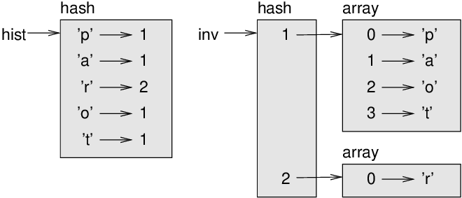
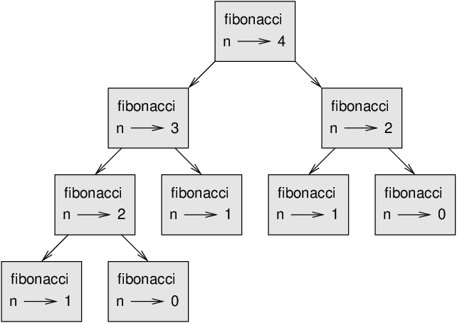

# Hashes

This chapter presents another built-in type called a hash. Hashes are
one of Ruby’s best features; they are the building blocks of many
efficient and elegant algorithms.

## A hash is a mapping

A **hash** is like an array, but more general. In an array,
the indices have to be integers; in a hash they can be any type.

A hash contains a collection of indices, which are called **keys**,
and a collection of values. Each key is associated with
a single value. The association of a key and a value is called a
**key-value pair** or sometimes an **item**.

In mathematical language, a hash represents a **mapping**
from keys to values, so you can also say that each key “maps to” a
value. As an example, we’ll build a hash that maps from English to
Spanish words, so the keys and the values are all strings.

The method `new` of Hash class creates a new hash with no items.

```ruby
>> eng2sp = Hash.new
=> {}
```

The squiggly-brackets, `{}`, represent an empty hash. To add items to
the hash, you can use square brackets:

```ruby
>> eng2sp['one'] = 'uno'
=> "uno"
```

This line creates an item that maps from the key `'one'` to the value
`'uno'`. If we print the hash again, we see a key-value pair with a
`=>` between the key and value:

```ruby
>> eng2sp
=> {"one"=>"uno"}
```

This output format is also an input format. For example, you can create
a new hash with three items:

```ruby
>> eng2sp = {'one' => 'uno', 'two' => 'dos', 'three' => 'tres'}
=> {"one"=>"uno", "two"=>"dos", "three"=>"tres"}
```

The order of the key-value pairs is the same as the order in which they
were inserted. In other programming languages, the order of items in a
hash is usually unpredictable.

But that’s not a problem because the elements of a hash are never
indexed with integer indices. Instead, you use the keys to look up the
corresponding values:

```ruby
>> eng2sp['two']
=> "dos"
```

The key `'two'` always maps to the value `'dos'` so the order of the
items doesn’t matter.

If the key isn’t in the hash, you get back `nil` value. To
get an exception, use the `fetch` method:

```ruby
>> eng2sp['four']
=> nil
>> eng2sp.fetch('four')
KeyError (key not found: "four")
```

The `length` method works on hashes; it returns the number of
key-value pairs:

```ruby
>> eng2sp.length
=> 3
```

The `include?` method works on hashes, too; it tells you
whether something appears as a *key* in the hash (appearing
as a value is not good enough).

```ruby
>> eng2sp.include?('one')
=> true
>> eng2sp.include?('uno')
=> false
```

To see whether something appears as a value in a hash, you can use the
`value?` method:

```ruby
>> eng2sp.value?('uno')
=> true
>> eng2sp.value?('one')
=> false
```

The `include?` method uses different algorithms for arrays
and hashes. For arrays, it searches the elements of the array in order,
as in Section [Searching](./strings.md#searching). As the array gets
longer, the search time gets longer in direct proportion.

Hashes have a remarkable property: the `include?` method
takes about the same amount of time no matter how many items are in the
hash. I explain how that’s possible in
Section [Hashtables](./analysis_of_algorithms.md#hashtables), but the
explanation might not make sense until you’ve read a few more chapters.

## Hash as a collection of counters

Suppose you are given a string and you want to count how many times each
letter appears. There are several ways you could do it:

1.  You could create 26 variables, one for each letter of the alphabet.
    Then you could traverse the string and, for each character,
    increment the corresponding counter, probably using a chained
    conditional.

2.  You could create an array with 26 elements. Then you could convert
    each character to a number (using the built-in method
    `ord`), use the number as an index into the array, and
    increment the appropriate counter.

3.  You could create a hash with characters as keys and counters as the
    corresponding values. The first time you see a character, you would
    add an item to the hash. After that you would increment the value of
    an existing item.

Each of these options performs the same computation, but each of them
implements that computation in a different way.

An **implementation** is a way of performing a computation;
some implementations are better than others. For example, an advantage
of the hash implementation is that we don’t have to know ahead of time
which letters appear in the string and we only have to make room for the
letters that do appear.

Here is what the code might look like:

```ruby
def histogram(s)
  h = Hash.new
  s.each_char do |c|
    if h.include?(c)
      h[c] += 1
    else
      h[c] = 1
    end
  end
  return h
end
```

The name of the method is `histogram`, which is a statistical
term for a collection of counters (or frequencies).

The first line of the method creates an empty hash. The
`each_char` method traverses the string. Each time through
the loop, if the character `c` is not in the hash, we create
a new item with key `c` and the initial value 1 (since we
have seen this letter once). If `c` is already in the hash we
increment `h[c]`.

Here’s how it works:

```ruby
>> h = histogram('brontosaurus')
=> {"b"=>1, "r"=>2, "o"=>2, "n"=>1, "t"=>1, "s"=>2, "a"=>1, "u"=>2}
```

The histogram indicates that the letters `'a'` and `'b'` appear once;
`'o'` appears twice, and so on.

An initial value can be passed to the `new` method, so that
this value is returned instead of `nil` as the default value.
For example:

```ruby
>> h = Hash.new(0)
=> {}
>> h['a'] = 2
=> 2
>> h
=> {"a"=>2}
>> h['b']
=> 0
```

As an exercise, pass an initial value to write `histogram`
more concisely. You should be able to eliminate the `if`
statement.

## Looping and hashes

If you use a hash in a `for` statement, it traverses the
key-value pair of the hash. For example, `print_hist` prints each key
and the corresponding value:

```ruby
def print_hist(h)
  for k, v in h
    puts "#{k} #{v}"
  end
end
```

For each iteration, we get key-value pair as an array. The two elements are
saved in two separate variables using **array assignment**. We'll discuss
that again in [next chapter](./arrays_and_hashes.md#array-assignment).

Here’s what the output looks like:

```ruby
>> h = histogram('parrot')
=> {"p"=>1, "a"=>1, "r"=>2, "o"=>1, "t"=>1}
>> print_hist(h)
p 1
a 1
r 2
o 1
t 1
=> {"p"=>1, "a"=>1, "r"=>2, "o"=>1, "t"=>1}
```

Like array, you can also use the built-in method `each` to
traverse:

```ruby
>> h.each { |k, v| puts "#{k} #{v}" }
p 1
a 1
r 2
o 1
t 1
=> {"p"=>1, "a"=>1, "r"=>2, "o"=>1, "t"=>1}
```

To traverse the keys in sorted order, you can use the `sort`
method:

```ruby
>> h.sort.each { |k, v| puts "#{k} #{v}" }
a 1
o 1
p 1
r 2
t 1
=> [["a", 1], ["o", 1], ["p", 1], ["r", 2], ["t", 1]]
```

## Reverse lookup

Given a hash `h` and a key `k`, it is easy to find
the corresponding value `v = h[k]`. This operation is
called a **lookup**.

But what if you have `v` and you want to find `k`?
You have a problem: there might be more than one key that maps to the
value `v`. Depending on the application, you might be able to
pick one, or you might have to make an array that contains all of them.

To get the first mapping to the value `v`, use the `key` method:

```ruby
>> h
=> {"p"=>1, "a"=>1, "r"=>2, "o"=>1, "t"=>1}
>> h.key(1)
=> "p"
>> h.key(2)
=> "r"
```

Here is a method that takes a value and returns an array of keys that
map to that value:

```ruby
def reverse_lookup(h, v)
  k = []
  h.each { |key, value| k.append(key) if value == v }

  if k.empty?
    raise KeyError
  else
    return k
  end
end
```

This method is yet another example of the search pattern, but it uses a
feature we haven’t seen before, `raise`. The **raise
method** causes an exception; in this case it causes a
`KeyError`, which is a built-in exception used to indicate
that the specified key was not found.

If `k` is empty at the end of the loop, that means
`v` doesn’t appear in the hash as a value, so we raise an
exception.

Here is an example of a successful reverse lookup:

```ruby
>> h = histogram('parrot')
=> {"p"=>1, "a"=>1, "r"=>2, "o"=>1, "t"=>1}
>> keys = reverse_lookup(h, 2)
=> ["r"]
>> keys = reverse_lookup(h, 1)
=> ["p", "a", "o", "t"]
```

And an unsuccessful one:

```ruby
>> keys = reverse_lookup(h, 3)
Traceback (most recent call last):
        3: from /usr/local/bin/irb:11:in `<main>'
        2: from (irb):32
        1: from (irb):23:in `reverse_lookup'
KeyError (KeyError)
```

The effect when you raise an exception is the same as when Ruby raises
one: it prints a traceback and an error message.

The `raise` method can take a detailed error message as an
optional argument. For example:

```ruby
>> raise KeyError, 'key with given value not found in the hash'
Traceback (most recent call last):
        2: from /usr/local/bin/irb:11:in `<main>'
        1: from (irb):37
KeyError (key with given value not found in the hash)
```

A reverse lookup is much slower than a forward lookup; if you have to do
it often, or if the hash gets big, the performance of your program will
suffer.

## Hashes and Arrays

Arrays can appear as values in a hash. For example, if you are given a
hash that maps from letters to frequencies, you might want to invert it;
that is, create a hash that maps from frequencies to letters. Since
there might be several letters with the same frequency, each value in
the inverted hash should be an array of letters.

Here is a method that inverts a hash:

```ruby
def invert_hash(h)
  inverse = Hash.new
  h.each do |key, val|
    if inverse.include?(val)
      inverse[val].append(key)
    else
      inverse[val] = [key]
    end
  end
  return inverse
end
```

Each time through the loop, `key` gets a key from
`h` and `val` gets the corresponding value. If
`val` is not in ` inverse`, that means we haven’t
seen it before, so we create a new item and initialize it with a
**singleton** (an array that contains a single element).
Otherwise we have seen this value before, so we append the corresponding
key to the array.

Here is an example:

```ruby
>> hist = histogram('parrot')
=> {"p"=>1, "a"=>1, "r"=>2, "o"=>1, "t"=>1}
>> inverse = invert_hash(hist)
=> {1=>["p", "a", "o", "t"], 2=>["r"]}
```

  
*Figure 11.1: State diagram*

Figure above is a state diagram showing `hist`
and `inverse`. A hash is represented as a box with the type
`hash` above it and the key-value pairs inside. If the values
are integers, floats or strings, I draw them inside the box, but I
usually draw arrays outside the box, just to keep the diagram simple.

Arrays can be values in a hash, as this example shows. They can be used
as keys as well. Here’s an example:

```ruby
>> t = [1, 2, 3]
=> [1, 2, 3]
>> h = Hash.new
=> {}
>> h[t] = 'foo'
=> "foo"
>> h
=> {[1, 2, 3]=>"foo"}
```

A **hash** is a method (not to be confused with `Hash` class) that takes a
value (of any kind) and returns an integer. Hashes use these integers,
called hash values, to store and look up key-value pairs.

```ruby
# these values will be consistent for a given session
# but won't be same across different Ruby invocations
>> 42.hash
=> 3577973027633181233
>> 'foo'.hash
=> -1287058253106040087
>> [1, 2, 3].hash
=> -3571993769152562407
```

This system works fine if the keys are immutable. But if the keys are
mutable, like arrays, bad things happen. For example, when you create a
key-value pair, Ruby hashes the key and stores it in the corresponding
location. If you modify the key and then hash it again, it would go to a
different location. In that case you might have two entries for the same
key, or you might not be able to find a key. Either way, the hash
wouldn’t work correctly.

That’s why immutable types like integers and symbols are preferred as
keys. As a special case, Ruby freezes strings when used as keys, so
string keys behave like an immutable type.

## Memos

If you played with the `fibonacci` method from Section
[One more example](./fruitful_methods.md#one-more-example), you might have
noticed that the bigger the argument you provide, the longer the method
takes to run. Furthermore, the run time increases quickly.

To understand why, consider below figure, which shows
the **call graph** for `fibonacci` with `n=4`:

  
*Figure 11.2: Call graph*

A call graph shows a set of method frames, with lines connecting each
frame to the frames of the method it calls. At the top of the graph,
`fibonacci` with `n=4` calls `fibonacci` with ` n=3` and `n=2`. In
turn, `fibonacci` with `n=3` calls `fibonacci` with `n=2` and `n=1`.
And so on.

Count how many times `fibonacci(0)` and
`fibonacci(1)` are called. This is an inefficient solution to
the problem, and it gets worse as the argument gets bigger.

One solution is to keep track of values that have already been computed
by storing them in a hash. A previously computed value that is stored
for later use is called a **memo**. Here is a “memoized”
version of `fibonacci`:

```ruby
$known = {0 => 0, 1 => 1}

def fibonacci(n)
  return $known[n] if $known.include?(n)

  res = fibonacci(n-1) + fibonacci(n-2)
  $known[n] = res
  return res
end
```

`$known` is a global variable (indicated by the prefix `$`) containing a
hash that keeps track of the Fibonacci numbers we already know. It starts
with two items: 0 maps to 0 and 1 maps to 1.

Whenever `fibonacci` is called, it checks
`$known`. If the result is already there, it can return
immediately. Otherwise it has to compute the new value, add it to the
hash, and return it.

If you run this version of `fibonacci` and compare it with
the original, you will find that it is much faster.

## Global variables

Variables prefixed with `$` are called
**global** because they can be accessed from anywhere.
Unlike local variables, which disappear when their method ends, global
variables persist from one method call to the next.

It is common to use global variables for **flags**; that
is, boolean variables that indicate (“flag”) whether a condition is
true. For example, some programs use a flag named `verbose`
to control the level of detail in the output:

```ruby
$verbose = true

def example1()
  if $verbose
    puts 'Running example1'
  end
end
```

Here’s an example that updates a global variable:

```ruby
$count = 0

def example2()
  $count = $count + 1
end
```

If you run it you get:

```ruby
>> example2()
=> 1
>> $count
=> 1
```

Global variables can be useful, but if you have a lot of them, and you
modify them frequently, they can make programs hard to debug.

## Debugging

As you work with bigger datasets it can become unwieldy to debug by
printing and checking the output by hand. Here are some suggestions for
debugging large datasets:

  - **Scale down the input**:  
    If possible, reduce the size of the dataset. For example if the
    program reads a text file, start with just the first 10 lines, or
    with the smallest example you can find. You can either edit the
    files themselves, or (better) modify the program so it reads only
    the first `n` lines.
    
    If there is an error, you can reduce `n` to the smallest
    value that manifests the error, and then increase it gradually as
    you find and correct errors.

  - **Check summaries and types**:  
    Instead of printing and checking the entire dataset, consider
    printing summaries of the data: for example, the number of items in
    a hash or the total of an array of numbers.
    
    A common cause of runtime errors is a value that is not the right
    type. For debugging this kind of error, it is often enough to print
    the type of a value.

  - **Write self-checks**:  
    Sometimes you can write code to check for errors automatically. For
    example, if you are computing the average of an array of numbers,
    you could check that the result is not greater than the largest
    element in the array or less than the smallest. This is called a
    “sanity check” because it detects results that are “insane”.
    
    Another kind of check compares the results of two different
    computations to see if they are consistent. This is called a
    “consistency check”.

  - **Format the output**:  
    Formatting debugging output can make it easier to spot an error. We
    saw an example in Section [Debugging](./fruitful_methods.md#debugging)
    of Fruitful methods chapter. Another tool
    you might find useful is the `pp` method, which displays
    built-in types in a more human-readable format (`pp`
    stands for “pretty print”).

Again, time you spend building scaffolding can reduce the time you spend
debugging.

## Glossary

  - **mapping**:  
    A relationship in which each element of one set corresponds to an
    element of another set.

  - **hash**:  
    A mapping from keys to their corresponding values.

  - **key-value pair**:  
    The representation of the mapping from a key to a value.

  - **item**:  
    In a hash, another name for a key-value pair.

  - **key**:  
    An object that appears in a hash as the first part of a key-value
    pair.

  - **value**:  
    An object that appears in a hash as the second part of a key-value
    pair. This is more specific than our previous use of the word
    “value”.

  - **implementation**:  
    A way of performing a computation.

  - **hash method**:  
    A method used by Hashes to compute the location for a key.

  - **lookup**:  
    A hash operation that takes a key and finds the corresponding value.

  - **reverse lookup**:  
    A hash operation that takes a value and finds one or more keys that
    map to it.

  - **raise method**:  
    A method that (deliberately) raises an exception.

  - **singleton**:  
    An array (or other sequence) with a single element.

  - **call graph**:  
    A diagram that shows every frame created during the execution of a
    program, with an arrow from each caller to each callee.

  - **memo**:  
    A computed value stored to avoid unnecessary future computation.

  - **global variable**:  
    A variable defined using a `$` prefix. Global variables
    can be accessed from anywhere.

  - **flag**:  
    A boolean variable used to indicate whether a condition is true.

## Exercises

**Exercise 1**  
Write a method that reads the words in `words.txt` and stores
them as keys in a hash. It doesn’t matter what the values are.
Then you can use the `include?` method as a fast way to check
whether a string is in the hash.

If you did Exercise [in_bisect?](./arrays.md#exercises), you can compare
the speed of this implementation with the array `include?` method
and the bisection search.

**Exercise 2**  
Read the documentation of the hash method `new` and use it to
write a more concise version of `invert_hash`.

**Exercise 3**  
Memoize the Ackermann method from Exercise
[Ackermann](./fruitful_methods.md#exercises)
and see if memoization makes it possible to evaluate the method with
bigger arguments. Hint: no.

**Exercise 4**  
If you did Exercise [duplicate](./arrays.md#exercises), you already have a
method named `has_duplicates?` that takes an array as a parameter and
returns `true` if there is any object that appears more than
once in the array.

Use a hash to write a faster, simpler version of `has_duplicates?`.

**Exercise 5**  
Two words are “rotate pairs” if you can rotate one of them and get the
other (see `rotate_word` in Exercise [rotate](./strings.md#exercises)).

Write a program that reads a wordlist and finds all the rotate pairs.

**Exercise 6**  
Here’s another Puzzler from *Car Talk*
(https://www.cartalk.com/puzzler/browse):

> This was sent in by a fellow named Dan O’Leary. He came upon a common
> one-syllable, five-letter word recently that has the following unique
> property. When you remove the first letter, the remaining letters form
> a homophone of the original word, that is a word that sounds exactly
> the same. Replace the first letter, that is, put it back and remove
> the second letter and the result is yet another homophone of the
> original word. And the question is, what’s the word?
> 
> Now I’m going to give you an example that doesn’t work. Let’s look at
> the five-letter word, ‘wrack.’ W-R-A-C-K, you know like to ‘wrack with
> pain.’ If I remove the first letter, I am left with a four-letter
> word, ’R-A-C-K.’ As in, ‘Holy cow, did you see the rack on that buck!
> It must have been a nine-pointer!’ It’s a perfect homophone. If you
> put the ‘w’ back, and remove the ‘r,’ instead, you’re left with the
> word, ‘wack,’ which is a real word, it’s just not a homophone of the
> other two words.
> 
> But there is, however, at least one word that Dan and we know of,
> which will yield two homophones if you remove either of the first two
> letters to make two, new four-letter words. The question is, what’s
> the word?

You can use the hash from Exercise 1 in this section to
check whether a string is in the word list.

To check whether two words are homophones, you can use the CMU
Pronouncing Dictionary. You can download it from
http://www.speech.cs.cmu.edu/cgi-bin/cmudict

Write a program that lists all the words that solve the Puzzler.

