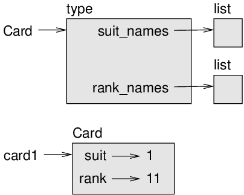
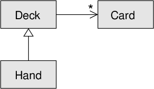

# Inheritance

The language feature most often associated with object-oriented
programming is **inheritance**. Inheritance is the ability
to define a new class that is a modified version of an existing class.
In this chapter I demonstrate inheritance using classes that represent
playing cards, decks of cards, and poker hands.

If you don’t play poker, you can read about it at
https://en.wikipedia.org/wiki/Poker, but you don’t have to; I’ll tell
you what you need to know for the exercises.

Code examples from this chapter are available from
http://thinkpython2.com/code/Card.py.

## Card objects

There are fifty-two cards in a deck, each of which belongs to one of
four suits and one of thirteen ranks. The suits are Spades, Hearts,
Diamonds, and Clubs (in descending order in bridge). The ranks are Ace,
2, 3, 4, 5, 6, 7, 8, 9, 10, Jack, Queen, and King. Depending on the game
that you are playing, an Ace may be higher than King or lower than 2.

If we want to define a new object to represent a playing card, it is
obvious what the attributes should be: `rank` and
`suit`. It is not as obvious what type the attributes should
be. One possibility is to use strings containing words like `'Spade'`
for suits and `'Queen'` for ranks. One problem with this implementation
is that it would not be easy to compare cards to see which had a higher
rank or suit.

An alternative is to use integers to **encode** the ranks
and suits. In this context, “encode” means that we are going to define a
mapping between numbers and suits, or between numbers and ranks. This
kind of encoding is not meant to be a secret (that would be
“encryption”).

For example, this table shows the suits and the corresponding integer
codes:

|          |   |   |
| -------- | - | - |
| Spades   | ↦ | 3 |
| Hearts   | ↦ | 2 |
| Diamonds | ↦ | 1 |
| Clubs    | ↦ | 0 |

This code makes it easy to compare cards; because higher suits map to
higher numbers, we can compare suits by comparing their codes.

The mapping for ranks is fairly obvious; each of the numerical ranks
maps to the corresponding integer, and for face cards:

|       |   |    |
| ----- | - | -- |
| Jack  | ↦ | 11 |
| Queen | ↦ | 12 |
| King  | ↦ | 13 |

I am using the ↦ symbol to make it clear that these mappings
are not part of the Python program. They are part of the program design,
but they don’t appear explicitly in the code.

The class definition for `Card` looks like this:

```ruby
class Card:
    """Represents a standard playing card."""

    def __init__(self, suit=0, rank=2):
        self.suit = suit
        self.rank = rank
```

As usual, the init method takes an optional parameter for each
attribute. The default card is the 2 of Clubs.

To create a Card, you call `Card` with the suit and rank of
the card you want.

```ruby
queen_of_diamonds = Card(1, 12)
```

## Class attributes

In order to print Card objects in a way that people can easily read, we
need a mapping from the integer codes to the corresponding ranks and
suits. A natural way to do that is with lists of strings. We assign
these lists to **class attributes**:

```ruby
# inside class Card:

    suit_names = ['Clubs', 'Diamonds', 'Hearts', 'Spades']
    rank_names = [None, 'Ace', '2', '3', '4', '5', '6', '7', 
              '8', '9', '10', 'Jack', 'Queen', 'King']

    def __str__(self):
        return '%s of %s' % (Card.rank_names[self.rank],
                             Card.suit_names[self.suit])
```

Variables like `suit_names` and `rank_names`, which are defined inside a
class but outside of any method, are called class attributes because
they are associated with the class object `Card`.

This term distinguishes them from variables like `suit` and
` rank`, which are called **instance
attributes** because they are associated with a particular
instance.

Both kinds of attribute are accessed using dot notation. For example, in
`__str__`, `self` is a Card object, and
`self.rank` is its rank. Similarly, `Card` is a
class object, and `Card.rank_names` is a list of strings associated with
the class.

Every card has its own `suit` and `rank`, but
there is only one copy of `suit_names` and `rank_names`.

Putting it all together, the expression `Card.rank_names[self.rank]`
means “use the attribute `rank` from the object
`self` as an index into the list `rank_names` from the class
`Card`, and select the appropriate string.”

The first element of `rank_names` is `None` because there is
no card with rank zero. By including `None` as a
place-keeper, we get a mapping with the nice property that the index 2
maps to the string `'2'`, and so on. To avoid this tweak, we could have
used a dictionary instead of a list.

With the methods we have so far, we can create and print cards:

```ruby
>>> card1 = Card(2, 11)
>>> print(card1)
Jack of Hearts
```

  
*Figure 18.1: Object diagram*

Figure above is a diagram of the `Card` class
object and one Card instance. `Card` is a class object; its
type is ` type`. `card1` is an instance of
`Card`, so its type is `Card`. To save space, I
didn’t draw the contents of `suit_names` and `rank_names`.

## Comparing cards

For built-in types, there are relational operators (`<`,
`>`, `==`, etc.) that compare values and
determine when one is greater than, less than, or equal to another. For
programmer-defined types, we can override the behavior of the built-in
operators by providing a method named `__lt__`, which stands for “less
than”.

`__lt__` takes two parameters, `self` and `other`,
and returns `True` if `self` is strictly less than
`other`.

The correct ordering for cards is not obvious. For example, which is
better, the 3 of Clubs or the 2 of Diamonds? One has a higher rank, but
the other has a higher suit. In order to compare cards, you have to
decide whether rank or suit is more important.

The answer might depend on what game you are playing, but to keep things
simple, we’ll make the arbitrary choice that suit is more important, so
all of the Spades outrank all of the Diamonds, and so on.

With that decided, we can write `__lt__`:

```ruby
# inside class Card:

    def __lt__(self, other):
        # check the suits
        if self.suit < other.suit: return True
        if self.suit > other.suit: return False

        # suits are the same... check ranks
        return self.rank < other.rank
```

You can write this more concisely using tuple comparison:

```ruby
# inside class Card:

    def __lt__(self, other):
        t1 = self.suit, self.rank
        t2 = other.suit, other.rank
        return t1 < t2
```

As an exercise, write an `__lt__` method for Time objects. You can use
tuple comparison, but you also might consider comparing integers.

## Decks

Now that we have Cards, the next step is to define Decks. Since a deck
is made up of cards, it is natural for each Deck to contain a list of
cards as an attribute.

The following is a class definition for `Deck`. The init
method creates the attribute `cards` and generates the
standard set of fifty-two cards:

```ruby
class Deck:

    def __init__(self):
        self.cards = []
        for suit in range(4):
            for rank in range(1, 14):
                card = Card(suit, rank)
                self.cards.append(card)
```

The easiest way to populate the deck is with a nested loop. The outer
loop enumerates the suits from 0 to 3. The inner loop enumerates the
ranks from 1 to 13. Each iteration creates a new Card with the current
suit and rank, and appends it to `self.cards`.

## Printing the deck

Here is a `__str__` method for `Deck`:

```ruby
#inside class Deck:

    def __str__(self):
        res = []
        for card in self.cards:
            res.append(str(card))
        return '\n'.join(res)
```

This method demonstrates an efficient way to accumulate a large string:
building a list of strings and then using the string method
`join`. The built-in function `str` invokes the
`__str__` method on each card and returns the string representation.

Since we invoke `join` on a newline character, the cards are
separated by newlines. Here’s what the result looks like:

```ruby
>>> deck = Deck()
>>> print(deck)
Ace of Clubs
2 of Clubs
3 of Clubs
...
10 of Spades
Jack of Spades
Queen of Spades
King of Spades
```

Even though the result appears on 52 lines, it is one long string that
contains newlines.

## Add, remove, shuffle and sort

To deal cards, we would like a method that removes a card from the deck
and returns it. The list method `pop` provides a convenient
way to do that:

```ruby
#inside class Deck:

    def pop_card(self):
        return self.cards.pop()
```

Since `pop` removes the *last* card in the list,
we are dealing from the bottom of the deck.

To add a card, we can use the list method `append`:

```ruby
#inside class Deck:

    def add_card(self, card):
        self.cards.append(card)
```

A method like this that uses another method without doing much work is
sometimes called a **veneer**. The metaphor comes from
woodworking, where a veneer is a thin layer of good quality wood glued
to the surface of a cheaper piece of wood to improve the appearance.

In this case `add_card` is a “thin” method that expresses a list
operation in terms appropriate for decks. It improves the appearance, or
interface, of the implementation.

As another example, we can write a Deck method named
`shuffle` using the function `shuffle` from the
`random` module:

```ruby
# inside class Deck:
            
    def shuffle(self):
        random.shuffle(self.cards)
```

Don’t forget to import `random`.

As an exercise, write a Deck method named `sort` that uses
the list method `sort` to sort the cards in a
`Deck`. `sort` uses the `__lt__` method we defined
to determine the order.

## Inheritance

Inheritance is the ability to define a new class that is a modified
version of an existing class. As an example, let’s say we want a class
to represent a “hand”, that is, the cards held by one player. A hand is
similar to a deck: both are made up of a collection of cards, and both
require operations like adding and removing cards.

A hand is also different from a deck; there are operations we want for
hands that don’t make sense for a deck. For example, in poker we might
compare two hands to see which one wins. In bridge, we might compute a
score for a hand in order to make a bid.

This relationship between classes—similar, but different—lends itself to
inheritance. To define a new class that inherits from an existing class,
you put the name of the existing class in parentheses:

```ruby
class Hand(Deck):
    """Represents a hand of playing cards."""
```

This definition indicates that `Hand` inherits from
`Deck`; that means we can use methods like `pop_card` and
`add_card` for Hands as well as Decks.

When a new class inherits from an existing one, the existing one is
called the **parent** and the new class is called the
**child**.

In this example, `Hand` inherits `__init__` from
`Deck`, but it doesn’t really do what we want: instead of
populating the hand with 52 new cards, the init method for Hands should
initialize ` cards` with an empty list.

If we provide an init method in the `Hand` class, it
overrides the one in the `Deck` class:

```ruby
# inside class Hand:

    def __init__(self, label=''):
        self.cards = []
        self.label = label
```

When you create a Hand, Python invokes this init method, not the one in
`Deck`.

```ruby
>>> hand = Hand('new hand')
>>> hand.cards
[]
>>> hand.label
'new hand'
```

The other methods are inherited from `Deck`, so we can use
`pop_card` and `add_card` to deal a card:

```ruby
>>> deck = Deck()
>>> card = deck.pop_card()
>>> hand.add_card(card)
>>> print(hand)
King of Spades
```

A natural next step is to encapsulate this code in a method called
`move_cards`:

```ruby
#inside class Deck:

    def move_cards(self, hand, num):
        for i in range(num):
            hand.add_card(self.pop_card())
```

`move_cards` takes two arguments, a Hand object and the number of cards
to deal. It modifies both `self` and `hand`, and
returns `None`.

In some games, cards are moved from one hand to another, or from a hand
back to the deck. You can use `move_cards` for any of these operations:
`self` can be either a Deck or a Hand, and `hand`,
despite the name, can also be a `Deck`.

Inheritance is a useful feature. Some programs that would be repetitive
without inheritance can be written more elegantly with it. Inheritance
can facilitate code reuse, since you can customize the behavior of
parent classes without having to modify them. In some cases, the
inheritance structure reflects the natural structure of the problem,
which makes the design easier to understand.

On the other hand, inheritance can make programs difficult to read. When
a method is invoked, it is sometimes not clear where to find its
definition. The relevant code may be spread across several modules.
Also, many of the things that can be done using inheritance can be done
as well or better without it.

## Class diagrams

So far we have seen stack diagrams, which show the state of a program,
and object diagrams, which show the attributes of an object and their
values. These diagrams represent a snapshot in the execution of a
program, so they change as the program runs.

They are also highly detailed; for some purposes, too detailed. A class
diagram is a more abstract representation of the structure of a program.
Instead of showing individual objects, it shows classes and the
relationships between them.

There are several kinds of relationship between classes:

  - Objects in one class might contain references to objects in another
    class. For example, each Rectangle contains a reference to a Point,
    and each Deck contains references to many Cards. This kind of
    relationship is called **HAS-A**, as in, “a Rectangle
    has a Point.”

  - One class might inherit from another. This relationship is called
    **IS-A**, as in, “a Hand is a kind of a Deck.”

  - One class might depend on another in the sense that objects in one
    class take objects in the second class as parameters, or use objects
    in the second class as part of a computation. This kind of
    relationship is called a **dependency**.

A **class diagram** is a graphical representation of these
relationships. For example, figure below shows the
relationships between `Card`, `Deck` and `Hand`.

  
*Figure 18.2: Class diagram*

The arrow with a hollow triangle head represents an IS-A relationship;
in this case it indicates that Hand inherits from Deck.

The standard arrow head represents a HAS-A relationship; in this case a
Deck has references to Card objects.

The star () near the arrow head is a **multiplicity**; it
indicates how many Cards a Deck has. A multiplicity can be a simple
number, like `52`, a range, like `5..7` or a star,
which indicates that a Deck can have any number of Cards.

There are no dependencies in this diagram. They would normally be shown
with a dashed arrow. Or if there are a lot of dependencies, they are
sometimes omitted.

A more detailed diagram might show that a Deck actually contains a
*list* of Cards, but built-in types like list and dict are
usually not included in class diagrams.

## Debugging

Inheritance can make debugging difficult because when you invoke a
method on an object, it might be hard to figure out which method will be
invoked.

Suppose you are writing a function that works with Hand objects. You
would like it to work with all kinds of Hands, like PokerHands,
BridgeHands, etc. If you invoke a method like `shuffle`, you
might get the one defined in `Deck`, but if any of the
subclasses override this method, you’ll get that version instead. This
behavior is usually a good thing, but it can be confusing.

Any time you are unsure about the flow of execution through your
program, the simplest solution is to add print statements at the
beginning of the relevant methods. If `Deck.shuffle` prints a
message that says something like `Running Deck.shuffle`, then
as the program runs it traces the flow of execution.

As an alternative, you could use this function, which takes an object
and a method name (as a string) and returns the class that provides the
definition of the method:

```ruby
def find_defining_class(obj, meth_name):
    for ty in type(obj).mro():
        if meth_name in ty.__dict__:
            return ty
```

Here’s an example:

```ruby
>>> hand = Hand()
>>> find_defining_class(hand, 'shuffle')
<class 'Card.Deck'>
```

So the `shuffle` method for this Hand is the one in `Deck`.

`find_defining_class` uses the `mro` method to get the list
of class objects (types) that will be searched for methods. “MRO” stands
for “method resolution order”, which is the sequence of classes Python
searches to “resolve” a method name.

Here’s a design suggestion: when you override a method, the interface of
the new method should be the same as the old. It should take the same
parameters, return the same type, and obey the same preconditions and
postconditions. If you follow this rule, you will find that any function
designed to work with an instance of a parent class, like a Deck, will
also work with instances of child classes like a Hand and PokerHand.

If you violate this rule, which is called the “Liskov substitution
principle”, your code will collapse like (sorry) a house of cards.

## Data encapsulation

The previous chapters demonstrate a development plan we might call
“object-oriented design”. We identified objects we needed—like
`Point`, `Rectangle` and `Time`—and
defined classes to represent them. In each case there is an obvious
correspondence between the object and some entity in the real world (or
at least a mathematical world).

But sometimes it is less obvious what objects you need and how they
should interact. In that case you need a different development plan. In
the same way that we discovered function interfaces by encapsulation and
generalization, we can discover class interfaces by **data
encapsulation**.

Markov analysis, from Section
[Markov analysis](./case_study_data_structure_selection.md#markov-analysis),
provides a good example. If you download my code from
http://thinkpython2.com/code/markov.py, you’ll see that it uses two
global variables—`suffix_map` and `prefix`—that are read and written
from several functions.

```ruby
suffix_map = {}        
prefix = ()            
```

Because these variables are global, we can only run one analysis at a
time. If we read two texts, their prefixes and suffixes would be added
to the same data structures (which makes for some interesting generated
text).

To run multiple analyses, and keep them separate, we can encapsulate the
state of each analysis in an object. Here’s what that looks like:

```ruby
class Markov:

def __init__(self):
    self.suffix_map = {}
    self.prefix = ()    
```

Next, we transform the functions into methods. For example, here’s
`process_word`:

```ruby
def process_word(self, word, order=2):
    if len(self.prefix) < order:
        self.prefix += (word,)
        return

        try:
            self.suffix_map[self.prefix].append(word)
        except KeyError:
            # if there is no entry for this prefix, make one
            self.suffix_map[self.prefix] = [word]

        self.prefix = shift(self.prefix, word)        
```

Transforming a program like this—changing the design without changing
the behavior—is another example of refactoring (see
Section [Refactoring](./case_study_interface_design.md#refactoring)).

This example suggests a development plan for designing objects and
methods:

1.  Start by writing functions that read and write global variables
    (when necessary).

2.  Once you get the program working, look for associations between
    global variables and the functions that use them.

3.  Encapsulate related variables as attributes of an object.

4.  Transform the associated functions into methods of the new class.

As an exercise, download my Markov code from
http://thinkpython2.com/code/markov.py, and follow the steps described
above to encapsulate the global variables as attributes of a new class
called `Markov`. Solution:
http://thinkpython2.com/code/Markov.py (note the capital M).

## Glossary

  - **encode**:  
    To represent one set of values using another set of values by
    constructing a mapping between them.

  - **class attribute**:  
    An attribute associated with a class object. Class attributes are
    defined inside a class definition but outside any method.

  - **instance attribute**:  
    An attribute associated with an instance of a class.

  - **veneer**:  
    A method or function that provides a different interface to another
    function without doing much computation.

  - **inheritance**:  
    The ability to define a new class that is a modified version of a
    previously defined class.

  - **parent class**:  
    The class from which a child class inherits.

  - **child class**:  
    A new class created by inheriting from an existing class; also
    called a “subclass”.

  - **IS-A relationship**:  
    A relationship between a child class and its parent class.

  - **HAS-A relationship**:  
    A relationship between two classes where instances of one class
    contain references to instances of the other.

  - **dependency**:  
    A relationship between two classes where instances of one class use
    instances of the other class, but do not store them as attributes.

  - **class diagram**:  
    A diagram that shows the classes in a program and the relationships
    between them.

  - **multiplicity**:  
    A notation in a class diagram that shows, for a HAS-A relationship,
    how many references there are to instances of another class.

  - **data encapsulation**:  
    A program development plan that involves a prototype using global
    variables and a final version that makes the global variables into
    instance attributes.

## Exercises

**Exercise 1**  
For the following program, draw a UML class diagram that shows these
classes and the relationships among them.

```ruby
class PingPongParent:
    pass

class Ping(PingPongParent):
    def __init__(self, pong):
        self.pong = pong


class Pong(PingPongParent):
    def __init__(self, pings=None):
        if pings is None:
            self.pings = []
        else:
            self.pings = pings

    def add_ping(self, ping):
        self.pings.append(ping)

pong = Pong()
ping = Ping(pong)
pong.add_ping(ping)
```

**Exercise 2**  
Write a Deck method called `deal_hands` that takes two parameters, the
number of hands and the number of cards per hand. It should create the
appropriate number of Hand objects, deal the appropriate number of cards
per hand, and return a list of Hands.

**Exercise 3**  
The following are the possible hands in poker, in increasing order of
value and decreasing order of probability:

  - **pair**:  
    two cards with the same rank

  - **two pair**:  
    two pairs of cards with the same rank

  - **three of a kind**:  
    three cards with the same rank

  - **straight**:  
    five cards with ranks in sequence (aces can be high or low, so
    `Ace-2-3-4-5` is a straight and so is
    `10-Jack-Queen-King-Ace`, but `Queen-King-Ace-2-3` is not.)

  - **flush**:  
    five cards with the same suit

  - **full house**:  
    three cards with one rank, two cards with another

  - **four of a kind**:  
    four cards with the same rank

  - **straight flush**:  
    five cards in sequence (as defined above) and with the same suit

The goal of these exercises is to estimate the probability of drawing
these various hands.

1.  Download the following files from http://thinkpython2.com/code:
    
      - `Card.py`  
        : A complete version of the `Card`, `Deck`
        and `Hand` classes in this chapter.
    
      - `PokerHand.py`  
        : An incomplete implementation of a class that represents a
        poker hand, and some code that tests it.

2.  If you run `PokerHand.py`, it deals seven 7-card poker
    hands and checks to see if any of them contains a flush. Read this
    code carefully before you go on.

3.  Add methods to `PokerHand.py` named `has_pair`,
    `has_twopair`, etc. that return True or False according to whether
    or not the hand meets the relevant criteria. Your code should work
    correctly for “hands” that contain any number of cards (although 5
    and 7 are the most common sizes).

4.  Write a method named `classify` that figures out the
    highest-value classification for a hand and sets the
    `label` attribute accordingly. For example, a 7-card hand
    might contain a flush and a pair; it should be labeled “flush”.

5.  When you are convinced that your classification methods are working,
    the next step is to estimate the probabilities of the various hands.
    Write a function in `PokerHand.py` that shuffles a deck
    of cards, divides it into hands, classifies the hands, and counts
    the number of times various classifications appear.

6.  Print a table of the classifications and their probabilities. Run
    your program with larger and larger numbers of hands until the
    output values converge to a reasonable degree of accuracy. Compare
    your results to the values at
    http://en.wikipedia.org/wiki/Hand_rankings.

Solution: http://thinkpython2.com/code/PokerHandSoln.py.

