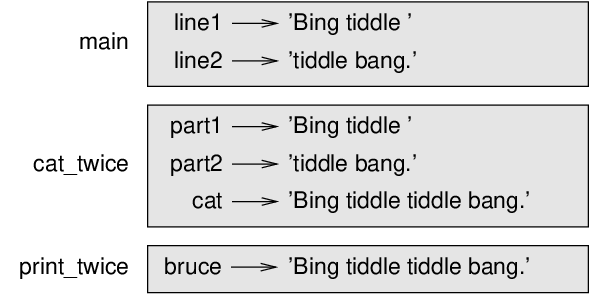

# Methods

In the context of programming, a **function** is a named
sequence of statements that performs a computation. When you define a
function, you specify the name and the sequence of statements. Later,
you can “call” the function by name.

Ruby is an object-oriented programming language. Functions in Ruby are
always associated with an object/class and are referred to as
**methods**.

## Method calls

We have already seen examples of **method call**:

```ruby
>> puts 'Hello, World!'
Hello, World!
=> nil
```

The name of the method in above example is `puts`. The string
passed is called the **argument** of the method.

It is common to say that a method “takes” an argument and “returns” a
result. The result is also called the **return value**. The
`puts` method always returns a special value `nil`.

Ruby provides methods that convert values from one type to another. The
`Integer` method takes any value and converts it to an
integer, if it can, or complains otherwise:

```ruby
>> Integer('32')
=> 32
>> Integer('Hello')
ArgumentError (invalid value for Integer(): "Hello")
```

`Integer` can convert floating-point values to integers, but
it doesn’t round off; it chops off the fraction part:

```ruby
>> Integer(3.99999)
=> 3
>> Integer(-2.3)
=> -2
```

`Float` converts integers and strings to floating-point
numbers:

```ruby
>> Float(32)
=> 32.0
>> Float('3.14159')
=> 3.14159
```

Finally, `String` converts its argument to a string:

```ruby
>> String(32)
=> "32"
>> String(3.14159)
=> "3.14159"
```

## Math methods

Ruby has a **Math** module that provides most of the
familiar mathematical functions. A **module** is a file
that contains a collection of related methods. The Math module is available
by default, later we’ll see modules which require loading.

To access one of the module methods, you have to specify the name of the
module and the name of the method, separated by a dot (also known as a
period). This format is called **dot notation**. To access
one of the module variables, you have to specify module name and name of
variable separated by two colons.

```ruby
ratio = signal_power / noise_power
decibels = 10 * Math.log10(ratio)

radians = 0.7
height = Math.sin(radians)
```

The first example uses `Math.log10` to compute a signal-to-noise ratio
in decibels (assuming that `signal_power` and `noise_power` are
defined). The Math module also provides `log`, which computes
logarithms base `e`.

The second example finds the sine of `radians`. The name of
the variable is a hint that `sin` and the other trigonometric
methods (`cos`, `tan`, etc.) take arguments in
radians. To convert from degrees to radians, divide by 180 and multiply
by `π`:

```ruby
>> degrees = 45
=> 45
>> radians = degrees / 180.0 * Math::PI
=> 0.7853981633974483
>> Math.sin(radians)
=> 0.7071067811865475
```

The expression `Math::PI` gets the variable `PI`
from the Math module. Its value is a floating-point approximation of
`π`, accurate to about 15 digits.

If you know trigonometry, you can check the previous result by comparing
it to the square root of two divided by two:

```ruby
>> Math.sqrt(2) / 2.0
=> 0.7071067811865476
```

## Composition

So far, we have looked at the elements of a program—variables,
expressions, and statements—in isolation, without talking about how to
combine them.

One of the most useful features of programming languages is their
ability to take small building blocks and **compose** them.
For example, the argument of a method can be any kind of expression,
including arithmetic operators:

```ruby
x = Math.sin(degrees / 360.0 * 2 * Math::PI)
```

And even method calls:

```ruby
x = Math.exp(Math.log(x+1))
```

Almost anywhere you can put a value, you can put an arbitrary
expression, with one exception: the left side of an assignment statement
has to be a variable name. Any other expression on the left side is a
syntax error (we will see exceptions to this rule later).

```ruby
>> minutes = hours * 60                 # right
>> hours * 60 = minutes                 # wrong!
SyntaxError: syntax error, unexpected '=', expecting end-of-input
```

## Adding new methods

So far, we have only been using the methods that come with Ruby, but it
is also possible to add new methods. A **method
definition** specifies the name of a new method and the sequence
of statements that run when the method is called.

Here is an example:

```ruby
def print_lyrics()
  puts "I'm a lumberjack, and I'm okay."
  puts "I sleep all night and I work all day."
end
```

`def` is a keyword that indicates that this is a method
definition. `end` keyword indicates end of method’s
definition. The name of the method is `print_lyrics`. The rules for
method names are similar to those for variable names: letters, numbers
and underscore are legal, but the first character can’t be a number.
Don’t use a keyword as the name of a method, and you should avoid
having a variable and a method with the same name.

The empty parentheses after the name indicate that this method doesn’t
take any arguments. In Ruby, parentheses are optional while defining and
calling methods.

The first line of the method definition is called the
**header**; the rest (excluding the end keyword) is called
the **body**. By convention, the body is indented by two
spaces. The body can contain any number of statements.

In the example above, the strings in the puts statement are enclosed in
double quotes. Single quotes and double quotes do similar things; most
people use single quotes except in cases like this where a single quote
(which is also an apostrophe) appears in the string. Other differences
between single and double quotes will be discussed later.

All quotation marks (single and double) must be “straight quotes”,
usually located next to Enter on the keyboard. “Curly quotes”, like the
ones in this sentence, are not legal in Ruby.

If you type a method definition in interactive mode, the interpreter
displays a return value which is same as name of the method prefixed by
a colon. That is a value of `Symbol` class and can be used as
reference to the method.

```ruby
>> def print_lyrics()
>>   puts "I'm a lumberjack, and I'm okay."
>>   puts "I sleep all night and I work all day."
>> end
=> :print_lyrics
```

The syntax for calling the new method is the same as for built-in
methods:

```ruby
>> print_lyrics()
I'm a lumberjack, and I'm okay.
I sleep all night and I work all day.
=> nil
```

Once you have defined a method, you can use it inside another method.
For example, to repeat the previous refrain, we could write a method
called `repeat_lyrics`:

```ruby
def repeat_lyrics()
  print_lyrics()
  print_lyrics()
end
```

And then call `repeat_lyrics`:

```ruby
>> repeat_lyrics()
I'm a lumberjack, and I'm okay.
I sleep all night and I work all day.
I'm a lumberjack, and I'm okay.
I sleep all night and I work all day.
=> nil
```

But that’s not really how the song goes.

## Definitions and uses

Pulling together the code fragments from the previous section, the whole
program looks like this:

```ruby
def print_lyrics()
  puts "I'm a lumberjack, and I'm okay."
  puts "I sleep all night and I work all day."
end

def repeat_lyrics()
  print_lyrics()
  print_lyrics()
end

repeat_lyrics()
```

This program contains two method definitions: `print_lyrics` and
`repeat_lyrics`. Method definitions get executed just like other
statements. The statements inside the method do not run until the method
is called, and the method definition generates no output.

As you might expect, you have to create a method before you can run it.
In other words, the method definition has to run before the method gets
called.

As an exercise, move the last line of this program to the top, so the
method call appears before the definitions. Run the program and see what
error message you get.

Now move the method call back to the bottom and move the definition of
`print_lyrics` after the definition of `repeat_lyrics`. What happens
when you run this program?

## Flow of execution

To ensure that a method is defined before its first use, you have to
know the order statements run in, which is called the **flow of
execution**.

Execution always begins at the first statement of the program.
Statements are run one at a time, in order from top to bottom.

Method definitions do not alter the flow of execution of the program,
but remember that statements inside the method don’t run until the
method is called.

A method call is like a detour in the flow of execution. Instead of
going to the next statement, the flow jumps to the body of the method,
runs the statements there, and then comes back to pick up where it left
off.

That sounds simple enough, until you remember that one method can call
another. While in the middle of one method, the program might have to
run the statements in another method. Then, while running that new
method, the program might have to run yet another method!

Fortunately, Ruby is good at keeping track of where it is, so each time
a method completes, the program picks up where it left off in the method
that called it. When it gets to the end of the program, it terminates.

In summary, when you read a program, you don’t always want to read from
top to bottom. Sometimes it makes more sense if you follow the flow of
execution.

## Parameters and arguments

Some of the methods we have seen require arguments. For example, when
you call `Math.sin` you pass a number as an argument. Some
methods take more than one argument: `Math.hypot` takes two,
the sides of a right-angled triangle.

Inside the method, the arguments are assigned to variables called
**parameters**. Here is a definition for a method that
takes an argument:

```ruby
def print_twice(bruce)
  puts bruce
  puts bruce
end
```

This method assigns the argument to a parameter named
`bruce`. When the method is called, it prints the value of
the parameter (whatever it is) twice.

This method works with any value that can be printed.

```ruby
>> print_twice('Spam')
Spam
Spam
=> nil
>> print_twice(42)
42
42
=> nil
>> print_twice(Math::PI)
3.141592653589793
3.141592653589793
=> nil
```

The same rules of composition that apply to built-in methods also apply
to programmer-defined methods, so we can use any kind of expression as
an argument for `print_twice`:

```ruby
>> print_twice('Spam '*4)
Spam Spam Spam Spam 
Spam Spam Spam Spam 
=> nil
>> print_twice(Math.cos(Math::PI))
-1.0
-1.0
=> nil
```

The argument is evaluated before the method is called, so in the
examples the expressions `'Spam '*4` and `Math.cos(Math::PI)`
are only evaluated once.

You can also use a variable as an argument:

```ruby
>> michael = 'Eric, the half a bee.'
=> "Eric, the half a bee."
>> print_twice(michael)
Eric, the half a bee.
Eric, the half a bee.
=> nil
```

The name of the variable we pass as an argument (`michael`)
has nothing to do with the name of the parameter (`bruce`).
It doesn’t matter what the value was called back home (in the caller);
here in `print_twice`, we call everybody `bruce`.

## Variables and parameters are local

When you create a variable inside a method, it is
**local**, which means that it only exists inside the
method. For example:

```ruby
def cat_twice(part1, part2)
  cat = part1 + part2
  print_twice(cat)
end
```

This method takes two arguments, concatenates them, and prints the
result twice. Here is an example that uses it:

```ruby
>> line1 = 'Bing tiddle '
=> "Bing tiddle "
>> line2 = 'tiddle bang.'
=> "tiddle bang."
>> cat_twice(line1, line2)
Bing tiddle tiddle bang.
Bing tiddle tiddle bang.
=> nil
```

When `cat_twice` terminates, the variable `cat` is destroyed.
If we try to print it, we get an exception:

```ruby
>> puts cat
NameError: undefined local variable or method `cat' for main:Object
```

Parameters are also local. For example, outside `print_twice`, there is
no such thing as `bruce`.

## Stack diagrams

To keep track of which variables can be used where, it is sometimes
useful to draw a **stack diagram**. Like state diagrams,
stack diagrams show the value of each variable, but they also show the
method each variable belongs to.

Each method is represented by a **frame**. A frame is a box
with the name of a method beside it and the parameters and variables of
the method inside it. The stack diagram for the previous example is
shown below.

  
*Figure 3.1: Stack diagram.*

The frames are arranged in a stack that indicates which method called
which, and so on. In this example, `print_twice` was called by
`cat_twice`, and `cat_twice` was called by `main`, which is a special
name for the topmost frame. When you create a variable outside of any
method, it belongs to `main`.

Each parameter refers to the same value as its corresponding argument.
So, `part1` has the same value as `line1`,
`part2` has the same value as `line2`, and
`bruce` has the same value as `cat`.

If an error occurs during a method call, Ruby prints the name of the
method, the name of the method that called it, and the name of the
method that called *that*, all the way back to `main`.

For example, if you try to access `cat` from within
`print_twice`, you get a `NameError`:

```
Traceback (most recent call last):
    2: from test.rb:14:in `<main>'
    1: from test.rb:9:in `cat_twice'
test.rb:4:in `print_twice': undefined local variable
        or method `cat' for main:Object (NameError)
```

This list of methods is called a **traceback**. It tells
you what program file the error occurred in, and what line, and what
methods were executing at the time.

The order of the methods in the traceback is the same as the order of
the frames in the stack diagram. The method that is currently running is
at the bottom.

## Fruitful methods and void methods

Some of the methods we have used, such as the Math methods, return
results; for lack of a better name, I call them **fruitful
methods**. Other methods, like `print_twice`, perform an action
but don’t return a value. They are called **void methods**.

When you call a fruitful method, you almost always want to do something
with the result; for example, you might assign it to a variable or use
it as part of an expression:

```ruby
x = Math.cos(radians)
golden = (Math.sqrt(5) + 1) / 2
```

When you call a method in interactive mode, Ruby displays the result:

```ruby
>> Math.sqrt(5)
=> 2.23606797749979
```

But in a script, if you call a fruitful method all by itself, the return
value is lost forever!

```ruby
Math.sqrt(5)
```

This script computes the square root of 5, but since it doesn’t store or
display the result, it is not very useful.

Void methods might display something on the screen or have some other
effect. If you assign the result to a variable, by default you get the
result of last evaluated expression of the method.

```ruby
>> result = print_twice('Bing')
Bing
Bing
=> nil
>> result
=> nil
```

The value `nil` is not the same as the string `'nil'`. It is
a special value that has its own type:

```ruby
>> nil.class
=> NilClass
```

The methods we have written so far are all void. It so happened that the
last expression in all of them was puts method which always returns
`nil`. We will start writing fruitful methods in a few
chapters.

## Why methods?

It may not be clear why it is worth the trouble to divide a program into
methods. There are several reasons:

  - Creating a new method gives you an opportunity to name a group of
    statements, which makes your program easier to read and debug.

  - Methods can make a program smaller by eliminating repetitive code.
    Later, if you make a change, you only have to make it in one place.

  - Dividing a long program into methods allows you to debug the parts
    one at a time and then assemble them into a working whole.

  - Well-designed methods are often useful for many programs. Once you
    write and debug one, you can reuse it.

## Debugging

One of the most important skills you will acquire is debugging. Although
it can be frustrating, debugging is one of the most intellectually rich,
challenging, and interesting parts of programming.

In some ways debugging is like detective work. You are confronted with
clues and you have to infer the processes and events that led to the
results you see.

Debugging is also like an experimental science. Once you have an idea
about what is going wrong, you modify your program and try again. If
your hypothesis was correct, you can predict the result of the
modification, and you take a step closer to a working program. If your
hypothesis was wrong, you have to come up with a new one. As Sherlock
Holmes pointed out, “When you have eliminated the impossible, whatever
remains, however improbable, must be the truth.” (A. Conan Doyle,
*The Sign of Four*)

For some people, programming and debugging are the same thing. That is,
programming is the process of gradually debugging a program until it
does what you want. The idea is that you should start with a working
program and make small modifications, debugging them as you go.

For example, Linux is an operating system that contains millions of
lines of code, but it started out as a simple program Linus Torvalds
used to explore the Intel 80386 chip. According to Larry Greenfield,
“One of Linus’s earlier projects was a program that would switch
between printing AAAA and BBBB. This later evolved to Linux.”
(*The Linux Users’ Guide* Beta Version 1).

## Glossary

  - **method**:  
    A named sequence of statements that performs some useful operation.
    Methods may or may not take arguments and may or may not produce a
    result.

  - **method definition**:  
    A statement that creates a new method, specifying its name,
    parameters, and the statements it contains.

  - **header**:  
    The first line of a method definition.

  - **body**:  
    The sequence of statements inside a method definition.

  - **parameter**:  
    A name used inside a method to refer to the value passed as an
    argument.

  - **method call**:  
    A statement that runs a method. It consists of the method name
    followed by an argument list in parentheses.

  - **argument**:  
    A value provided to a method when the method is called. This value
    is assigned to the corresponding parameter in the method.

  - **local variable**:  
    A variable defined inside a method. A local variable can only be
    used inside its method.

  - **return value**:  
    The result of a method. If a method call is used as an expression,
    the return value is the value of the expression.

  - **fruitful method**:  
    A method that returns a value.

  - **void method**:  
    A method that doesn’t explicitly return a value.

  - **`nil`**:  
    A special value to indicate absence of a value.

  - **module**:  
    A file that contains a collection of related methods and other
    definitions.

  - **dot notation**:  
    The syntax for calling a method in another module by specifying the
    module name followed by a dot (period) and the method name.

  - **composition**:  
    Using an expression as part of a larger expression, or a statement
    as part of a larger statement.

  - **flow of execution**:  
    The order statements run in.

  - **stack diagram**:  
    A graphical representation of a stack of methods, their variables,
    and the values they refer to.

  - **frame**:  
    A box in a stack diagram that represents a method call. It contains
    the local variables and parameters of the method.

  - **traceback**:  
    A list of the methods that are executing, printed when an exception
    occurs.

## Exercises

**Exercise 1**  
Write a method named `right_justify` that takes a string named
`s` as a parameter and prints the string with enough leading
spaces so that the last letter of the string is in column 70 of the
display.

    >>> right_justify('hello')
                                                                     hello

Hint: Use string concatenation and repetition. Also, Ruby provides a
built-in String method called `length` that returns the
length of a string, so the value of `'hello'.length` is 5.

**Exercise 2**  
Return value of a method definition is a symbol value you can assign to
a variable or pass as an argument. For example, `do_twice` is a method
that takes a symbol as an argument and calls it twice:

```ruby
def do_twice(s)
  m = method(s)
  m.call
  m.call
end
```

Here’s an example that uses `do_twice` to call a method named
`print_spam` twice.

```ruby
def print_spam()
  puts 'spam'
end

do_twice(:print_spam)
```

1.  Type this example into a script and test it.

2.  Modify `do_twice` so that it takes two arguments, a method’s symbol
    and a value, and calls the method twice, passing the value as an
    argument.

3.  Copy the definition of `print_twice` from earlier in this chapter to
    your script.

4.  Use the modified version of `do_twice` to call `print_twice` twice,
    passing `'spam'` as an argument.

5.  Define a new method called `do_four` that takes a method’s symbol
    and a value and calls the method four times, passing the value as a
    parameter. There should be only two statements in the body of this
    method, not four.

**Exercise 3**  
Note: This exercise should be done using only the statements and other
features we have learned so far.

1.  Write a method that draws a grid like the following:
    
        + - - - - + - - - - +
        |         |         |
        |         |         |
        |         |         |
        |         |         |
        + - - - - + - - - - +
        |         |         |
        |         |         |
        |         |         |
        |         |         |
        + - - - - + - - - - +
    
    Hint: Use string concatenation and repetition. By defining a method
    that accepts two characters as arguments, you could get both types
    of lines.

2.  Write a method that draws a similar grid with four rows and four
    columns.

Credit: This exercise is based on an exercise in Oualline,
*Practical C Programming, Third Edition*, O’Reilly Media, 1997.

