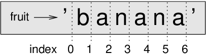
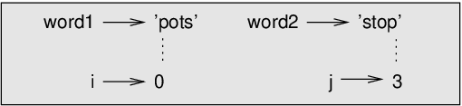

# Strings

Strings are not like integers, floats, and booleans. A string is a
**sequence**, which means it is an ordered collection of
other values. In this chapter you’ll see how to access the characters
that make up a string, and you’ll learn about some of the methods
strings provide.

## A string is a sequence

A string is a sequence of characters. You can access the characters one
at a time with the bracket operator:

```ruby
fruit = 'banana'
letter = fruit[1]
```

The second statement selects character number 1 from ` fruit`
and assigns it to `letter`.

The expression in brackets is called an **index**. The
index indicates which character in the sequence you want (hence the
name).

But you might not get what you expect:

```ruby
>> letter
=> "a"
```

For most people, the first letter of `'banana'` is `b`, not
`a`. But for computer scientists, the index is an offset from
the beginning of the string, and the offset of the first letter is zero.

```ruby
>> letter = fruit[0]
=> "b"
```

So `b` is the 0th letter (“zero-eth”) of `'banana'`, `
a` is the 1th letter (“one-eth”), and `n` is the 2th
letter (“two-eth”).

As an index you can use an expression that contains variables and
operators:

```ruby
>> i = 1
=> 1
>> fruit[i]
=> "a"
>> fruit[i+1]
=> "n"
```

If a floating-point value is given as index, it is rounded down to an
integer:

```ruby
>> letter = fruit[1.2]
=> "a"
>> letter = fruit[1.7]
=> "a"
```

## length

`length` is a built-in String method that returns the number
of characters in a string:

```ruby
>> fruit = 'banana'
=> "banana"
>> fruit.length
=> 6
```

To get the last letter of a string, you might be tempted to try
something like this:

```ruby
>> length = fruit.length
=> 6
>> last = fruit[length]
=> nil
```

The reason for the `nil` is that there is no letter in `’banana’`
with the index 6. Since we started counting at zero, the
six letters are numbered 0 to 5. To get the last character, you have to
subtract 1 from `length`:

```ruby
>> last = fruit[length-1]
=> "a"
```

Or you can use negative indices, which count backward from the end of
the string. The expression `fruit[-1]` yields the last
letter, `fruit[-2]` yields the second to last, and so on.

## Traversal with a for loop

A lot of computations involve processing a string one character at a
time. Often they start at the beginning, select each character in turn,
do something to it, and continue until the end. This pattern of
processing is called a **traversal**. One way to write a
traversal is with a `while` loop:

```ruby
index = 0
while index < fruit.length
  letter = fruit[index]
  puts letter
  index = index + 1
end
```

This loop traverses the string and displays each letter on a line by
itself. The loop condition is `index < fruit.length`, so
when `index` is equal to the length of the string, the
condition is false, and the body of the loop doesn’t run. The last
character accessed is the one with the index
`fruit.length-1`, which is the last character in the string.

As an exercise, write a method that takes a string as an argument and
displays the letters backward, one per line.

Another way to write a traversal is with a `for` loop:

```ruby
for letter in fruit.chars
  puts letter
end
```

Each time through the loop, the next character in the string is assigned
to the variable `letter`. The loop continues until no
characters are left.

The `chars` method converts a string into an [array](./arrays.md) (which
we'll cover later) with each character as a separate item.

```ruby
>> fruit.chars
=> ["b", "a", "n", "a", "n", "a"]
```

String traversal is so commonly used that Ruby provides a built-in method
`each_char`. Some methods also accept a **block** of statements as
shown below:

```ruby
fruit.each_char do |letter|
  puts letter
end
```

Parameters are declared bounded by `|` character after the `do` keyword.
For each iteration, the parameter `letter` gets next character in the
string, just like the `for` loop snippet seen earlier.

The following example shows how to use concatenation (string addition)
and a `for` loop to generate an abecedarian series (that is,
in alphabetical order). In Robert McCloskey’s book *Make Way for
Ducklings*, the names of the ducklings are Jack, Kack, Lack,
Mack, Nack, Ouack, Pack, and Quack. This loop outputs these names in
order:

```ruby
prefixes = 'JKLMNOPQ'
suffix = 'ack'

for letter in prefixes.chars
  puts letter + suffix
end
```

The output is:

```
Jack
Kack
Lack
Mack
Nack
Oack
Pack
Qack
```

Of course, that’s not quite right because “Ouack” and “Quack” are
misspelled. As an exercise, modify the program to fix this error.

## String slices

A segment of a string is called a **slice**. Selecting a
slice is similar to selecting a character:

```ruby
>> s = 'Ruby gems'
=> "Ruby gems"
>> s[0..3]
=> "Ruby"
>> s[5..8]
=> "gems"
```

The range operator `..` helps to return the part of the
string from the “n-eth” index to the “m-eth” index. To return including
the first but excluding the second index, use `...` form of
the range operator. This behavior is counterintuitive, but it might help
to imagine the indices pointing *between* the characters,
as shown below.

  
*Figure 8.1: Slice indices*

If the first index is `0`, the slice starts at the beginning
of the string. If the second index is `-1`, the slice goes to
the end of the string:

```ruby
>> fruit = 'banana'
=> "banana"
>> fruit[0..2]
=> "ban"
>> fruit[3..-1]
=> "ana"
```

If the first index is greater than the second the result is an
**empty string**, represented by two quotation marks:

```ruby
>> fruit = 'banana'
=> "banana"
>> fruit[3..2]
=> ""
```

An empty string contains no characters and has length 0, but other than
that, it is the same as any other string.

Continuing this example, what do you think `fruit[0..-1]`
means? Try it and see.

Another way to get a slice is to specify starting index and length of
string needed from that index separated by a comma.

```ruby
>> fruit = 'pineapple'
=> "pineapple"
>> fruit[0, 3]
=> "pin"
>> fruit[-4, 3]
=> "ppl"
```

## Strings are mutable

Slicing can be used to change character(s) in a string. For example:

```ruby
>> greeting = 'Hello, world!'
=> "Hello, world!"
>> greeting[0] = 'J'
=> "J"
>> greeting
=> "Jello, world!"

>> greeting[5..-1] = '.'
=> "."
>> greeting
=> "Jello."
```

To create a new string that is a variation on the original:

```ruby
>> greeting = 'Hello, world!'
=> "Hello, world!"
>> new_greeting = 'J' + greeting[1..-1]
=> "Jello, world!"
```

This example concatenates a new first letter onto a slice of
`greeting`. It has no effect on the original string.

## Searching

What does the following method do?

```ruby
def find(word, letter)
  index = 0
  while index < word.length
    return index if word[index] == letter
    index = index + 1
  end
  return nil
end
```

In a sense, `find` is the inverse of the `[]` operator. Instead of
taking an index and extracting the corresponding character, it takes a
character and finds the index where that character appears. If the
character is not found, the method returns ` nil`.

This is the first example we have seen of a `return`
statement inside a loop. If `word[index] == letter`, the
method breaks out of the loop and returns immediately.

If the character doesn’t appear in the string, the program exits the
loop normally and returns `nil`.

This pattern of computation—traversing a sequence and returning when we
find what we are looking for—is called a **search**.

As an exercise, modify `find` so that it has a third
parameter, the index in `word` where it should start looking.

## Looping and counting

The following program counts the number of times the letter
`a` appears in a string:

```ruby
word = 'banana'
count = 0
word.each_char do |letter|
  if letter == 'a'
    count = count + 1
  end
end
puts count
```

This program demonstrates another pattern of computation called a **counter**.
The variable `count` is initialized to 0
and then incremented each time an `a` is found. When the loop
exits, `count` contains the result—the total number of `a`’s.

As an exercise, encapsulate this code in a method named `count`,
and generalize it so that it accepts the string and the
letter as arguments.

Then rewrite the method so that instead of traversing the string, it
uses the three-parameter version of `find` from the previous
section.

## String methods

Strings provide methods that perform a variety of useful operations. For
example, the method `upcase` takes a string and returns a new
string with all uppercase letters.

```ruby
>> word = 'banana'
=> "banana"
>> new_word = word.upcase
=> "BANANA"
```

As it turns out, there is a string method named `index` that
is remarkably similar to the `find` method we wrote:

```ruby
>> word = 'banana'
=> "banana"
>> word.index('a')
=> 1
>> word.index('z')
=> nil
```

In this example, we invoke `index` on `word` and
pass the letter we are looking for as a parameter.

Actually, the `index` method is more general than our
`find` method; it can find substrings, not just characters:

```ruby
>> word.index('na')
=> 2
```

By default, `index` starts at the beginning of the string,
but it can take a second argument, the index where it should start:

```ruby
>> word.index('na', 3)
=> 4
```

This is an example of an **optional argument**.

## The include? method

The `include?` method returns `true` if the given
string argument appears as a substring:

```ruby
>> 'banana'.include?('a')
=> true
>> 'banana'.include?('seed')
=> false
```

For example, the following method prints all the letters from
`word1` that also appear in `word2`:

```ruby
def in_both(word1, word2)
  word1.each_char do |letter|
    puts letter if word2.include?(letter)
  end
end
```

Here’s what you get if you compare apples and oranges:

```ruby
>> in_both('apples', 'oranges')
a
e
s
=> "apples"
```

## String comparison

The relational operators work on strings. To see if two strings are
equal:

```ruby
if word == 'banana'
  puts 'All right, bananas.'
end
```

Other relational operations are useful for putting words in alphabetical
order:

```ruby
if word < 'banana'
  puts "Your word, #{word}, comes before banana."
elsif word > 'banana'
  puts "Your word, #{word}, comes after banana."
else
  puts 'All right, bananas.'
end
```

Ruby does not handle uppercase and lowercase letters the same way people
do. All the uppercase letters come before all the lowercase letters, so:

```
Your word, Pineapple, comes before banana.
```

A common way to address this problem is to convert strings to a standard
format, such as all lowercase, before performing the comparison. Keep
that in mind in case you have to defend yourself against a man armed
with a Pineapple.

## Debugging

When you use indices to traverse the values in a sequence, it is tricky
to get the beginning and end of the traversal right. Here is a method
that is supposed to compare two words and return `true` if
one of the words is the reverse of the other, but it contains two
errors:

```ruby
def reverse?(word1, word2)
  return false if word1.length != word2.length
  
  i = 0
  j = word2.length

  while j > 0
    return false if word1[i] != word2[j]
    i = i+1
    j = j-1
  end

  return true
end
```

The first `if` statement checks whether the words are the
same length. If not, we can return `false` immediately.
Otherwise, for the rest of the method, we can assume that the words are
the same length. This is an example of the guardian pattern in
Section [Checking types](./fruitful_methods.md#checking-types).

`i` and `j` are indices: `i` traverses
`word1` forward while `j` traverses
`word2` backward. If we find two letters that don’t match, we
can return `false` immediately. If we get through the whole
loop and all the letters match, we return `true`.

If we test this method with the words “pots” and “stop”, we expect the
return value `true`, but we get `false`:

```ruby
>> reverse?('pots', 'stop')
=> false
```

For debugging this kind of issue, my first move is to print the values
of the indices inside the loop:

```ruby
  while j > 0
    puts "#{i} #{j}"

    return false if word1[i] != word2[j]
    i = i+1
    j = j-1
  end
```

Now when I run the program again, I get more information:

```ruby
>> reverse?('pots', 'stop')
0 4
=> false
```

The first time through the loop, the value of `j` is 4, which
is out of range for the string `'stop'`. The index of the last character
is 3, so the initial value for `j` should be
`word2.length-1`.

If I fix that issue and run the program again, I get:

```ruby
>> reverse?('pots', 'stop')
0 3
1 2
2 1
=> true
```

This time we get the right answer, but it looks like the loop only ran
three times, which is suspicious. To get a better idea of what is
happening, it is useful to draw a state diagram. During the first
iteration, the frame for `reverse?` is shown below:

  
*Figure 8.2: State diagram*

I took some license by arranging the variables in the frame and adding
dotted lines to show that the values of `i` and
`j` indicate characters in `word1` and `word2`.

Starting with this diagram, run the program on paper, changing the
values of `i` and `j` during each iteration. Find
and fix the second error in this method.

## Glossary

  - **object**:  
    Something a variable can refer to. For now, you can use “object” and
    “value” interchangeably.

  - **sequence**:  
    An ordered collection of values where each value is identified by an
    integer index.

  - **item**:  
    One of the values in a sequence.

  - **index**:  
    An integer value used to select an item in a sequence, such as a
    character in a string. In Ruby indices start from 0.

  - **slice**:  
    A part of a string specified by a range of indices.

  - **empty string**:  
    A string with no characters and length 0, represented by two
    quotation marks.

  - **traverse**:  
    To iterate through the items in a sequence, performing a similar
    operation on each.

  - **search**:  
    A pattern of traversal that stops when it finds what it is looking
    for.

  - **counter**:  
    A variable used to count something, usually initialized to zero and
    then incremented.

  - **invocation**:  
    A statement that calls a method.

  - **optional argument**:  
    A function or method argument that is not required.

## Exercises

**Exercise 1**  
Read the documentation of the string methods at
https://ruby-doc.org/core-2.5.0/String.html. You might want to
experiment with some of them to make sure you understand how they work.
`strip`, `match?` and `gsub` are particularly useful.

**Exercise 2**  
There is a string method called `count` that is similar to
the method in Section [Looping and counting](#looping-and-counting).
Read the documentation of this method and write an invocation that
counts the number of `a`’s in `'banana'`.

**Exercise 3**  
The string method `reverse` gives back characters in reversed
order:

```ruby
>> fruit = 'banana'
=> "banana"
>> fruit.reverse
=> "ananab"
```

Use this method to write a one-line version of `palindrome?` exercise
from [Fruitful methods](./fruitful_methods.md#exercises) chapter.

**Exercise 4**  
The following methods are all *intended* to check whether a
string contains any lowercase letters, but at least some of them are
wrong. For each method, describe what the method actually does (assuming
that the parameter is a string consisting of ASCII characters only).

```ruby
def any_lowercase1(s)
  for c in s.chars
    if c.match?(/[a-z]/)
      return true
    else
      return false
    end
  end
end

def any_lowercase2(s)
  for c in s.chars
    if 'c'.match?(/[a-z]/)
      return 'true'
    else
      return 'false'
    end
  end
end

def any_lowercase3(s)
  for c in s.chars
    flag = c.match?(/[a-z]/)
  end
  return flag
end

def any_lowercase4(s)
  flag = false
  for c in s.chars
    flag = flag || c.match?(/[a-z]/)
  end
  return flag
end

def any_lowercase5(s)
  for c in s.chars
    return false if !c.match?(/[a-z]/)
  end
  return true
end
```

**Exercise 5**  
A Caesar cypher is a weak form of encryption that involves “rotating” each
letter by a fixed number of places. To rotate a letter means to shift it
through the alphabet, wrapping around to the beginning if necessary, so
’A’ rotated by 3 is ’D’ and ’Z’ rotated by 1 is ’A’.

To rotate a word, rotate each letter by the same amount. For example,
“cheer” rotated by 7 is “jolly” and “melon” rotated by -10 is “cubed”.
In the movie *2001: A Space Odyssey*, the ship computer is
called HAL, which is IBM rotated by -1.

Write a method called `rotate_word` that takes a string and an integer
as parameters, and returns a new string that contains the letters from
the original string rotated by the given amount.

You might want to use the built-in method `ord`, which
converts a character to a numeric code, and `chr`, which
converts numeric codes to characters. Letters of the alphabet are
encoded in alphabetical order, so for example:

```ruby
>> 97.chr
=> "a"
>> 99.chr
=> "c"

>> 'c'.ord - 'a'.ord
=> 2
```

Because `'c'` is the two-eth letter of the alphabet. But beware: the
numeric codes for upper case letters are different.

Potentially offensive jokes on the Internet are sometimes encoded in
ROT13, which is a Caesar cypher with rotation 13. If you are not easily
offended, find and decode some of them.

